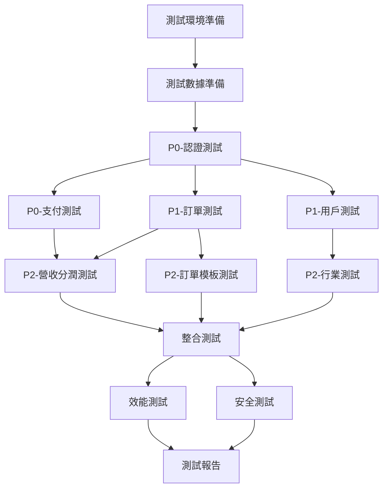

# Case Manager AI Chat - API 測試任務清單

## 任務進度總覽

- [ ] 測試環境準備與配置
- [ ] 測試工具安裝與設置
- [ ] 測試數據準備
- [ ] P0 - 極高優先級測試
- [ ] P1 - 高優先級測試
- [ ] P2 - 中優先級測試
- [ ] P3 - 低優先級測試
- [ ] 測試報告生成與分析

## 詳細任務清單

### 1. 測試準備階段

#### 1.1 環境準備
- [ ] 搭建測試環境
  - 完成條件：測試服務器配置完成，應用部署成功
  - 負責人：DevOps團隊
  - 相依性：無

- [ ] 配置測試數據庫
  - 完成條件：測試數據庫初始化完成，基礎數據導入
  - 負責人：DBA
  - 相依性：測試環境搭建完成

- [ ] 設置測試工具環境
  - 完成條件：Postman、Newman、JMeter安裝配置完成
  - 負責人：測試團隊
  - 相依性：無

#### 1.2 測試數據準備
- [ ] 準備基礎測試數據
  - 完成條件：用戶、角色、權限等基礎數據準備完成
  - 負責人：測試團隊
  - 相依性：測試數據庫配置完成

- [ ] 準備業務測試數據
  - 完成條件：訂單、支付、行業等業務數據準備完成
  - 負責人：測試團隊
  - 相依性：基礎測試數據準備完成

### 2. P0 - 極高優先級測試任務

#### 2.1 AuthController (認證管理) 測試
執行順序：1
相依性：測試環境準備完成

- [ ] **POST /api/auth/login** - 用戶登入測試
  - 測試類型：功能測試、安全測試
  - 測試要點：
    - 正確憑證登入成功
    - 錯誤憑證登入失敗
    - SQL注入防護
    - 暴力破解防護
    - JWT token生成驗證

- [ ] **POST /api/auth/register** - 用戶註冊測試
  - 測試類型：功能測試、安全測試
  - 測試要點：
    - 有效資料註冊成功
    - 重複註冊防護
    - 輸入驗證（Email格式、密碼強度）
    - XSS防護

- [ ] **POST /api/auth/forgetpassword** - 忘記密碼測試
  - 測試類型：功能測試、安全測試
  - 測試要點：
    - 郵件發送功能
    - Token有效期驗證
    - 防止信息洩露

- [ ] **POST /api/auth/resetpassword** - 重設密碼測試
  - 測試類型：功能測試、安全測試
  - 測試要點：
    - Token驗證
    - 密碼更新成功
    - Token一次性使用

#### 2.2 PaymentController (支付管理) 測試
執行順序：2
相依性：認證測試完成

- [ ] **PATCH /api/orders/payment/{pId}/pay** - 處理付款測試
  - 測試類型：功能測試、安全測試、效能測試
  - 測試要點：
    - 支付流程完整性
    - 金額計算準確性
    - 並發支付處理
    - 支付狀態一致性
    - 防重複支付

- [ ] **PATCH /api/orders/payment/{pId}/complete** - 完成付款測試
  - 測試類型：功能測試、整合測試
  - 測試要點：
    - 支付完成狀態更新
    - 訂單狀態同步
    - 營收分潤觸發

- [ ] **POST /api/orders/payment/{pId}/receipt** - 上傳付款收據測試
  - 測試類型：功能測試、安全測試
  - 測試要點：
    - 檔案上傳安全
    - 檔案類型驗證
    - 檔案大小限制

### 3. P1 - 高優先級測試任務

#### 3.1 OrderController (訂單管理) 測試
執行順序：3
相依性：認證測試完成、支付測試完成

- [ ] **POST /api/orders** - 建立訂單測試
  - 測試類型：功能測試、業務流程測試
  - 測試要點：
    - 從模板建立訂單
    - 必填欄位驗證
    - 業務規則驗證
    - 訂單號生成

- [ ] **GET /api/orders/myclientorders** - 取得客戶訂單測試
  - 測試類型：功能測試、權限測試
  - 測試要點：
    - 數據隔離驗證
    - 分頁功能
    - 排序功能
    - 查詢效能

- [ ] **PATCH /api/orders/{oId}/status** - 更新訂單狀態測試
  - 測試類型：功能測試、狀態機測試
  - 測試要點：
    - 狀態轉換規則
    - 權限控制
    - 狀態變更通知
    - 並發更新處理

- [ ] **合約相關功能測試**
  - [ ] POST /api/orders/contract/{cId}/clientsign - 客戶簽署
  - [ ] POST /api/orders/contract/{cId}/providersign - 服務商簽署
  - [ ] POST /api/orders/{oId}/contract/request-change - 請求變更
  - 測試要點：
    - 簽署流程完整性
    - 數位簽名驗證
    - 合約變更審批流程

#### 3.2 UserController (用戶管理) 測試
執行順序：4
相依性：認證測試完成

- [ ] **GET /api/profile** - 取得當前用戶資料測試
  - 測試類型：功能測試、權限測試
  - 測試要點：
    - Token驗證
    - 資料完整性
    - 敏感資料過濾

- [ ] **PUT /api/profile/changepassword** - 變更密碼測試
  - 測試類型：功能測試、安全測試
  - 測試要點：
    - 舊密碼驗證
    - 密碼強度檢查
    - 變更後重新登入

- [ ] **PUT /api/profile/personal** - 更新個人資料測試
  - 測試類型：功能測試、資料驗證測試
  - 測試要點：
    - 欄位驗證
    - 部分更新支援
    - 資料一致性

- [ ] **PUT /api/profile/business** - 更新商業資料測試
  - 測試類型：功能測試、業務規則測試
  - 測試要點：
    - 商業資料驗證
    - 檔案上傳（營業執照等）
    - 審核流程觸發

### 4. P2 - 中優先級測試任務

#### 4.1 IndustryController (行業管理) 測試
執行順序：5
相依性：基礎功能測試完成

- [ ] **GET /api/industries** - 取得行業清單測試
  - 測試類型：功能測試、效能測試
  - 測試要點：
    - 層級結構正確性
    - 查詢效能優化
    - 快取機制驗證

- [ ] **POST /api/industries** - 建立新行業測試
  - 測試類型：功能測試、權限測試
  - 測試要點：
    - 管理員權限驗證
    - 唯一性約束
    - 父子關係驗證

- [ ] **PUT /api/industries/{id}** - 更新行業測試
  - 測試類型：功能測試、資料一致性測試
  - 測試要點：
    - 部分更新支援
    - 關聯數據影響
    - 版本控制

#### 4.2 RevenueShareController (營收分潤) 測試
執行順序：6
相依性：訂單測試完成、支付測試完成

- [ ] **GET /api/revenue-shares** - 列出營收分潤測試
  - 測試類型：功能測試、權限測試
  - 測試要點：
    - 數據權限控制
    - 分頁查詢
    - 篩選條件

- [ ] **PUT /api/revenue-shares/{id}/status** - 更新分潤狀態測試
  - 測試類型：功能測試、業務流程測試
  - 測試要點：
    - 狀態轉換規則
    - 審批流程
    - 通知機制

- [ ] **GET /api/revenue-shares/stats** - 取得分潤統計測試
  - 測試類型：功能測試、效能測試
  - 測試要點：
    - 統計準確性
    - 查詢效能
    - 數據聚合正確性

#### 4.3 OrderTemplateController (訂單模板) 測試
執行順序：7
相依性：行業測試完成

- [ ] **GET /api/ordertemplates/me** - 取得我的模板測試
  - 測試類型：功能測試、權限測試
  - 測試要點：
    - 數據隔離
    - 模板狀態過濾

- [ ] **POST /api/ordertemplates** - 建立訂單模板測試
  - 測試類型：功能測試、業務規則測試
  - 測試要點：
    - 模板結構驗證
    - 必填欄位檢查
    - 區塊配置驗證

- [ ] **模板配置相關測試**
  - [ ] PATCH /{oId}/image - 更新圖片
  - [ ] PATCH /{oId}/paymentmethod - 更新付款方式
  - [ ] POST /{oId}/discount - 新增折扣
  - [ ] POST /{oId}/input - 新增輸入區塊
  - 測試要點：
    - 配置項驗證
    - 關聯影響分析

### 5. P3 - 低優先級測試任務

#### 5.1 ShowcaseController (作品展示) 測試
執行順序：8
相依性：基礎功能測試完成

- [ ] **POST /api/showcase** - 建立作品展示測試
  - 測試類型：功能測試
  - 測試要點：
    - 檔案上傳
    - 資料關聯

- [ ] **GET /api/showcase/provider/{uId}** - 取得服務商作品測試
  - 測試類型：功能測試、效能測試
  - 測試要點：
    - 查詢效能
    - 圖片載入優化

#### 5.2 FavouriteController (收藏管理) 測試
執行順序：9
相依性：基礎功能測試完成

- [ ] **POST /api/favourites** - 新增收藏測試
  - 測試類型：功能測試
  - 測試要點：
    - 重複收藏防護
    - 收藏上限

- [ ] **DELETE /api/favourites/{favouriteId}** - 刪除收藏測試
  - 測試類型：功能測試
  - 測試要點：
    - 權限驗證
    - 軟刪除機制

#### 5.3 其他功能測試
執行順序：10
相依性：核心功能測試完成

- [ ] **EvaluateController** - 評價管理測試
- [ ] **CertificationController** - 認證管理測試
- [ ] **UserChatController** - 聊天功能測試
- [ ] **RankingController** - 排名功能測試

### 6. 整合測試任務

執行順序：11
相依性：所有單元API測試完成

#### 6.1 端到端業務流程測試

- [ ] **完整訂單流程測試**
  - 流程：註冊 → 登入 → 瀏覽模板 → 建立訂單 → 支付 → 交付 → 評價
  - 測試要點：
    - 流程完整性
    - 數據一致性
    - 狀態同步

- [ ] **服務商入駐流程測試**
  - 流程：註冊 → 認證申請 → 審核 → 建立模板 → 接單 → 服務
  - 測試要點：
    - 審核流程
    - 權限變更
    - 通知機制

#### 6.2 跨模組整合測試

- [ ] **訂單-支付整合測試**
  - 測試要點：
    - 支付狀態同步
    - 異常處理
    - 回滾機制

- [ ] **訂單-營收分潤整合測試**
  - 測試要點：
    - 分潤計算準確性
    - 觸發時機
    - 數據一致性

### 7. 非功能性測試任務

執行順序：12
相依性：功能測試完成

#### 7.1 效能測試

- [ ] **關鍵API效能基準測試**
  - 目標API：登入、訂單查詢、支付處理
  - 測試指標：
    - 響應時間
    - 吞吐量
    - 資源使用率

- [ ] **負載測試**
  - 測試場景：
    - 正常負載（100並發）
    - 峰值負載（500並發）
    - 壓力測試（1000並發）

#### 7.2 安全測試

- [ ] **OWASP Top 10 安全測試**
  - 測試項目：
    - SQL注入
    - XSS攻擊
    - CSRF防護
    - 敏感資料洩露

- [ ] **權限控制測試**
  - 測試要點：
    - 越權訪問
    - 角色權限驗證
    - 資源隔離

### 8. 測試完成與交付

執行順序：13
相依性：所有測試完成

- [ ] **測試報告生成**
  - 內容包括：
    - 測試執行摘要
    - 缺陷統計分析
    - 效能測試結果
    - 安全測試結果

- [ ] **缺陷追蹤與修復驗證**
  - 任務：
    - 缺陷分類與優先級
    - 修復驗證測試
    - 回歸測試

- [ ] **測試文檔更新**
  - 更新內容：
    - 測試案例庫
    - 測試數據集
    - 自動化腳本

## 執行時間估算與資源需求

### 測試階段時間分配

| 測試階段 | 工作內容 | 人力需求 |
|---------|---------|---------|
| 準備階段 | 環境搭建、數據準備 | 2人 |
| P0測試 | 認證、支付測試 | 3人 |
| P1測試 | 訂單、用戶測試 | 3人 |
| P2測試 | 行業、分潤、模板測試 | 2人 |
| P3測試 | 其他功能測試 | 2人 |
| 整合測試 | 業務流程、跨模組測試 | 3人 |
| 非功能測試 | 效能、安全測試 | 2人 |
| 報告交付 | 報告生成、文檔更新 | 1人 |

### 相依性關係圖

## 風險管理

### 關鍵風險項

1. **測試環境不穩定**
   - 緩解措施：準備備用環境，定期備份測試數據

2. **第三方服務依賴**
   - 緩解措施：準備Mock服務，降低外部依賴

3. **測試數據準備複雜**
   - 緩解措施：建立數據工廠，自動化數據生成

4. **測試執行時間過長**
   - 緩解措施：並行執行測試，優化測試案例

## 持續改進

- [ ] 每週測試回顧會議
- [ ] 測試指標監控與分析
- [ ] 測試自動化覆蓋率提升
- [ ] 測試知識庫建設

---

**注意事項**：
1. 所有測試任務需在對應的測試管理系統中創建詳細的測試案例
2. 每個測試任務完成後需更新任務狀態並記錄測試結果
3. 發現的缺陷需及時記錄到缺陷管理系統
4. 測試過程中的重要發現和經驗需記錄到知識庫