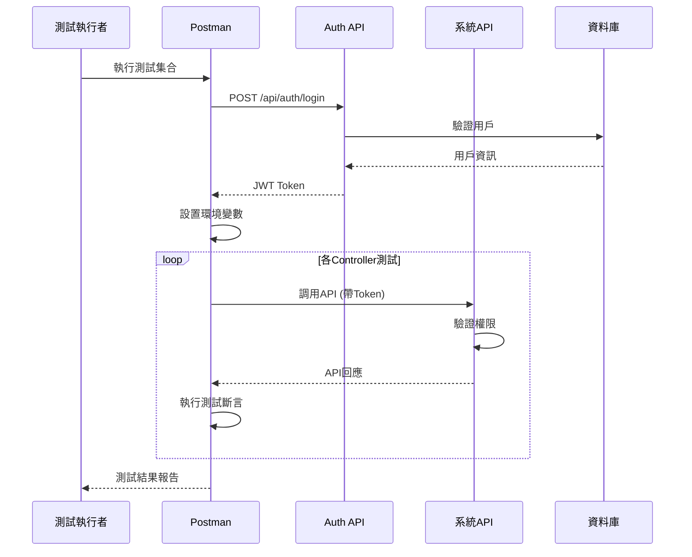
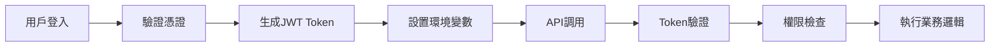
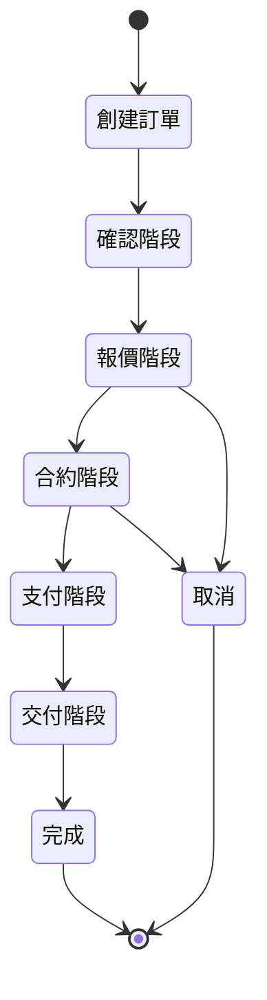
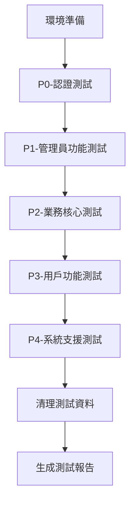

# API測試規格文件 (API Testing Specification)

## 📋 **專案概述**

### 專案資訊
- **專案名稱**: Case Manager AI Chat - API測試計畫
- **測試工具**: Postman
- **測試範圍**: 完整覆蓋所有30個Controller的基本CRUD功能測試
- **測試策略**: 以Controller為單位組織測試集合

### 系統架構
- **後端框架**: Spring Boot 3.x
- **認證機制**: JWT (2小時有效期)
- **資料庫**: MySQL (162.43.92.30:3307/project)
- **API設計**: RESTful架構
- **權限控制**: 角色基礎授權 (RBAC)

## 🏗️ **測試架構設計**

### 測試集合組織架構

```mermaid
graph TB
    A[API測試集合] --> B[P0-核心認證群組]
    A --> C[P1-管理員功能群組]
    A --> D[P2-業務核心群組]
    A --> E[P3-用戶功能群組]
    A --> F[P4-系統支援群組]
    
    B --> B1[AuthController<br/>8個端點]
    
    C --> C1[AdminUserController<br/>12個端點]
    C --> C2[AdminOrderController<br/>3個端點]
    C --> C3[AdminCommissionController<br/>3個端點]
    C --> C4[AdminCertificationController<br/>2個端點]
    C --> C5[AdminRevenueShareController<br/>管理端點]
    C --> C6[AdminUpgradeController<br/>1個端點]
    C --> C7[AdminInvitationController<br/>2個端點]
    C --> C8[RoleController<br/>角色管理]
    
    D --> D1[OrderController<br/>25+個端點]
    D --> D2[OrderTemplateController<br/>範本管理]
    D --> D3[IndustryController<br/>9個端點]
    D --> D4[PaymentController<br/>支付處理]
    D --> D5[RevenueShareController<br/>收益分享]
    
    E --> E1[UserDataController<br/>15個端點]
    E --> E2[CertificationController<br/>認證申請]
    E --> E3[ShowcaseController<br/>作品展示]
    E --> E4[UserChatController<br/>聊天功能]
    E --> E5[FavouriteController<br/>收藏功能]
    
    F --> F1[LocationController<br/>地區管理]
    F --> F2[CurrencyController<br/>貨幣管理]
    F --> F3[SysListItemController<br/>系統清單]
    F --> F4[FileUploadController<br/>檔案上傳]
    F --> F5[RankingController<br/>排名系統]
```



### 測試執行流程



## 🔐 **認證與權限系統**

### JWT認證流程



### 角色權限矩陣

| 角色 | 權限範圍 | 主要功能 |
|------|----------|----------|
| `ROLE_ADMIN` | 系統管理員 | 完整系統管理權限 |
| `ROLE_USER` | 一般用戶 | 基本用戶功能 |
| `ROLE_SUPER_ADMIN` | 超級管理員 | 最高權限 |
| `ROLE_UPGRADE_MANAGE` | 升級管理 | 用戶升級管理 |
| `ROLE_ORDER_MANAGE` | 訂單管理 | 訂單相關管理 |
| `ROLE_COMMISSION_MANAGE` | 佣金管理 | 佣金系統管理 |
| `ROLE_CERTIFICATION_MANAGE` | 認證管理 | 認證審核管理 |
| `ROLE_INVITE_MANAGE` | 邀請管理 | 邀請系統管理 |

## 📝 **Controller詳細測試規格**

### P0-核心認證群組

#### AuthController (/api/auth)
**優先級**: P0 (最高)
**測試端點**: 8個

| HTTP方法 | 端點 | 功能描述 | 測試重點 |
|----------|------|----------|----------|
| POST | `/login` | 用戶登入 | 憑證驗證、Token生成 |
| POST | `/register` | 用戶註冊 | 帳戶創建、自動登入 |
| POST | `/forgetpassword` | 忘記密碼 | 郵件發送、驗證碼生成 |
| POST | `/resetpassword` | 重設密碼 | 驗證碼驗證、密碼更新 |
| GET | `/parse` | 解析Token | Token解析、資訊提取 |
| GET | `/isexpired` | 檢查過期 | Token有效性驗證 |
| PUT | `/verifyemail` | 郵件驗證 | 驗證碼確認 |
| PUT | `/resendverifycode` | 重發驗證碼 | 驗證碼重新發送 |

**測試資料準備**:
```json
{
  "validUser": {
    "username": "testuser",
    "password": "password123"
  },
  "invalidUser": {
    "username": "invalid",
    "password": "wrong"
  }
}
```

### P1-管理員功能群組

#### AdminUserController (/api/admin/users)
**優先級**: P1
**權限要求**: `@PreAuthorize("hasRole('ADMIN')")`
**測試端點**: 12個

| HTTP方法 | 端點 | 功能描述 | 測試重點 |
|----------|------|----------|----------|
| GET | `/` | 獲取用戶列表 | 分頁、排序 |
| POST | `/` | 創建用戶 | 用戶創建、角色分配 |
| PUT | `/{userId}` | 更新用戶 | 資料更新、權限變更 |
| DELETE | `/{userId}` | 刪除用戶 | 軟刪除、關聯處理 |
| PUT | `/{userId}/move-up` | 上移用戶 | 排序調整 |
| PUT | `/{userId}/move-down` | 下移用戶 | 排序調整 |
| PUT | `/batch-order` | 批次排序 | 批次操作 |
| GET | `/{userId}/industry-scopes` | 產業權限 | 權限查詢 |
| GET | `/{userId}/industry-scopes/role/{roleName}` | 角色產業權限 | 角色權限查詢 |
| PUT | `/{userId}/enable` | 啟用/停用 | 狀態切換 |
| PUT | `/{userId}/reset-password` | 重設密碼 | 管理員重設 |

### P2-業務核心群組

#### OrderController (/api/orders)
**優先級**: P1
**測試端點**: 25+個

**訂單生命週期測試**:


| 階段 | 端點 | HTTP方法 | 測試重點 |
|------|------|----------|----------|
| 創建 | `/` | POST | 從範本創建訂單 |
| 查詢 | `/{base62no}` | GET | 訂單詳情查詢 |
| 確認 | `/confirmation/{bid}/select/{iid}` | PATCH | 確認項目選擇 |
| 報價 | `/{base62no}/sendquote` | POST | 發送報價 |
| 報價 | `/{base62no}/acceptquote` | POST | 接受報價 |
| 合約 | `/contract/{cId}/clientsign` | POST | 客戶簽署 |
| 合約 | `/contract/{cId}/providersign` | POST | 提供者簽署 |
| 支付 | `/payment/{pId}/pay` | PATCH | 處理支付 |
| 交付 | `/{base62no}/deliveries` | GET | 交付項目 |
| 完成 | `/{base62no}/complete` | PATCH | 完成訂單 |

#### IndustryController (/api/industries)
**優先級**: P2
**測試端點**: 9個

| HTTP方法 | 端點 | 功能描述 | 測試重點 |
|----------|------|----------|----------|
| GET | `/` | 產業列表 | 階層結構 |
| GET | `/{id}` | 產業詳情 | 詳細資訊 |
| POST | `/` | 創建產業 | 階層創建 |
| PUT | `/{id}` | 更新產業 | 資料更新 |
| DELETE | `/{id}` | 刪除產業 | 級聯刪除 |
| GET | `/type/{type}` | 系統清單項目 | 類型過濾 |
| GET | `/{parentIndustry}/ordertemplates` | 父產業範本 | 範本查詢 |
| GET | `/{parentIndustry}/{childIndustry}/ordertemplates` | 階層範本 | 階層查詢 |
| GET | `/{name}/subindustries` | 子產業 | 子項目查詢 |

### P3-用戶功能群組

#### UserDataController (/api/profile)
**優先級**: P2
**測試端點**: 15個

| HTTP方法 | 端點 | 功能描述 | 測試重點 |
|----------|------|----------|----------|
| GET | `/` | 當前用戶資料 | 個人資訊 |
| GET | `/roles` | 用戶角色 | 權限資訊 |
| PUT | `/changepassword` | 變更密碼 | 密碼安全 |
| PUT | `/changeusertype` | 變更用戶類型 | 類型切換 |
| PUT | `/personal` | 更新個人資料 | 個人資訊更新 |
| PUT | `/business` | 更新企業資料 | 企業資訊更新 |
| GET | `/intro/{uId}` | 用戶介紹 | 公開資訊 |
| POST | `/intro/title` | 更新介紹標題 | 標題更新 |
| POST | `/intro/content` | 更新介紹內容 | 內容更新 |
| POST | `/intro/video` | 上傳介紹影片 | 檔案上傳 |
| POST | `/intro/videourl` | 設置影片URL | URL設置 |
| POST | `/intro/signature` | 上傳簽名 | 簽名上傳 |
| POST | `/intro/paymentaccount` | 支付帳戶 | 帳戶設置 |
| POST | `/intro/receivingaccount` | 收款帳戶 | 帳戶設置 |

## 🧪 **測試資料設計**

### 環境變數配置

```json
{
  "baseUrl": "http://localhost:8080",
  "dbHost": "162.43.92.30:3307",
  "dbName": "project",
  "jwtSecret": "{{JWT_SECRET}}",
  "tokenExpiry": "2h"
}
```

### 測試用戶資料

```json
{
  "adminUser": {
    "username": "admin",
    "password": "admin123",
    "roles": ["ROLE_ADMIN"]
  },
  "normalUser": {
    "username": "user",
    "password": "user123",
    "roles": ["ROLE_USER"]
  },
  "providerUser": {
    "username": "provider",
    "password": "provider123",
    "roles": ["ROLE_USER"],
    "userType": "PROVIDER"
  }
}
```

### 測試資料模板

```json
{
  "industryData": {
    "name": "測試產業",
    "description": "測試用產業描述",
    "parentId": null
  },
  "orderData": {
    "templateId": 1,
    "clientId": 2,
    "providerId": 3,
    "description": "測試訂單"
  },
  "userProfileData": {
    "personal": {
      "firstName": "測試",
      "lastName": "用戶",
      "phone": "0912345678"
    },
    "business": {
      "companyName": "測試公司",
      "businessType": "服務業"
    }
  }
}
```

## 📊 **測試斷言設計**

### 通用測試斷言

```javascript
// 狀態碼檢查
pm.test("Status code is 200", function () {
    pm.response.to.have.status(200);
});

// 回應時間檢查
pm.test("Response time is less than 2000ms", function () {
    pm.expect(pm.response.responseTime).to.be.below(2000);
});

// JSON格式檢查
pm.test("Response is JSON", function () {
    pm.response.to.be.json;
});

// 必要欄位檢查
pm.test("Response has required fields", function () {
    const jsonData = pm.response.json();
    pm.expect(jsonData).to.have.property('data');
    pm.expect(jsonData).to.have.property('message');
});
```

### 認證相關斷言

```javascript
// Token格式檢查
pm.test("Token is valid JWT format", function () {
    const jsonData = pm.response.json();
    const token = jsonData.token;
    pm.expect(token).to.match(/^[A-Za-z0-9-_]+\.[A-Za-z0-9-_]+\.[A-Za-z0-9-_]+$/);
});

// 設置環境變數
pm.test("Set auth token", function () {
    const jsonData = pm.response.json();
    pm.environment.set("authToken", jsonData.token);
    pm.environment.set("userId", jsonData.userId);
});
```

### CRUD操作斷言

```javascript
// 創建操作
pm.test("Create operation successful", function () {
    pm.response.to.have.status(201);
    const jsonData = pm.response.json();
    pm.expect(jsonData).to.have.property('id');
    pm.environment.set("createdId", jsonData.id);
});

// 讀取操作
pm.test("Read operation successful", function () {
    pm.response.to.have.status(200);
    const jsonData = pm.response.json();
    pm.expect(jsonData).to.be.an('object');
});

// 更新操作
pm.test("Update operation successful", function () {
    pm.response.to.have.status(200);
    const jsonData = pm.response.json();
    pm.expect(jsonData.updatedAt).to.exist;
});

// 刪除操作
pm.test("Delete operation successful", function () {
    pm.response.to.have.status(204);
});
```

## 🔄 **測試執行策略**

### 測試執行順序



### 前置腳本 (Pre-request Script)

```javascript
// 自動獲取認證Token
if (!pm.environment.get("authToken")) {
    pm.sendRequest({
        url: pm.environment.get("baseUrl") + "/api/auth/login",
        method: 'POST',
        header: {
            'Content-Type': 'application/json',
        },
        body: {
            mode: 'raw',
            raw: JSON.stringify({
                username: pm.environment.get("testUsername"),
                password: pm.environment.get("testPassword")
            })
        }
    }, function (err, response) {
        if (response.code === 200) {
            const jsonData = response.json();
            pm.environment.set("authToken", jsonData.token);
        }
    });
}
```

### 後置腳本 (Post-response Script)

```javascript
// 錯誤處理
if (pm.response.code >= 400) {
    console.log("Error Response:", pm.response.text());
}

// 測試資料清理
if (pm.info.requestName.includes("Delete")) {
    pm.environment.unset("createdId");
}

// 測試結果記錄
const testResults = {
    requestName: pm.info.requestName,
    status: pm.response.code,
    responseTime: pm.response.responseTime,
    timestamp: new Date().toISOString()
};
console.log("Test Result:", JSON.stringify(testResults));
```

## 📈 **測試報告與監控**

### 測試覆蓋率目標

| 測試類型 | 目標覆蓋率 | 說明 |
|----------|------------|------|
| API端點覆蓋 | 100% | 所有30個Controller的端點 |
| HTTP方法覆蓋 | 100% | GET, POST, PUT, PATCH, DELETE |
| 權限測試覆蓋 | 100% | 所有權限註解的端點 |
| 錯誤情境覆蓋 | 80% | 主要錯誤情境 |

### 效能基準

| 指標 | 目標值 | 說明 |
|------|--------|------|
| 回應時間 | < 2秒 | 95%的API調用 |
| 併發處理 | 100 TPS | 每秒交易數 |
| 錯誤率 | < 1% | 系統錯誤率 |
| 可用性 | 99.9% | 系統可用性 |

## 🛠️ **工具與技術規格**

### Postman集合結構

```
Case-Manager-API-Tests/
├── P0-Authentication/
│   ├── Login
│   ├── Register
│   ├── Password-Management
│   └── Token-Operations
├── P1-Admin-Functions/
│   ├── User-Management
│   ├── Role-Management
│   └── Permission-Management
├── P2-Business-Core/
│   ├── Order-Management
│   ├── Industry-Management
│   └── Payment-Processing
├── P3-User-Functions/
│   ├── Profile-Management
│   ├── Certification
│   └── Showcase
└── P4-System-Support/
    ├── File-Upload
    ├── Location-Management
    └── System-Lists
```

### 環境配置檔案

```json
{
  "id": "case-manager-api-test-env",
  "name": "Case Manager API Test Environment",
  "values": [
    {
      "key": "baseUrl",
      "value": "http://localhost:8080",
      "enabled": true
    },
    {
      "key": "testUsername",
      "value": "testuser",
      "enabled": true
    },
    {
      "key": "testPassword",
      "value": "password123",
      "enabled": true
    },
    {
      "key": "authToken",
      "value": "",
      "enabled": true
    }
  ]
}
```

## 📋 **實施檢查清單**

### 準備階段
- [ ] 確認測試環境可用性
- [ ] 準備測試資料
- [ ] 配置Postman環境
- [ ] 建立測試用戶帳戶

### 實施階段
- [ ] 建立P0認證測試集合
- [ ] 建立P1管理員功能測試集合
- [ ] 建立P2業務核心測試集合
- [ ] 建立P3用戶功能測試集合
- [ ] 建立P4系統支援測試集合

### 驗證階段
- [ ] 執行完整測試套件
- [ ] 驗證測試覆蓋率
- [ ] 檢查測試結果
- [ ] 生成測試報告

### 維護階段
- [ ] 定期更新測試資料
- [ ] 監控API變更
- [ ] 更新測試腳本
- [ ] 優化測試效能

---

**文件版本**: v1.0  
**建立日期**: 2025-01-15  
**最後更新**: 2025-01-15  
**負責人**: API測試團隊