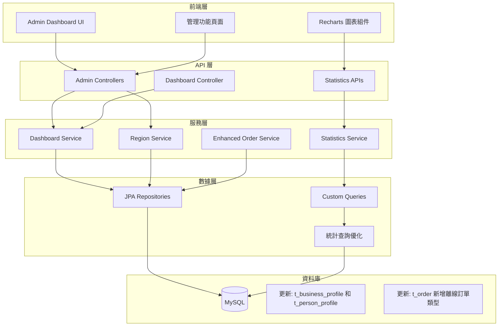

# 管理員功能開發計畫

## 一、現況分析

### 已實現功能
1. **使用者管理** (AdminUserController) 
   - 完整的 CRUD 功能
   - 基於地區的權限過濾
   - 角色和產業範圍管理

2. **認證管理** (AdminCertificationController)
   - 列表查詢（含地區過濾）
   - 狀態更新、評分和評論功能

3. **佣金管理** (AdminCommissionController)
   - 基於地區的佣金記錄查詢

4. **訂單管理** (AdminOrderController)
   - 基本的列表查詢功能
   - 地區過濾機制

5. **RBAC 權限系統**
   - 完整的角色權限管理
   - 產業範圍控制 (AdminRoleIndustryScope)

### 待開發功能
1. Admin Dashboard（管理員儀表板）
2. 統計圖表數據 API
3. 地區與地點管理
4. 產業管理的權限控制增強
5. 離線訂單區分和管理

## 二、開發優先順序

基於功能的重要性和相依性，建議開發順序如下：

1. **第一階段：基礎功能完善**
   - Profile 實體新增 region 和 location 欄位
   - 更新查詢邏輯支援地區過濾
   - 離線訂單功能（訂單管理的完善）

2. **第二階段：數據統計基礎**
   - 統計數據 Service 層
   - Dashboard 數據 API

3. **第三階段：儀表板實現**
   - Admin Dashboard 完整功能
   - 圖表整合

4. **第四階段：功能增強**
   - 產業管理權限控制

## 三、詳細開發步驟

### 1. Profile 實體地區欄位支援

由於 Region 和 Location 由前端管理和設定，後端只需在 BusinessProfile 和 PersonProfile 實體中新增字串欄位來儲存這些資訊。個人和企業可能會有不同的地區和地點設定。

#### 1.1 資料庫更新
```sql
-- 更新 BusinessProfile 表格
ALTER TABLE t_business_profile ADD COLUMN region VARCHAR(100);
ALTER TABLE t_business_profile ADD COLUMN location VARCHAR(200);

-- 更新 PersonProfile 表格
ALTER TABLE t_person_profile ADD COLUMN region VARCHAR(100);
ALTER TABLE t_person_profile ADD COLUMN location VARCHAR(200);
```

#### 1.2 Entity 更新
需要更新以下實體：
- **BusinessProfile.java**
  - 新增 region 欄位（地區）
  - 新增 location 欄位（具體地點）
  
- **PersonProfile.java**
  - 新增 region 欄位（地區）
  - 新增 location 欄位（具體地點）

#### 1.3 Service 層調整
- **ProfileService** 需要支援基於 region 和 location 的查詢過濾
- **UserService** 在查詢用戶時可透過關聯的 Profile 進行地區過濾
- **AdminUserController** 需要調整查詢邏輯，根據 Profile 的 region 過濾

#### 1.4 前端整合
- 前端負責管理完整的地區/地點清單和階層結構
- 在用戶註冊或更新 Profile 時，前端提供地區和地點選項
- 後端接收並儲存這些字串值
- 管理員查詢時可根據 region 進行過濾

### 2. 離線訂單管理功能

#### 2.1 擴展 OrderType 枚舉
```java
public enum OrderType {
    PROMOTED,     // 推廣訂單
    DIRECT,       // 直接訂單
    OFFLINE,      // 離線訂單
    PLATFORM      // 平台訂單
}
```

#### 2.2 訂單 Service 層增強
- 新增離線訂單創建方法
- 離線訂單專屬查詢接口
- 離線訂單統計功能

#### 2.3 API 擴展
```
POST   /api/admin/orders/offline       # 創建離線訂單
GET    /api/admin/orders/offline       # 查詢離線訂單
GET    /api/admin/orders/stats/type    # 按類型統計訂單
```

### 3. Dashboard 統計 API

#### 3.1 統計 Service 設計
```java
// DashboardService.java
public interface DashboardService {
    // 總覽統計（基於 Profile 的 region 過濾）
    DashboardOverviewDTO getOverview(String region, LocalDate startDate, LocalDate endDate);
    
    // 訂單統計（透過用戶的 Profile region 過濾）
    OrderStatsDTO getOrderStats(String region, LocalDate startDate, LocalDate endDate);
    
    // 用戶統計（直接從 Profile 查詢）
    UserStatsDTO getUserStats(String region, LocalDate startDate, LocalDate endDate);
    
    // 收入統計（基於訂單關聯的用戶 Profile）
    RevenueStatsDTO getRevenueStats(String region, LocalDate startDate, LocalDate endDate);
    
    // 認證統計（基於申請人的 Profile region）
    CertificationStatsDTO getCertificationStats(String region, LocalDate startDate, LocalDate endDate);
}
```

#### 3.2 統計數據 DTO
```java
// 儀表板總覽
public class DashboardOverviewDTO {
    private Long totalUsers;
    private Long activeUsers;
    private Long totalOrders;
    private BigDecimal totalRevenue;
    private Double growthRate;
    // getters/setters
}

// 訂單統計（用於圖表）
public class OrderStatsDTO {
    private List<OrderCountByDate> dailyOrders;
    private Map<String, Long> ordersByType;
    private Map<String, Long> ordersByStatus;
    private List<TopProviderDTO> topProviders;
    // getters/setters
}
```

#### 3.3 API 端點
```
# Dashboard API
GET /api/admin/dashboard/overview
GET /api/admin/dashboard/orders/stats
GET /api/admin/dashboard/orders/chart    # Recharts 數據
GET /api/admin/dashboard/users/stats
GET /api/admin/dashboard/users/chart     # Recharts 數據
GET /api/admin/dashboard/revenue/stats
GET /api/admin/dashboard/revenue/chart   # Recharts 數據
```

### 4. Admin Dashboard 實現

#### 4.1 主要組件
1. **總覽卡片**
   - 用戶總數
   - 活躍用戶數
   - 訂單總數
   - 總收入

2. **圖表區域**
   - 訂單趨勢圖（折線圖）
   - 訂單類型分佈（餅圖）
   - 收入趨勢圖（面積圖）
   - 用戶增長圖（柱狀圖）

3. **數據表格**
   - 最新訂單列表
   - Top 服務提供者
   - 待處理認證

#### 4.2 Controller 實現
```java
@RestController
@RequestMapping("/api/admin/dashboard")
@Tag(name = "Admin Dashboard", description = "管理員儀表板 API")
public class AdminDashboardController {
    
    @GetMapping("/overview")
    @Secured("ROLE_DASHBOARD_VIEW")
    public ResponseEntity<DashboardOverviewDTO> getOverview(
        @RequestParam(required = false) String region,
        @RequestParam(required = false) @DateTimeFormat(iso = DateTimeFormat.ISO.DATE) LocalDate startDate,
        @RequestParam(required = false) @DateTimeFormat(iso = DateTimeFormat.ISO.DATE) LocalDate endDate
    ) {
        // 實現
    }
}
```

### 5. 產業管理權限增強

#### 5.1 IndustryController 權限改造
```java
@RestController
@RequestMapping("/api/admin/industries")
@Tag(name = "Admin Industry Management")
public class AdminIndustryController {
    
    @PostMapping
    @Secured("ROLE_INDUSTRY_MANAGE")
    public ResponseEntity<IndustryResponse> create(@RequestBody IndustryRequest request) {
        // 檢查管理員的產業管理範圍
    }
    
    @PutMapping("/{id}")
    @Secured("ROLE_INDUSTRY_MANAGE")
    public ResponseEntity<IndustryResponse> update(
        @PathVariable Long id,
        @RequestBody IndustryRequest request
    ) {
        // 檢查管理員是否有權管理此產業
    }
}
```

## 四、技術架構圖



## 五、時程評估

### 第一階段（1.5週）
- **Week 1**: Profile 地區欄位支援
  - Day 1: BusinessProfile 和 PersonProfile 實體更新
  - Day 2: 資料庫 migration 腳本
  - Day 3: Service 層更新支援地區過濾
  - Day 4-5: 管理員查詢 API 調整

- **Week 2 (前3天)**: 離線訂單功能
  - Day 1: OrderType 擴展和資料庫更新
  - Day 2: Service 層功能增強
  - Day 3: API 開發和測試

### 第二階段（2週）
- **Week 3**: 統計服務基礎
  - Day 1-3: DashboardService 實現
  - Day 4-5: 統計查詢優化

- **Week 4**: Dashboard API 開發
  - Day 1-3: 各類統計 API 實現
  - Day 4-5: Recharts 數據格式調整

### 第三階段（1週）
- **Week 5**: Dashboard 整合
  - Day 1-2: Controller 完整實現
  - Day 3-4: 權限和地區過濾測試
  - Day 5: 性能優化

### 第四階段（3天）
- **Day 1-2**: 產業管理權限增強
- **Day 3**: 整體測試和文檔

**總計時程：約 5 週**

## 六、前端整合考量

### Recharts 數據格式範例
```javascript
// 折線圖數據
{
  "data": [
    { "date": "2024-01-01", "orders": 45, "revenue": 12500 },
    { "date": "2024-01-02", "orders": 52, "revenue": 14200 },
    // ...
  ],
  "xAxisKey": "date",
  "lines": [
    { "dataKey": "orders", "name": "訂單數", "color": "#8884d8" },
    { "dataKey": "revenue", "name": "收入", "color": "#82ca9d" }
  ]
}

// 餅圖數據
{
  "data": [
    { "name": "推廣訂單", "value": 400, "color": "#0088FE" },
    { "name": "直接訂單", "value": 300, "color": "#00C49F" },
    { "name": "離線訂單", "value": 200, "color": "#FFBB28" }
  ]
}
```

## 七、注意事項

1. **權限控制**：所有新 API 都需要適當的 @Secured 註解
2. **地區過濾**：
   - Dashboard 數據需要根據管理員權限自動過濾
   - 查詢時需要 JOIN Profile 表格來獲取 region 資訊
   - 考慮為 region 欄位建立索引以提升查詢效能
3. **Profile 關聯**：
   - BusinessProfile 和 PersonProfile 的 region 可能不同
   - 查詢邏輯需要考慮用戶類型（個人/企業）
4. **性能優化**：統計查詢建議使用資料庫索引和快取
5. **數據一致性**：離線訂單創建需要考慮與現有訂單流程的整合
6. **向後兼容**：OrderType 枚舉更新需要處理現有數據

## 八、成功指標

1. Dashboard 頁面載入時間 < 2秒
2. 統計數據準確率 100%
3. 所有 API 都有完整的權限控制
4. 支援多地區數據隔離
5. 前端圖表渲染流暢