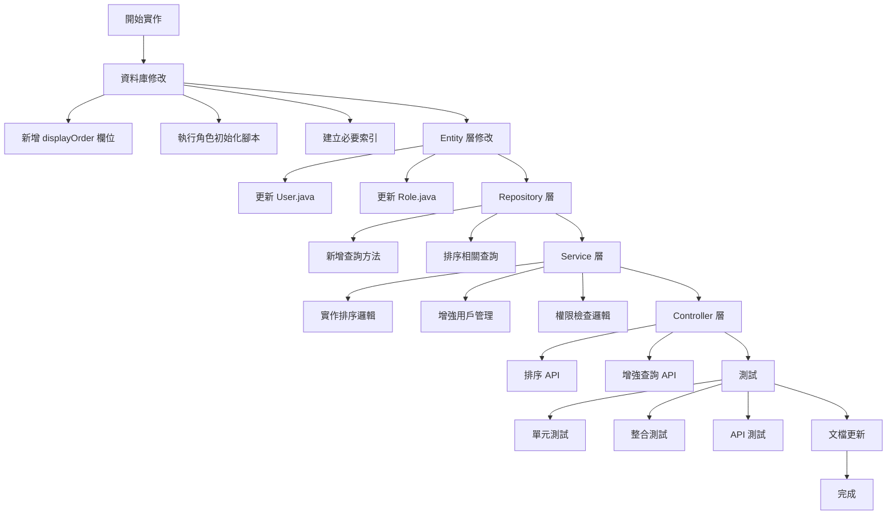

# Admin User 管理功能 - 後端完整實作計畫

## 一、專案概述

本計畫旨在完善 Admin User 管理功能的後端實作，補充現有系統缺失的功能，確保滿足所有業務需求。

### 1.1 現有功能分析

**已實現功能：**
- ✅ 創建用戶 API (`POST /api/admin/users`)
- ✅ 更新用戶 API (`PUT /api/admin/users/{userId}`)
- ✅ 刪除用戶 API (`DELETE /api/admin/users/{userId}`)
- ✅ 列出所有用戶 API (`GET /api/admin/users`)
- ✅ 角色產業範圍設定機制

**缺失功能：**
- ✅ 用戶排序功能（displayOrder）- **已完成**
- ✅ moveUp/moveDown API - **已完成**
- ✅ 細化的角色權限定義 - **已完成**
- ✅ 產業範圍查詢 API - **已完成**

### 1.2 實作進度追蹤

**已完成項目（2025/1/16）：**
- ✅ User 實體新增 displayOrder 欄位
- ✅ Role 實體新增 description 欄位
- ✅ 創建 UserOrderRequest 和 UserBatchOrderRequest 請求物件
- ✅ 創建 AdminRoleIndustryScopeResponse 響應物件
- ✅ 創建 AdminRoleIndustryScopeConverter 轉換器
- ✅ 更新 UserRepository，新增排序相關查詢方法
- ✅ 更新 AdminRoleIndustryScopeRepository，新增查詢方法
- ✅ 創建 AdminUserService 介面
- ✅ 創建 AdminUserServiceImpl 實作類
- ✅ 創建 AdminUserController，包含所有所需的 API 端點
- ✅ 創建 IndustryScopeSecurityUtil 工具類

**待完成項目：**
- ⏳ 資料庫遷移腳本執行（等待 JPA 自動更新）
- ⏳ 角色初始化 SQL 腳本
- ⏳ 單元測試撰寫
- ⏳ 整合測試撰寫
- ⏳ API 文檔更新
- ⏳ Postman Collection 更新

## 二、實作範圍

### 2.1 資料庫層面修改

#### A. User 實體新增欄位
```java
// 檔案: src/main/java/com/casemgr/entity/User.java

@Column(name = "DISPLAY_ORDER", nullable = false)
private Integer displayOrder = 0;

// 新增 getter/setter
public Integer getDisplayOrder() {
    return displayOrder;
}

public void setDisplayOrder(Integer displayOrder) {
    this.displayOrder = displayOrder;
}
```

#### B. 資料庫遷移腳本
```sql
-- 新增 displayOrder 欄位
ALTER TABLE T_USER ADD COLUMN DISPLAY_ORDER INT DEFAULT 0 NOT NULL;

-- 初始化現有用戶的排序值
UPDATE T_USER 
SET DISPLAY_ORDER = ID 
WHERE DISPLAY_ORDER = 0;

-- 建立索引以優化排序查詢
CREATE INDEX idx_user_display_order ON T_USER(DISPLAY_ORDER);
```

### 2.2 角色權限細化

#### A. 新增角色定義
```sql
-- 新增細化的角色
INSERT INTO T_ROLE (ROLENAME, ENABLED, CREATED_BY, CREATED_DATE) VALUES
('ROLE_USER_MANAGE', true, 'SYSTEM', NOW()),           -- 管理用戶
('ROLE_PROMOTED_ORDER_MANAGE', true, 'SYSTEM', NOW()), -- 管理推廣訂單
('ROLE_DIRECT_ORDER_MANAGE', true, 'SYSTEM', NOW()),   -- 管理直接訂單
('ROLE_CERTIFICATION_MANAGE', true, 'SYSTEM', NOW());  -- 管理認證
```

#### B. 角色描述更新
```java
// 檔案: src/main/java/com/casemgr/entity/Role.java

@Column(name = "DESCRIPTION", length = 200)
private String description;

// 新增相關的 getter/setter
public String getDescription() {
    return description;
}

public void setDescription(String description) {
    this.description = description;
}
```

### 2.3 API 端點實作

#### A. 用戶排序 API

##### 1. 請求/響應物件定義
```java
// 檔案: src/main/java/com/casemgr/request/UserOrderRequest.java
package com.casemgr.request;

import lombok.Data;
import jakarta.validation.constraints.NotNull;

@Data
public class UserOrderRequest {
    @NotNull(message = "User ID cannot be null")
    private Long userId;
    
    @NotNull(message = "Display order cannot be null")
    private Integer displayOrder;
}

// 檔案: src/main/java/com/casemgr/request/UserBatchOrderRequest.java
package com.casemgr.request;

import lombok.Data;
import jakarta.validation.Valid;
import jakarta.validation.constraints.NotEmpty;
import java.util.List;

@Data
public class UserBatchOrderRequest {
    @NotEmpty(message = "Order list cannot be empty")
    @Valid
    private List<UserOrderRequest> orders;
}
```

##### 2. Controller 端點
```java
// 新增到: src/main/java/com/casemgr/controller/AdminUserController.java

@Operation(summary = "Update users display order", 
           description = "Batch update display order for multiple users")
@PutMapping("/users/reorder")
public ResponseEntity<?> reorderUsers(
        @Valid @RequestBody UserBatchOrderRequest orderRequest) {
    try {
        userService.updateUsersDisplayOrder(orderRequest.getOrders());
        return ResponseEntity.ok()
            .body("User display order updated successfully");
    } catch (Exception e) {
        return ResponseEntity.status(HttpStatus.INTERNAL_SERVER_ERROR)
            .body("Error updating user order: " + e.getMessage());
    }
}

@Operation(summary = "Move user up in order", 
           description = "Move user one position up in display order")
@PutMapping("/users/{userId}/move-up")
public ResponseEntity<?> moveUserUp(@PathVariable Long userId) {
    try {
        userService.moveUserUp(userId);
        return ResponseEntity.ok()
            .body("User moved up successfully");
    } catch (Exception e) {
        return ResponseEntity.status(HttpStatus.BAD_REQUEST)
            .body("Error moving user: " + e.getMessage());
    }
}

@Operation(summary = "Move user down in order", 
           description = "Move user one position down in display order")
@PutMapping("/users/{userId}/move-down")
public ResponseEntity<?> moveUserDown(@PathVariable Long userId) {
    try {
        userService.moveUserDown(userId);
        return ResponseEntity.ok()
            .body("User moved down successfully");
    } catch (Exception e) {
        return ResponseEntity.status(HttpStatus.BAD_REQUEST)
            .body("Error moving user: " + e.getMessage());
    }
}
```

##### 3. Service 層實作
```java
// 新增到: src/main/java/com/casemgr/service/impl/UserServiceImpl.java

@Transactional
public void updateUsersDisplayOrder(List<UserOrderRequest> orderRequests) {
    for (UserOrderRequest request : orderRequests) {
        User user = userRepository.findById(request.getUserId())
            .orElseThrow(() -> new EntityNotFoundException(
                "User not found with id: " + request.getUserId()));
        user.setDisplayOrder(request.getDisplayOrder());
        userRepository.save(user);
    }
}

@Transactional
public void moveUserUp(Long userId) {
    User currentUser = userRepository.findById(userId)
        .orElseThrow(() -> new EntityNotFoundException(
            "User not found with id: " + userId));
    
    // 找到上一個用戶（displayOrder 較小的）
    User previousUser = userRepository
        .findTopByDisplayOrderLessThanOrderByDisplayOrderDesc(
            currentUser.getDisplayOrder())
        .orElseThrow(() -> new IllegalStateException(
            "User is already at the top"));
    
    // 交換排序值
    Integer tempOrder = currentUser.getDisplayOrder();
    currentUser.setDisplayOrder(previousUser.getDisplayOrder());
    previousUser.setDisplayOrder(tempOrder);
    
    userRepository.save(currentUser);
    userRepository.save(previousUser);
}

@Transactional
public void moveUserDown(Long userId) {
    User currentUser = userRepository.findById(userId)
        .orElseThrow(() -> new EntityNotFoundException(
            "User not found with id: " + userId));
    
    // 找到下一個用戶（displayOrder 較大的）
    User nextUser = userRepository
        .findTopByDisplayOrderGreaterThanOrderByDisplayOrderAsc(
            currentUser.getDisplayOrder())
        .orElseThrow(() -> new IllegalStateException(
            "User is already at the bottom"));
    
    // 交換排序值
    Integer tempOrder = currentUser.getDisplayOrder();
    currentUser.setDisplayOrder(nextUser.getDisplayOrder());
    nextUser.setDisplayOrder(tempOrder);
    
    userRepository.save(currentUser);
    userRepository.save(nextUser);
}
```

##### 4. Repository 方法
```java
// 新增到: src/main/java/com/casemgr/repository/UserRepository.java

Optional<User> findTopByDisplayOrderLessThanOrderByDisplayOrderDesc(
    Integer displayOrder);

Optional<User> findTopByDisplayOrderGreaterThanOrderByDisplayOrderAsc(
    Integer displayOrder);

List<User> findAllByOrderByDisplayOrderAsc();

@Query("SELECT MAX(u.displayOrder) FROM User u")
Optional<Integer> findMaxDisplayOrder();
```

#### B. 增強的用戶列表 API

修改現有的 `GET /api/admin/users` 端點，確保返回按 displayOrder 排序的結果：

```java
// 修改: src/main/java/com/casemgr/controller/AdminUserController.java

@Operation(summary = "All user", 
           description = "Get all user(include details) ordered by display order")
@GetMapping("/users")
public ResponseEntity<List<UserResponse>> listAllUser() {
    List<User> users = userService.getAllUsersOrderedByDisplay();
    List<UserResponse> responses = users.stream()
        .map(UserConverter.INSTANCT::entityToResponse)
        .collect(Collectors.toList());
    return ResponseEntity.ok(responses);
}
```

```java
// 新增到: src/main/java/com/casemgr/service/impl/UserServiceImpl.java

public List<User> getAllUsersOrderedByDisplay() {
    return userRepository.findAllByOrderByDisplayOrderAsc();
}
```

### 2.4 角色產業範圍查詢增強

#### A. 新增查詢端點
```java
// 新增到: src/main/java/com/casemgr/controller/AdminUserController.java

@Operation(summary = "Get user industry scopes", 
           description = "Get all industry scopes for a specific user")
@GetMapping("/users/{userId}/industry-scopes")
public ResponseEntity<List<AdminRoleIndustryScopeResponse>> 
    getUserIndustryScopes(@PathVariable Long userId) {
    List<AdminRoleIndustryScope> scopes = 
        userService.getUserIndustryScopes(userId);
    List<AdminRoleIndustryScopeResponse> responses = scopes.stream()
        .map(AdminRoleIndustryScopeConverter.INSTANCE::toResponse)
        .collect(Collectors.toList());
    return ResponseEntity.ok(responses);
}
```

#### B. Response 物件
```java
// 檔案: src/main/java/com/casemgr/response/AdminRoleIndustryScopeResponse.java
package com.casemgr.response;

import lombok.Data;

@Data
public class AdminRoleIndustryScopeResponse {
    private Long id;
    private String roleName;
    private Boolean isAllIndustries;
    private Long industryId;
    private String industryName;
}
#### C. Converter 實作
```java
// 檔案: src/main/java/com/casemgr/converter/AdminRoleIndustryScopeConverter.java
package com.casemgr.converter;

import org.mapstruct.Mapper;
import org.mapstruct.Mapping;
import org.mapstruct.factory.Mappers;
import com.casemgr.entity.AdminRoleIndustryScope;
import com.casemgr.response.AdminRoleIndustryScopeResponse;

@Mapper
public interface AdminRoleIndustryScopeConverter {
    AdminRoleIndustryScopeConverter INSTANCE = 
        Mappers.getMapper(AdminRoleIndustryScopeConverter.class);
    
    @Mapping(source = "role.roleName", target = "roleName")
    @Mapping(source = "industry.id", target = "industryId")
    @Mapping(source = "industry.name", target = "industryName")
    AdminRoleIndustryScopeResponse toResponse(AdminRoleIndustryScope scope);
}
```

### 2.5 資料驗證增強

#### A. 用戶創建時的自動排序值設定
```java
// 修改: src/main/java/com/casemgr/service/impl/UserServiceImpl.java

public User createAdminUser(AdminUserCreateRequest createRequest) {
    // 現有的驗證和用戶創建代碼...
    
    // 設定排序值為最大值 + 1
    Integer maxOrder = userRepository.findMaxDisplayOrder()
        .orElse(0);
    user.setDisplayOrder(maxOrder + 1);
    
    // 保存用戶和後續處理...
    return user;
}
```

### 2.6 權限檢查機制

#### A. 產業範圍權限檢查工具類
```java
// 檔案: src/main/java/com/casemgr/security/IndustryScopeSecurityUtil.java
package com.casemgr.security;

import org.springframework.stereotype.Component;
import org.springframework.beans.factory.annotation.Autowired;
import com.casemgr.entity.User;
import com.casemgr.entity.AdminRoleIndustryScope;
import com.casemgr.repository.AdminRoleIndustryScopeRepository;
import java.util.List;

@Component
public class IndustryScopeSecurityUtil {
    
    @Autowired
    private AdminRoleIndustryScopeRepository scopeRepository;
    
    public boolean hasAccessToIndustry(User user, Long industryId, 
                                     String roleName) {
        List<AdminRoleIndustryScope> scopes = scopeRepository
            .findByUserAndRole_RoleName(user, roleName);
        
        for (AdminRoleIndustryScope scope : scopes) {
            if (scope.getIsAllIndustries()) {
                return true;
            }
            if (scope.getIndustry() != null && 
                scope.getIndustry().getId().equals(industryId)) {
                return true;
            }
        }
        return false;
    }
    
    public boolean hasAccessToAllIndustries(User user, String roleName) {
        List<AdminRoleIndustryScope> scopes = scopeRepository
            .findByUserAndRole_RoleName(user, roleName);
        
        return scopes.stream()
            .anyMatch(scope -> scope.getIsAllIndustries());
    }
}
```

#### B. Repository 查詢方法
```java
// 新增到: src/main/java/com/casemgr/repository/AdminRoleIndustryScopeRepository.java

List<AdminRoleIndustryScope> findByUserAndRole_RoleName(User user, String roleName);
List<AdminRoleIndustryScope> findByUser(User user);
```

#### C. Service 層新增方法
```java
// 新增到: src/main/java/com/casemgr/service/impl/UserServiceImpl.java

public List<AdminRoleIndustryScope> getUserIndustryScopes(Long userId) {
    User user = userRepository.findById(userId)
        .orElseThrow(() -> new EntityNotFoundException(
            "User not found with id: " + userId));
    return adminRoleIndustryScopeRepository.findByUser(user);
}
```

## 三、實作流程圖



## 四、API 端點總覽

| HTTP 方法 | 端點路徑 | 功能描述 | 新增/修改 |
|-----------|----------|----------|-----------|
| GET | `/api/admin/users` | 獲取所有用戶（按displayOrder排序） | 修改 |
| POST | `/api/admin/users` | 創建新用戶 | 已有 |
| PUT | `/api/admin/users/{userId}` | 更新現有用戶 | 已有 |
| DELETE | `/api/admin/users/{userId}` | 刪除用戶 | 已有 |
| PUT | `/api/admin/users/reorder` | 批量更新用戶排序 | 新增 |
| PUT | `/api/admin/users/{userId}/move-up` | 向上移動用戶 | 新增 |
| PUT | `/api/admin/users/{userId}/move-down` | 向下移動用戶 | 新增 |
| GET | `/api/admin/users/{userId}/industry-scopes` | 獲取用戶產業範圍 | 新增 |

## 五、測試計畫

### 5.1 單元測試案例

#### A. UserService 測試
```java
@Test
public void testCreateUserWithAutoDisplayOrder() {
    // 測試創建用戶時自動設定 displayOrder
    AdminUserCreateRequest request = new AdminUserCreateRequest();
    request.setUsername("testuser");
    request.setPassword("password123");
    request.setEmail("test@example.com");
    
    User createdUser = userService.createAdminUser(request);
    
    assertNotNull(createdUser.getDisplayOrder());
    assertTrue(createdUser.getDisplayOrder() > 0);
}

@Test
public void testMoveUserUp() {
    // 測試向上移動用戶
    Long userId = 2L;
    userService.moveUserUp(userId);
    
    User movedUser = userRepository.findById(userId).orElse(null);
    assertNotNull(movedUser);
    // 驗證排序值已改變
}

@Test
public void testMoveUserDown() {
    // 測試向下移動用戶
    Long userId = 1L;
    userService.moveUserDown(userId);
    
    User movedUser = userRepository.findById(userId).orElse(null);
    assertNotNull(movedUser);
    // 驗證排序值已改變
}
```

#### B. IndustryScopeSecurityUtil 測試
```java
@Test
public void testHasAccessToAllIndustries() {
    // 測試全產業訪問權限
    User user = createTestUser();
    String roleName = "ROLE_USER_MANAGE";
    
    boolean hasAccess = industryScopeUtil
        .hasAccessToAllIndustries(user, roleName);
    
    assertTrue(hasAccess);
}

@Test
public void testHasAccessToSpecificIndustry() {
    // 測試特定產業訪問權限
    User user = createTestUser();
    Long industryId = 1L;
    String roleName = "ROLE_ORDER_MANAGE";
    
    boolean hasAccess = industryScopeUtil
        .hasAccessToIndustry(user, industryId, roleName);
    
    assertTrue(hasAccess);
}
```

### 5.2 整合測試案例

1. **創建用戶流程測試**
   - 創建用戶
   - 驗證 displayOrder 自動設定
   - 驗證角色產業範圍儲存

2. **用戶排序測試**
   - 創建多個用戶
   - 測試移動操作
   - 驗證排序結果

3. **權限檢查測試**
   - 設定不同權限的用戶
   - 測試產業範圍訪問控制

### 5.3 API 測試 (Postman Collection)

```json
{
  "info": {
    "name": "Admin User Management API Tests",
    "description": "測試 Admin User 管理功能的所有 API"
  },
  "item": [
    {
      "name": "Get All Users (Ordered)",
      "request": {
        "method": "GET",
        "url": "{{baseUrl}}/api/admin/users",
        "headers": {
          "Authorization": "Bearer {{token}}"
        }
      }
    },
    {
      "name": "Move User Up",
      "request": {
        "method": "PUT",
        "url": "{{baseUrl}}/api/admin/users/{{userId}}/move-up",
        "headers": {
          "Authorization": "Bearer {{token}}"
        }
      }
    },
    {
      "name": "Move User Down",
      "request": {
        "method": "PUT",
        "url": "{{baseUrl}}/api/admin/users/{{userId}}/move-down",
        "headers": {
          "Authorization": "Bearer {{token}}"
        }
      }
    },
    {
      "name": "Batch Reorder Users",
      "request": {
        "method": "PUT",
        "url": "{{baseUrl}}/api/admin/users/reorder",
        "headers": {
          "Authorization": "Bearer {{token}}",
          "Content-Type": "application/json"
        },
        "body": {
          "mode": "raw",
          "raw": "{\n  \"orders\": [\n    {\"userId\": 1, \"displayOrder\": 1},\n    {\"userId\": 2, \"displayOrder\": 2},\n    {\"userId\": 3, \"displayOrder\": 3}\n  ]\n}"
        }
      }
    },
    {
      "name": "Get User Industry Scopes",
      "request": {
        "method": "GET",
        "url": "{{baseUrl}}/api/admin/users/{{userId}}/industry-scopes",
        "headers": {
          "Authorization": "Bearer {{token}}"
        }
      }
    }
  ]
}
```

## 六、風險評估與緩解措施

| 風險項目 | 影響程度 | 發生機率 | 緩解措施 |
|---------|---------|----------|---------|
| 資料庫遷移失敗 | 高 | 低 | 1. 準備回滾腳本<br>2. 先在測試環境驗證<br>3. 備份生產資料庫 |
| 排序值衝突 | 中 | 中 | 1. 實作唯一性檢查<br>2. 自動修復機制<br>3. 定期重新編號 |
| 效能影響 | 中 | 低 | 1. 新增資料庫索引<br>2. 實作分頁查詢<br>3. 快取常用查詢 |
| 權限檢查複雜度 | 低 | 中 | 1. 實作快取機制<br>2. 優化查詢邏輯<br>3. 定期效能測試 |
| 併發更新問題 | 中 | 低 | 1. 使用樂觀鎖<br>2. 事務隔離級別調整<br>3. 衝突重試機制 |

## 七、效能優化建議

### 7.1 資料庫優化
- 為 displayOrder 建立索引
- 使用批量更新減少資料庫交互
- 考慮使用快取儲存排序資訊

### 7.2 查詢優化
- 使用投影查詢減少資料傳輸
- 實作延遲載入避免 N+1 問題
- 對常用查詢實作結果快取

### 7.3 業務邏輯優化
- 批量操作代替單一操作
- 非同步處理大量更新
- 實作變更通知機制

## 八、未來擴展建議

1. **拖放排序支援**
   - 前端實作拖放介面
   - 後端支援批量更新優化

2. **排序策略擴展**
   - 支援按不同條件排序
   - 自定義排序規則

3. **權限模板**
   - 預定義權限組合
   - 快速套用權限模板

4. **審計日誌**
   - 記錄所有管理操作
   - 提供操作歷史查詢

## 九、實作時程估算

| 階段 | 工作項目 | 預估時間 |
|------|----------|----------|
| 第一階段 | 資料庫修改與Entity更新 | 0.5天 |
| 第二階段 | Repository層實作 | 0.5天 |
| 第三階段 | Service層邏輯實作 | 1天 |
| 第四階段 | Controller層API實作 | 1天 |
| 第五階段 | 單元測試撰寫 | 1天 |
| 第六階段 | 整合測試與調試 | 1天 |
| 第七階段 | 文檔更新與部署準備 | 0.5天 |
| **總計** | | **5.5天** |

## 十、相關文件更新清單

1. **API 文檔更新**
   - 更新 `api-docs/admin-user-manager-api.md`
   - 新增排序相關 API 說明
   - 更新響應範例

2. **Postman Collection 更新**
   - 新增排序 API 測試案例
   - 更新環境變數配置
   - 新增測試腳本

3. **資料庫文檔**
   - 更新表結構說明
   - 新增索引說明
   - 記錄遷移腳本

4. **部署文檔**
   - 新增資料庫遷移步驟
   - 更新部署檢查清單
   - 新增回滾程序

## 十一、總結

本實作計畫涵蓋了 Admin User 管理功能後端的所有缺失項目，包括：

1. **用戶排序功能** - 新增 displayOrder 欄位和相關 API
2. **角色權限細化** - 定義具體的管理角色
3. **產業範圍查詢** - 提供查詢用戶產業權限的 API
4. **權限檢查機制** - 實作產業範圍的權限驗證

透過本計畫的實施，將能完整滿足管理員管理功能的所有需求，提供一個功能完善、易於使用的後端系統。