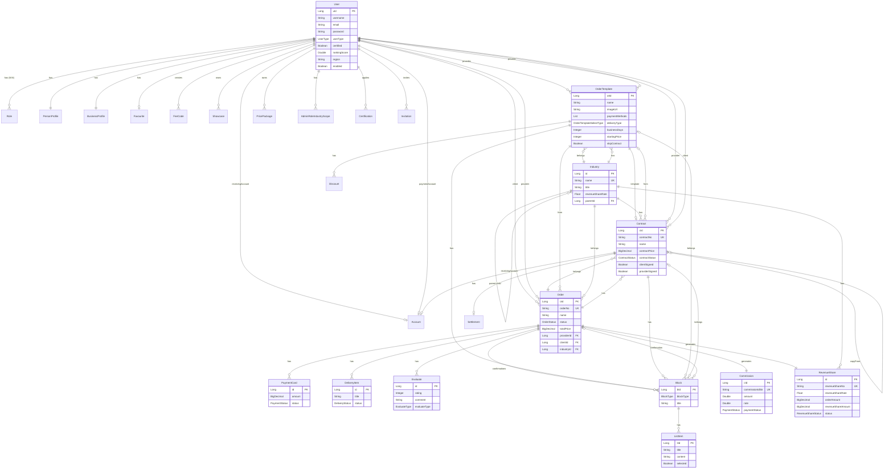
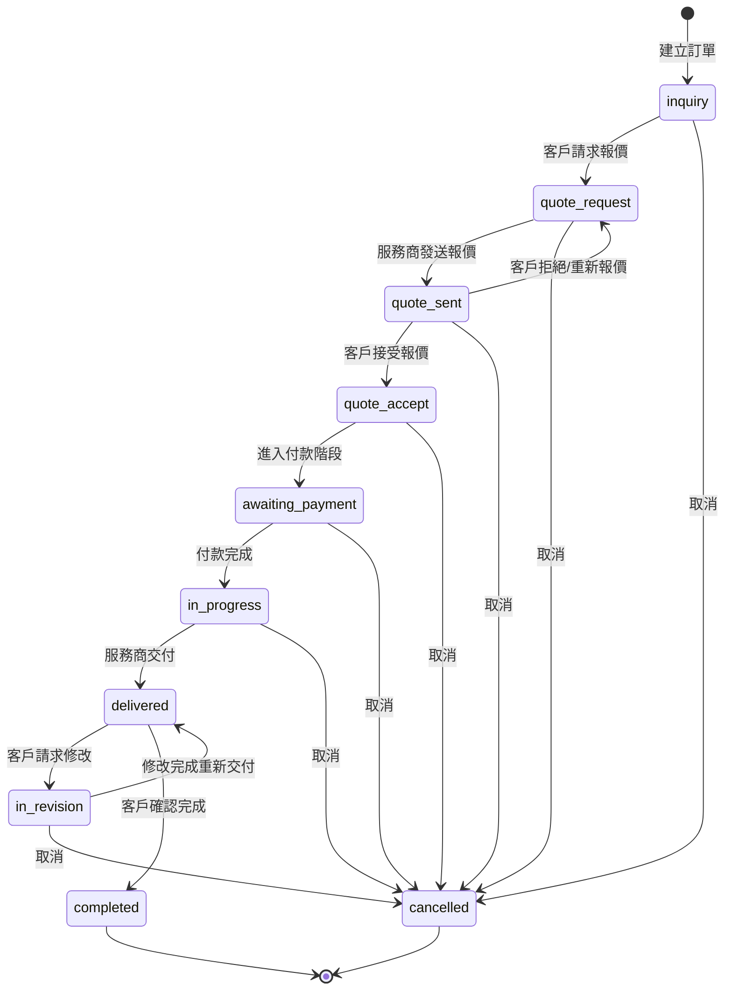
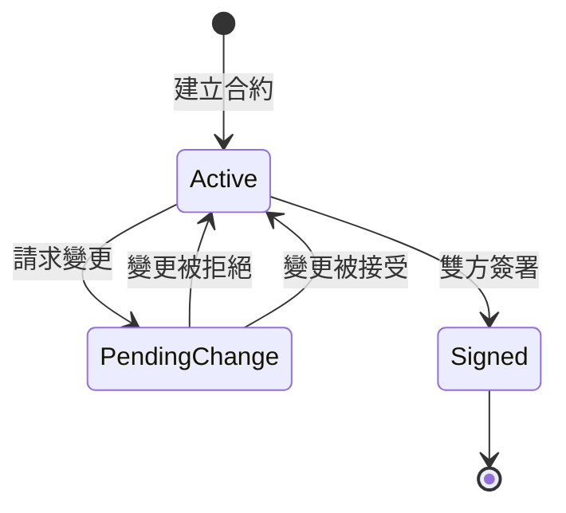
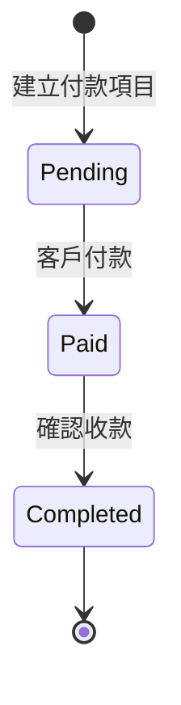
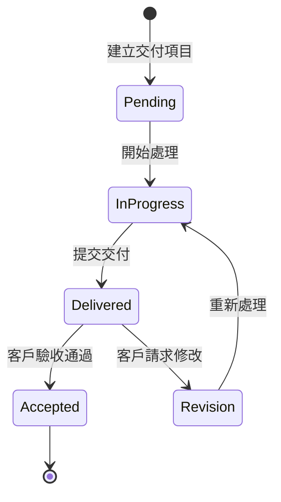
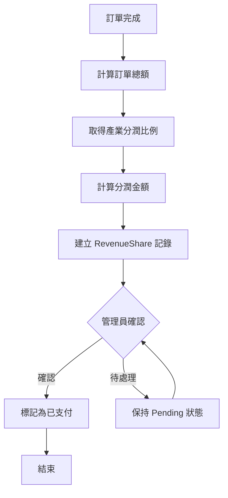

# CaseDeep 後端完整規格文件

> **文件版本**: 1.0  
> **建立日期**: 2025-12-31  
> **專案版本**: 0.8.5

---

# 第一部分：系統現況規格

## 1. 系統概述

CaseDeep 是一個案件管理 AI 對話系統，實現了服務商 (Provider) 與客戶 (Client) 之間的媒合、訂單管理、合約簽署、付款及交付的完整工作流程。

### 1.1 技術棧

| 層級     | 技術                                |
| -------- | ----------------------------------- |
| 框架     | Spring Boot 3.0.6 + Jakarta EE      |
| 語言     | Java 17                             |
| 安全     | Spring Security + JWT (JJWT 0.11.5) |
| 資料庫   | MySQL 8.x (主) / H2 (測試)          |
| ORM      | Spring Data JPA + Hibernate         |
| DTO 轉換 | MapStruct 1.5.5                     |
| API 文件 | SpringDoc OpenAPI 3.0               |
| 即時通訊 | WebSocket + STOMP                   |
| 郵件服務 | SMTP / Resend.com                   |

### 1.2 分層架構

```
Controllers (32個) → Services (25個) → Repositories (32個) → Entities (38個)
     ↓                    ↓                   ↓                    ↓
  REST APIs           業務邏輯            資料存取               資料庫
```

---

## 2. 核心業務模組

### 2.1 模組統計

| 類型         | 數量 | 說明              |
| ------------ | ---- | ----------------- |
| Controller   | 32   | REST API 控制器   |
| Service      | 25   | 業務邏輯介面      |
| Repository   | 32   | 資料存取層        |
| Entity       | 38   | JPA 實體類        |
| Enum         | 20   | 業務狀態/類型定義 |
| Converter    | 23   | DTO 轉換器        |
| Request DTO  | 67   | 請求資料物件      |
| Response DTO | 50   | 回應資料物件      |

### 2.2 功能模組分類

#### 🔐 用戶與認證模組
- **AuthController** - 登入/註冊/忘記密碼/重設密碼
- **UserDataController** - 用戶資料/角色/個人商業檔案
- **RoleController** - 角色 CRUD (需 ADMIN)

#### 📦 訂單管理模組
- **OrderController** - 訂單建立/狀態更新/報價/付款/交付
- **OrderTemplateController** - 訂單模板管理 (30+ 端點)

#### 🏭 產業與分類模組
- **IndustryController** - 產業分類/父子產業/模板查詢
- **SysListItemController** - 系統清單項目管理

#### 💰 財務模組
- **CommissionController** - 佣金管理
- **RevenueShareController** - 營收分潤
- **SettlementController** - 結算管理 *(尚未實作)*

#### 📋 評價與認證模組
- **EvaluateController** - 評價 CRUD
- **CertificationController** - 用戶認證申請

#### 🛠️ 管理員模組 (Admin)
- AdminUserController / AdminOrderController / AdminCommissionController
- AdminRevenueShareController / AdminUpgradeController
- AdminCertificationController / AdminInvitationController
- AdminUserQueryController / AdminFeeCodeController

---

## 3. 資料模型 (Entity)

### 3.1 實體清單

| 實體              | 說明     | 主要欄位                                                |
| ----------------- | -------- | ------------------------------------------------------- |
| **User**          | 用戶     | uId, username, email, userType, certified, rankingScore |
| **Order**         | 訂單     | oId, orderNo, status, totalPrice, provider, client      |
| **OrderTemplate** | 訂單模板 | name, industry, paymentMethods, deliveryType            |
| **Contract**      | 合約     | contractNo, status, clientSign, providerSign            |
| **PaymentCard**   | 付款卡   | amount, status, receipt, invoice                        |
| **DeliveryItem**  | 交付項目 | title, status, files                                    |
| **Industry**      | 產業分類 | name, title, parentIndustry, revenueShareRate           |
| **Evaluate**      | 評價     | rating, comment, evaluateType                           |
| **Commission**    | 佣金     | amount, status, user                                    |
| **RevenueShare**  | 營收分潤 | amount, status, paidTime                                |
| **Certification** | 用戶認證 | certNo, status, documents                               |
| **Invitation**    | 邀請碼   | code, status, expiry                                    |
| **Role**          | 角色     | roleName, description                                   |
| **Block**         | 區塊     | blockType, title, listItems                             |
| **ListItem**      | 清單項目 | title, content, selected                                |
| **Showcase**      | 作品展示 | title, files, orderTemplate                             |
| **Account**       | 帳戶     | bankName, accountNumber                                 |

### 3.2 狀態枚舉定義

| Enum               | 狀態值                                                                                                                        |
| ------------------ | ----------------------------------------------------------------------------------------------------------------------------- |
| OrderStatus        | inquiry, quote_request, quote_sent, quote_accept, awaiting_payment, in_progress, delivered, in_revision, completed, cancelled |
| UserType           | CLIENT, PROVIDER                                                                                                              |
| ContractStatus     | Active, PendingChange, Signed                                                                                                 |
| PaymentStatus      | Pending, Paid, Completed                                                                                                      |
| DeliveryStatus     | Pending, InProgress, Delivered, Accepted                                                                                      |
| CEStatus           | Pending, Approved, Rejected                                                                                                   |
| RevenueShareStatus | Pending, Paid                                                                                                                 |
| InvitationStatus   | Pending, Accepted, Expired                                                                                                    |

---

## 4. API 端點總覽

### 4.1 統計
- **總端點數**: 約 200+
- **公開端點**: 認證/註冊、系統清單、Swagger
- **認證端點**: 大部分業務 API
- **管理員端點**: `/api/admin/**` (需 ADMIN 角色)

### 4.2 主要 API 路由

| 模組     | 基礎路徑               | 端點數        |
| -------- | ---------------------- | ------------- |
| 認證     | `/api/auth`            | 4             |
| 用戶資料 | `/api/profile`         | 13            |
| 訂單     | `/api/orders`          | 25+           |
| 訂單模板 | `/api/ordertemplates`  | 30+           |
| 產業     | `/api/industries`      | 9             |
| 價格套餐 | `/api/pricepackages`   | 8             |
| 作品展示 | `/api/showcase`        | 6             |
| 聊天     | `/api/chat`            | 5 + WebSocket |
| 評價     | `/api/evaluations`     | 7             |
| 收藏     | `/api/favourites`      | 3             |
| 檔案     | `/api/files`           | 3             |
| 角色     | `/api/admin/roles`     | 5             |
| 地點     | `/api/admin/locations` | 6             |
| 貨幣     | `/api/currencies`      | 5             |

### 4.3 WebSocket 端點

| 端點                | 功能               |
| ------------------- | ------------------ |
| `/ws`               | WebSocket 連線端點 |
| `/app/connect`      | 用戶連線           |
| `/app/chat/message` | 聊天訊息           |
| `/app/video/offer`  | 視訊通話邀請       |
| `/app/video/answer` | 視訊通話回應       |

---

## 5. 安全配置

### 5.1 認證機制
- **JWT Bearer Token** - 2 小時有效期
- **密碼加密** - BCrypt

### 5.2 授權角色

| 角色                      | 說明         |
| ------------------------- | ------------ |
| ROLE_ADMIN                | 系統管理員   |
| ROLE_USER                 | 一般用戶     |
| ROLE_ORDER_MANAGE         | 訂單管理權限 |
| ROLE_CERTIFICATION_MANAGE | 認證管理權限 |

### 5.3 公開端點
- `/api/auth/**`
- `/swagger-ui/**`
- `/v3/api-docs/**`
- `/api/systemlists`
- `/api/typies/**`

---

# 第二部分：ERD 與流程圖

## 6. 完整實體關係圖 (ERD)

### 6.1 核心業務實體



### 6.2 支援實體

```mermaid
erDiagram
    Role {
        Long id PK
        String roleName UK
        String description
    }

    PersonProfile {
        Long id PK
        String firstName
        String lastName
        String phone
    }

    BusinessProfile {
        Long id PK
        String companyName
        String taxId
        String address
    }

    Account {
        Long id PK
        String bankName
        String accountNumber
        String accountHolder
    }

    Showcase {
        Long id PK
        String title
        Long userId FK
    }

    PricePackage {
        Long id PK
        String name
        BigDecimal price
    }

    Certification {
        Long id PK
        String certNo
        CEStatus status
    }

    Invitation {
        Long id PK
        String code
        InvitationStatus status
    }

    Settlement {
        Long id PK
        BigDecimal amount
    }

    Discount {
        Long id PK
        DiscountType discountType
        Integer value
    }

    Currency {
        Long id PK
        String code
        String symbol
        String name
    }

    Location {
        Long id PK
        String name
        String country
    }

    FeeCode {
        Long fcId PK
        String feeCode UK
    }
```



---

## 7. 訂單狀態流程圖

### 7.1 主要狀態轉換



### 7.2 狀態說明表

| 狀態               | 中文名稱   | 說明                        |
| ------------------ | ---------- | --------------------------- |
| `inquiry`          | 詢價中     | 訂單初始狀態，等待客戶行動  |
| `quote_request`    | 請求報價   | 客戶已請求服務商報價        |
| `quote_sent`       | 報價已發送 | 服務商已發送報價            |
| `quote_accept`     | 報價已接受 | 客戶接受報價，準備簽約/付款 |
| `awaiting_payment` | 等待付款   | 合約已簽署，等待客戶付款    |
| `in_progress`      | 進行中     | 付款完成，服務進行中        |
| `delivered`        | 已交付     | 服務商已交付成果            |
| `in_revision`      | 修改中     | 客戶請求修改                |
| `completed`        | 已完成     | 訂單成功完成                |
| `cancelled`        | 已取消     | 訂單被取消                  |

---

## 8. 合約狀態流程



| 狀態            | 說明             |
| --------------- | ---------------- |
| `Active`        | 合約有效，可編輯 |
| `PendingChange` | 有變更請求待審核 |
| `Signed`        | 雙方已簽署       |

---

## 9. 付款狀態流程



---

## 10. 交付狀態流程



---

## 11. 分潤計算流程



---

# 第三部分：附錄

## 12. 資料表命名對照

| Entity 類別   | 資料表名稱       |
| ------------- | ---------------- |
| User          | T_USER           |
| Order         | T_ORDER          |
| OrderTemplate | T_ORDER_TEMPLATE |
| Contract      | T_CONTRACT       |
| Industry      | T_INDUSTRY       |
| Commission    | T_COMMISSION     |
| RevenueShare  | T_REVENUE_SHARE  |
| PaymentCard   | T_PAYMENT_CARD   |
| DeliveryItem  | T_DELIVERY_ITEM  |
| Evaluate      | T_EVALUATE       |
| Block         | T_BLOCK          |
| ListItem      | T_LIST_ITEM      |
| Role          | T_ROLE           |
| Certification | T_CERTIFICATION  |
| Invitation    | T_INVITATION     |

## 13. 目錄結構

```
backend/
├── src/main/java/com/casemgr/
│   ├── CaseMgrAiChatApplication.java
│   ├── config/          # 配置類 (5)
│   ├── controller/      # 控制器 (32)
│   ├── converter/       # DTO 轉換器 (23)
│   ├── entity/          # JPA 實體 (38)
│   ├── enumtype/        # 枚舉類型 (20)
│   ├── exception/       # 例外處理 (2)
│   ├── repository/      # 資料存取 (32)
│   ├── request/         # 請求 DTO (67)
│   ├── response/        # 回應 DTO (50)
│   ├── schedule/        # 排程任務 (2)
│   ├── security/        # 安全配置 (2)
│   ├── service/         # 業務邏輯 (25 + impl)
│   ├── specification/   # 查詢規格 (1)
│   └── utils/           # 工具類 (7)
├── postman-collections/ # Postman 測試 (22)
├── scripts/             # 測試腳本 (5)
├── api-docs/            # API 文件 (2)
└── *.md                 # 規格文件
```

## 14. 欠缺與待完成項目

### 14.1 程式碼層面

| 項目                          | 狀態       | 說明                                    |
| ----------------------------- | ---------- | --------------------------------------- |
| SettlementController          | ❌ 未實作   | 結算功能尚未實作                        |
| OrderServiceImpl 測試對齊     | 🔄 進行中   | listOrders 明文訂單號、cancelOrder 方法 |
| OrderTemplateServiceImpl 對齊 | 🔄 進行中   | getReferenceById 改 findById、例外處理  |
| Template 付款方式 PATCH       | ⚠️ 部分修復 | 新建模板時可能仍有 500 錯誤             |

### 14.2 建議優先改善項目

**高優先級 (P0)**
1. SettlementController 實作 - 結算功能是營運必要
2. OrderService 測試對齊 - 確保核心業務穩定性

**中優先級 (P1)**
1. 前端 API 文件 - 支援前端開發
2. 錯誤代碼規格 - 統一錯誤處理

**低優先級 (P2)**
1. 測試覆蓋率提升
2. 效能優化文件
3. 部署文件

---

*此文檔為 CaseDeep 後端系統完整規格，如需詳細 API 規格請參閱 `api-inventory.md`*
