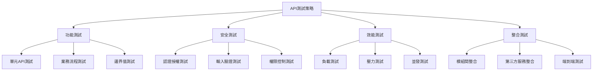
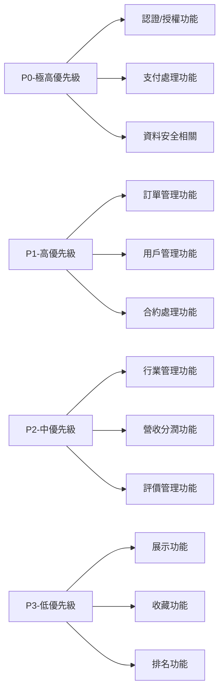
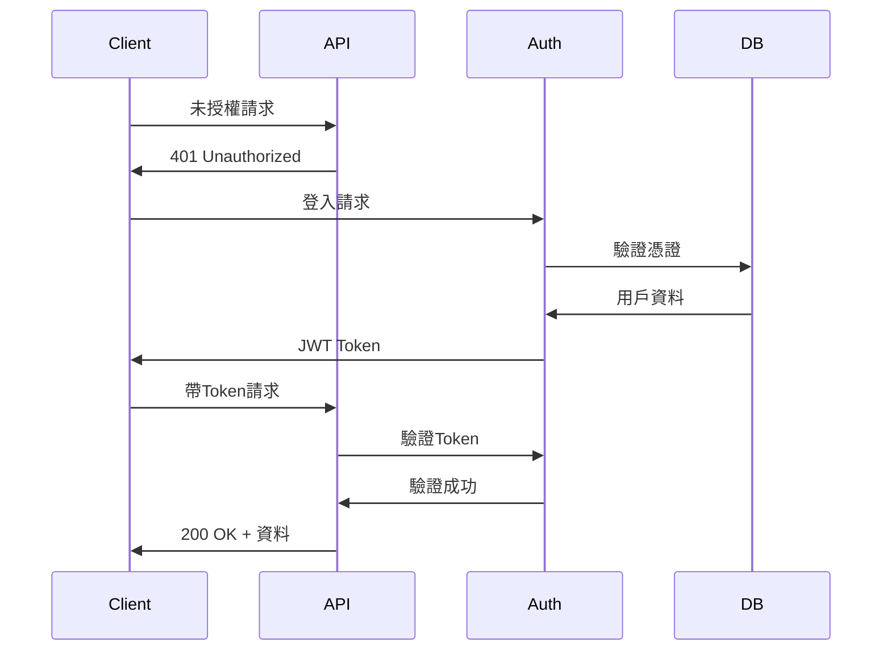
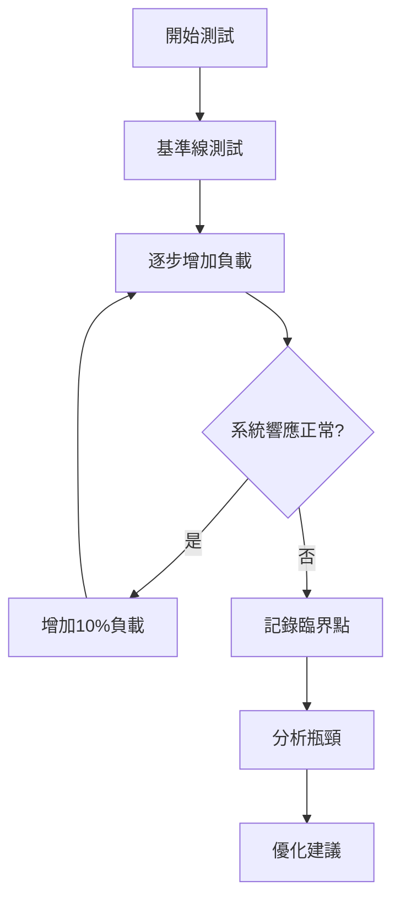
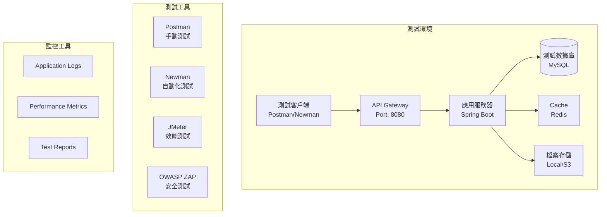
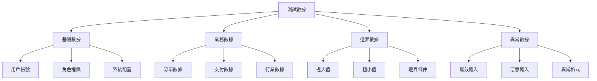
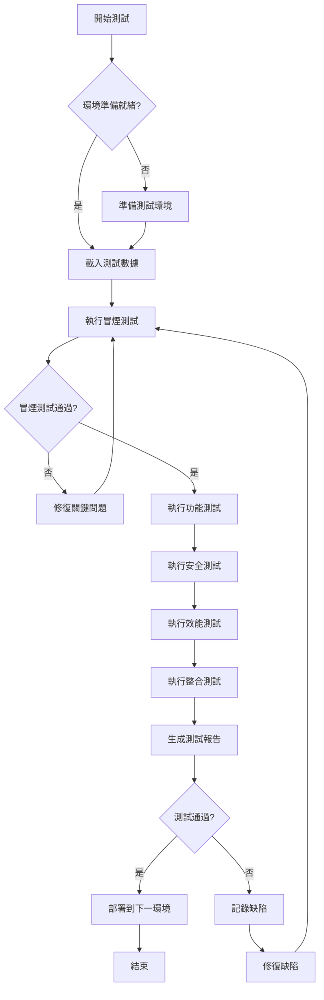
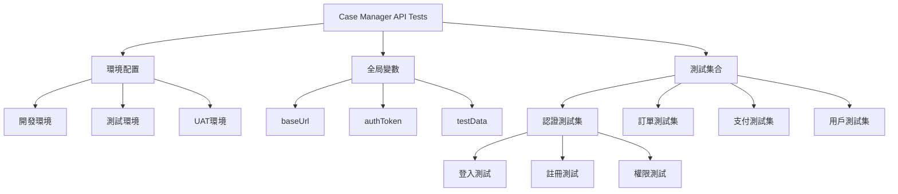
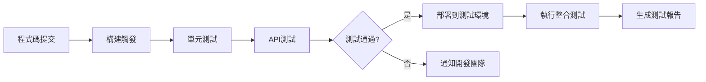

# Case Manager AI Chat - API 測試規格文件

## 1. 執行摘要

本文件定義了 Case Manager AI Chat 系統的 API 測試策略與規範。系統包含 30 個控制器，超過 200 個 API 端點，涵蓋用戶管理、訂單管理、支付管理、認證管理等核心業務功能。

## 2. 測試策略與方法論

### 2.1 測試策略概述



### 2.2 測試方法論

採用**風險驅動測試**方法論，結合以下測試實踐：

1. **BDD (行為驅動開發)**：使用 Given-When-Then 格式編寫測試案例
2. **數據驅動測試**：使用參數化測試覆蓋多種輸入場景
3. **契約測試**：確保 API 符合定義的規格
4. **持續測試**：整合到 CI/CD 流程中

## 3. 測試優先級分類（基於風險評估）

### 3.1 風險評估矩陣

| 風險等級 | 業務影響 | 發生機率 | 測試優先級 | 相關Controller |
|---------|---------|---------|-----------|---------------|
| 極高 | 系統癱瘓/資料外洩 | 高 | P0 - 立即測試 | AuthController, PaymentController |
| 高 | 核心功能失效 | 中 | P1 - 優先測試 | OrderController, UserController |
| 中 | 部分功能受限 | 中 | P2 - 常規測試 | IndustryController, RevenueShareController |
| 低 | 使用體驗影響 | 低 | P3 - 選擇測試 | ShowcaseController, FavouriteController |

### 3.2 優先級定義



## 4. 測試類型詳細說明

### 4.1 功能測試 (Functional Testing)

#### 4.1.1 單元API測試
- **目標**：驗證每個API端點的基本功能
- **覆蓋範圍**：
  - 正常請求流程
  - 參數驗證
  - 回應格式驗證
  - 錯誤處理

#### 4.1.2 業務流程測試
- **目標**：驗證完整的業務場景
- **主要場景**：
  - 用戶註冊 → 登入 → 創建訂單 → 支付 → 完成
  - 服務商認證 → 創建模板 → 接收訂單 → 交付

#### 4.1.3 邊界值測試
- **目標**：測試極限情況
- **測試項目**：
  - 最大/最小值輸入
  - 空值處理
  - 特殊字符處理

### 4.2 安全測試 (Security Testing)

#### 4.2.1 認證授權測試


#### 4.2.2 輸入驗證測試
- SQL注入測試
- XSS攻擊測試
- CSRF防護測試
- 檔案上傳安全測試

#### 4.2.3 權限控制測試
- 角色權限驗證（ADMIN, USER, MANAGER_ORDER）
- 資源訪問控制
- 數據隔離測試

### 4.3 效能測試 (Performance Testing)

#### 4.3.1 負載測試目標
| API類型 | 目標TPS | 響應時間(ms) | 並發用戶數 |
|---------|---------|-------------|-----------|
| 認證API | 100 | <200 | 500 |
| 查詢API | 500 | <100 | 1000 |
| 交易API | 50 | <500 | 200 |
| 上傳API | 20 | <2000 | 50 |

#### 4.3.2 壓力測試策略


### 4.4 整合測試 (Integration Testing)

#### 4.4.1 模組間整合測試
- 訂單與支付模組整合
- 用戶與認證模組整合
- 訂單與營收分潤整合

#### 4.4.2 第三方服務整合
- 郵件服務整合測試
- 檔案存儲服務測試
- WebSocket通訊測試

## 5. 測試環境架構



### 5.1 環境配置要求

| 環境類型 | 用途 | 配置需求 | 數據策略 |
|---------|------|---------|---------|
| 開發測試環境 | 開發階段測試 | 單機配置 | Mock數據 |
| 整合測試環境 | 整合測試 | 集群配置 | 測試數據集 |
| 效能測試環境 | 效能測試 | 生產級配置 | 大量測試數據 |
| UAT環境 | 用戶驗收測試 | 準生產配置 | 仿真數據 |

## 6. 測試資料規劃

### 6.1 測試數據分類



### 6.2 測試數據管理策略

1. **數據隔離**：每個測試套件使用獨立的數據集
2. **數據重置**：測試前後自動重置數據狀態
3. **數據生成**：使用數據工廠模式生成測試數據
4. **數據版本控制**：測試數據腳本納入版本管理

### 6.3 測試用戶矩陣

| 用戶類型 | 用戶名 | 角色 | 測試用途 |
|---------|--------|------|---------|
| 超級管理員 | admin@test.com | ADMIN | 管理功能測試 |
| 訂單管理員 | manager@test.com | MANAGER_ORDER | 訂單管理測試 |
| 服務提供商 | provider@test.com | USER (Provider) | 服務商功能測試 |
| 一般客戶 | client@test.com | USER (Client) | 客戶功能測試 |
| 未認證用戶 | guest@test.com | - | 公開API測試 |

## 7. 測試執行流程



### 7.1 測試執行階段

1. **準備階段**
   - 環境配置驗證
   - 測試數據準備
   - 測試工具配置

2. **執行階段**
   - 冒煙測試（Smoke Test）
   - 功能測試執行
   - 非功能測試執行

3. **報告階段**
   - 測試結果收集
   - 缺陷記錄
   - 測試報告生成

## 8. 測試案例設計原則

### 8.1 測試案例結構

```yaml
TestCase:
  id: TC_AUTH_001
  name: 用戶登入測試
  priority: P0
  category: 功能測試/認證
  preconditions:
    - 測試用戶已註冊
    - API服務正常運行
  test_data:
    username: "test@example.com"
    password: "Test123!"
  steps:
    - step: 發送POST請求到/api/auth/login
      expected: 返回200狀態碼
    - step: 驗證響應包含JWT token
      expected: token不為空
    - step: 驗證token格式
      expected: 符合JWT標準格式
  postconditions:
    - 清理測試會話
```

### 8.2 測試案例命名規範

- 格式：`TC_<模組>_<編號>_<描述>`
- 範例：`TC_ORDER_001_CreateOrder`

## 9. Postman 測試集合架構



### 9.1 Postman 環境變數設計

```json
{
  "dev": {
    "baseUrl": "http://localhost:8080",
    "authToken": "{{dynamic}}",
    "testUserId": "{{dynamic}}",
    "testOrderId": "{{dynamic}}"
  },
  "test": {
    "baseUrl": "http://test-api.casemgr.com",
    "authToken": "{{dynamic}}",
    "testUserId": "{{dynamic}}",
    "testOrderId": "{{dynamic}}"
  }
}
```

### 9.2 測試腳本架構

```javascript
// Pre-request Script 範例
pm.environment.set("timestamp", new Date().toISOString());
pm.environment.set("randomEmail", `test_${Date.now()}@example.com`);

// Test Script 範例
pm.test("Status code is 200", function () {
    pm.response.to.have.status(200);
});

pm.test("Response has required fields", function () {
    const jsonData = pm.response.json();
    pm.expect(jsonData).to.have.property('id');
    pm.expect(jsonData).to.have.property('status');
});

// 保存動態數據供後續測試使用
if (pm.response.code === 200) {
    const response = pm.response.json();
    pm.environment.set("lastCreatedId", response.id);
}
```

### 9.3 斷言規則庫

| 斷言類型 | 用途 | 範例 |
|---------|------|------|
| 狀態碼驗證 | 驗證HTTP狀態 | `pm.response.to.have.status(200)` |
| 響應時間 | 效能驗證 | `pm.expect(pm.response.responseTime).to.be.below(200)` |
| 資料結構 | 驗證響應格式 | `pm.expect(jsonData).to.have.property('id')` |
| 業務規則 | 驗證業務邏輯 | `pm.expect(order.status).to.be.oneOf(['PENDING', 'CONFIRMED'])` |
| 安全驗證 | 驗證安全要求 | `pm.expect(pm.response.headers.get('X-Content-Type-Options')).to.eql('nosniff')` |

## 10. 測試自動化策略

### 10.1 CI/CD 整合



### 10.2 自動化測試工具鏈

1. **Newman**: Postman集合的命令行執行
2. **Jenkins/GitLab CI**: CI/CD平台
3. **Allure**: 測試報告生成
4. **Slack/Email**: 測試結果通知

## 11. 測試度量指標

### 11.1 關鍵績效指標 (KPIs)

| 指標名稱 | 計算方式 | 目標值 | 監控頻率 |
|---------|---------|--------|---------|
| API覆蓋率 | 已測試API數/總API數 | >95% | 每日 |
| 測試通過率 | 通過測試數/總測試數 | >98% | 每次執行 |
| 缺陷密度 | 缺陷數/測試案例數 | <0.05 | 每週 |
| 平均響應時間 | 所有API響應時間平均值 | <200ms | 每日 |
| 測試執行時間 | 完整測試套件執行時間 | <30分鐘 | 每次執行 |

### 11.2 測試報告模板

```markdown
# API測試報告
- 測試日期: {{date}}
- 測試環境: {{environment}}
- 測試範圍: {{scope}}

## 執行摘要
- 總測試案例數: {{total}}
- 通過: {{passed}}
- 失敗: {{failed}}
- 跳過: {{skipped}}

## 詳細結果
[按模組分類的測試結果]

## 發現的問題
[缺陷列表及嚴重程度]

## 建議與下一步
[改進建議]
```

## 12. 風險與緩解措施

| 風險項目 | 風險等級 | 影響 | 緩解措施 |
|---------|---------|------|---------|
| 測試環境不穩定 | 高 | 測試中斷 | 建立專用測試環境，定期維護 |
| 測試數據污染 | 中 | 測試結果不準確 | 實施數據隔離和自動清理機制 |
| 第三方服務依賴 | 中 | 整合測試失敗 | 使用Mock服務和服務虛擬化 |
| 測試覆蓋不足 | 高 | 缺陷遺漏 | 定期審查和更新測試案例 |

## 13. 測試最佳實踐

1. **測試獨立性**: 每個測試案例應該獨立執行，不依賴其他測試的結果
2. **數據驅動**: 使用外部數據源驅動測試，提高測試覆蓋率
3. **持續優化**: 定期回顧測試結果，優化測試案例和執行策略
4. **文檔化**: 保持測試文檔與代碼同步更新
5. **協作溝通**: 與開發團隊保持密切溝通，及時反饋問題

## 14. 附錄

### 14.1 測試工具清單
- Postman v9.0+
- Newman v5.0+
- JMeter v5.4+
- OWASP ZAP v2.11+

### 14.2 參考文獻
- REST API Testing Best Practices
- OWASP API Security Top 10
- ISO/IEC 25010 軟體品質模型

### 14.3 術語表
- **TPS**: Transactions Per Second，每秒交易數
- **JWT**: JSON Web Token，用於API認證
- **UAT**: User Acceptance Testing，用戶驗收測試
- **CI/CD**: Continuous Integration/Continuous Deployment，持續整合/持續部署