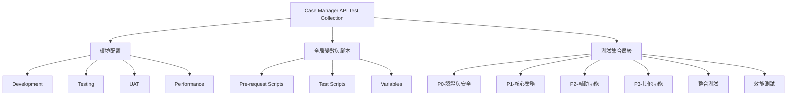

# Case Manager AI Chat - Postman測試集合結構設計

## 1. 整體架構概述



## 2. 環境變數設計

### 2.1 基礎環境變數

```json
{
  "id": "case-mgr-env-dev",
  "name": "Development Environment",
  "values": [
    {
      "key": "baseUrl",
      "value": "http://localhost:8080",
      "enabled": true
    },
    {
      "key": "authToken",
      "value": "",
      "enabled": true
    },
    {
      "key": "adminToken",
      "value": "",
      "enabled": true
    },
    {
      "key": "testUserId",
      "value": "",
      "enabled": true
    },
    {
      "key": "testOrderId",
      "value": "",
      "enabled": true
    },
    {
      "key": "testTemplateId",
      "value": "",
      "enabled": true
    },
    {
      "key": "timestamp",
      "value": "",
      "enabled": true
    }
  ]
}
```

### 2.2 測試數據環境變數

```json
{
  "testData": {
    "users": {
      "admin": {
        "email": "admin@test.com",
        "password": "Admin123!"
      },
      "client": {
        "email": "client@test.com",
        "password": "Client123!"
      },
      "provider": {
        "email": "provider@test.com",
        "password": "Provider123!"
      }
    },
    "sampleData": {
      "validOrderTemplate": {
        "name": "測試服務模板",
        "description": "這是測試用的服務模板",
        "price": 1000,
        "currency": "TWD"
      }
    }
  }
}
```

## 3. 集合層級結構

### 3.1 P0 - 認證與安全測試集

```
📁 P0-Authentication-Security
├── 📁 Authentication
│   ├── ✅ Login - Success
│   ├── ❌ Login - Invalid Credentials
│   ├── ❌ Login - SQL Injection
│   ├── ✅ Register - New User
│   ├── ❌ Register - Duplicate Email
│   ├── ✅ Forgot Password
│   └── ✅ Reset Password
├── 📁 Authorization
│   ├── ✅ Admin Access Test
│   ├── ✅ User Access Test
│   └── ❌ Unauthorized Access Test
└── 📁 Security
    ├── 🔒 XSS Prevention Test
    ├── 🔒 CSRF Protection Test
    └── 🔒 Input Validation Test
```

### 3.2 P1 - 核心業務測試集

```
📁 P1-Core-Business
├── 📁 Order Management
│   ├── 📁 Create Order
│   │   ├── ✅ Create from Template
│   │   ├── ❌ Create with Invalid Data
│   │   └── ✅ Create with Custom Fields
│   ├── 📁 Order Status
│   │   ├── ✅ Update Status - Valid Transition
│   │   └── ❌ Update Status - Invalid Transition
│   ├── 📁 Order Query
│   │   ├── ✅ Get My Orders - Client
│   │   ├── ✅ Get My Orders - Provider
│   │   └── ✅ Get Order Details
│   └── 📁 Contract Management
│       ├── ✅ Client Sign Contract
│       ├── ✅ Provider Sign Contract
│       └── ✅ Request Contract Change
├── 📁 Payment Processing
│   ├── ✅ Initiate Payment
│   ├── ✅ Process Payment
│   ├── ✅ Upload Receipt
│   ├── ❌ Duplicate Payment Prevention
│   └── ✅ Payment Status Query
└── 📁 User Management
    ├── ✅ Get Profile
    ├── ✅ Update Personal Info
    ├── ✅ Update Business Info
    ├── ✅ Change Password
    └── ✅ Upload Avatar
```

### 3.3 P2 - 輔助功能測試集

```
📁 P2-Supporting-Features
├── 📁 Industry Management
│   ├── ✅ List Industries
│   ├── ✅ Get Industry Details
│   ├── ✅ Create Industry (Admin)
│   └── ✅ Update Industry (Admin)
├── 📁 Revenue Share
│   ├── ✅ List Revenue Shares
│   ├── ✅ Get Revenue Share Details
│   ├── ✅ Update Status
│   └── ✅ Get Statistics
└── 📁 Order Templates
    ├── ✅ Create Template
    ├── ✅ Update Template
    ├── ✅ Add Discount
    └── ✅ Configure Blocks
```

## 4. 測試腳本架構

### 4.1 全局Pre-request Script

```javascript
// Global Pre-request Script
// 設置時間戳
pm.globals.set('timestamp', new Date().getTime());
pm.globals.set('isoTimestamp', new Date().toISOString());

// 生成隨機數據
pm.globals.set('randomEmail', `test_${Date.now()}@example.com`);
pm.globals.set('randomPhone', `+8869${Math.floor(Math.random() * 100000000)}`);

// 檢查並刷新Token
const tokenExpiry = pm.environment.get('tokenExpiry');
if (tokenExpiry && new Date(tokenExpiry) < new Date()) {
    console.log('Token expired, need to refresh');
    // 這裡可以觸發重新登入流程
}

// 設置通用Headers
pm.request.headers.add({
    key: 'X-Request-ID',
    value: pm.variables.get('timestamp')
});
```

### 4.2 通用測試腳本庫

```javascript
// Test Utilities Library
const TestUtils = {
    // 響應基本驗證
    validateBasicResponse: () => {
        pm.test("Status code is successful", function () {
            pm.expect(pm.response.code).to.be.oneOf([200, 201]);
        });
        
        pm.test("Response time is acceptable", function () {
            pm.expect(pm.response.responseTime).to.be.below(1000);
        });
        
        pm.test("Content-Type is JSON", function () {
            pm.expect(pm.response.headers.get('Content-Type')).to.include('application/json');
        });
    },
    
    // 錯誤響應驗證
    validateErrorResponse: (expectedCode, expectedMessage) => {
        pm.test(`Status code is ${expectedCode}`, function () {
            pm.response.to.have.status(expectedCode);
        });
        
        if (expectedMessage) {
            pm.test("Error message is correct", function () {
                const jsonData = pm.response.json();
                pm.expect(jsonData.message).to.include(expectedMessage);
            });
        }
    },
    
    // 分頁響應驗證
    validatePaginationResponse: () => {
        pm.test("Has pagination structure", function () {
            const jsonData = pm.response.json();
            pm.expect(jsonData).to.have.property('content');
            pm.expect(jsonData).to.have.property('pageable');
            pm.expect(jsonData).to.have.property('totalElements');
            pm.expect(jsonData).to.have.property('totalPages');
        });
    },
    
    // 保存動態數據
    saveResponseData: (mappings) => {
        const jsonData = pm.response.json();
        Object.entries(mappings).forEach(([responseKey, envKey]) => {
            if (jsonData[responseKey]) {
                pm.environment.set(envKey, jsonData[responseKey]);
                console.log(`Saved ${responseKey} as ${envKey}: ${jsonData[responseKey]}`);
            }
        });
    }
};

// 設為全局可用
pm.globals.set('TestUtils', TestUtils.toString());
```

### 4.3 斷言規則庫

```javascript
// Assertion Rules Library
const AssertionRules = {
    // 認證相關斷言
    auth: {
        validateToken: () => {
            pm.test("Token is valid JWT", function () {
                const token = pm.response.json().token;
                const parts = token.split('.');
                pm.expect(parts.length).to.equal(3);
                
                // 解析payload
                try {
                    const payload = JSON.parse(atob(parts[1]));
                    pm.expect(payload).to.have.property('sub');
                    pm.expect(payload).to.have.property('exp');
                } catch (e) {
                    pm.expect.fail('Invalid JWT token structure');
                }
            });
        }
    },
    
    // 業務規則斷言
    business: {
        validateOrderStatus: (expectedStatus) => {
            pm.test(`Order status is ${expectedStatus}`, function () {
                const order = pm.response.json();
                pm.expect(order.status).to.equal(expectedStatus);
            });
        },
        
        validatePriceCalculation: (expectedTotal) => {
            pm.test("Price calculation is correct", function () {
                const order = pm.response.json();
                pm.expect(order.totalAmount).to.equal(expectedTotal);
            });
        }
    },
    
    // 安全相關斷言
    security: {
        validateSecurityHeaders: () => {
            pm.test("Security headers are present", function () {
                pm.expect(pm.response.headers.get('X-Content-Type-Options')).to.equal('nosniff');
                pm.expect(pm.response.headers.get('X-Frame-Options')).to.equal('DENY');
                pm.expect(pm.response.headers.get('X-XSS-Protection')).to.equal('1; mode=block');
            });
        },
        
        validateNoSensitiveData: (fields) => {
            pm.test("No sensitive data exposed", function () {
                const jsonData = pm.response.json();
                fields.forEach(field => {
                    pm.expect(jsonData).to.not.have.property(field);
                });
            });
        }
    }
};

pm.globals.set('AssertionRules', AssertionRules.toString());
```

## 5. 測試資料管理策略

### 5.1 測試資料生命週期

```javascript
// Test Data Lifecycle Management
const TestDataManager = {
    // 測試前準備
    setup: {
        createTestUser: async () => {
            const response = await pm.sendRequest({
                url: pm.environment.get('baseUrl') + '/api/auth/register',
                method: 'POST',
                header: {
                    'Content-Type': 'application/json'
                },
                body: {
                    mode: 'raw',
                    raw: JSON.stringify({
                        username: pm.globals.get('randomEmail'),
                        password: 'Test123!',
                        userType: 'CLIENT'
                    })
                }
            });
            
            return response.json();
        }
    },
    
    // 測試後清理
    cleanup: {
        deleteTestData: async (resourceType, resourceId) => {
            const token = pm.environment.get('adminToken');
            await pm.sendRequest({
                url: `${pm.environment.get('baseUrl')}/api/admin/${resourceType}/${resourceId}`,
                method: 'DELETE',
                header: {
                    'Authorization': `Bearer ${token}`
                }
            });
        }
    },
    
    // 測試數據追蹤
    tracking: {
        createdResources: [],
        
        trackResource: function(type, id) {
            this.createdResources.push({ type, id, timestamp: new Date() });
            pm.environment.set('testDataTracker', JSON.stringify(this.createdResources));
        },
        
        getTrackedResources: function() {
            const tracked = pm.environment.get('testDataTracker');
            return tracked ? JSON.parse(tracked) : [];
        }
    }
};

pm.globals.set('TestDataManager', TestDataManager.toString());
```

### 5.2 測試數據集

```json
{
  "testDataSets": {
    "validationTests": {
      "emails": {
        "valid": ["test@example.com", "user.name@company.com", "test+tag@example.com"],
        "invalid": ["notanemail", "@example.com", "test@", "test..double@example.com"]
      },
      "passwords": {
        "valid": ["Test123!", "P@ssw0rd123", "Secure#Pass1"],
        "invalid": ["weak", "12345678", "password", "NoNumber!", "no-upper-123"]
      },
      "phones": {
        "valid": ["+886912345678", "+886987654321"],
        "invalid": ["123456", "notaphone", "+88612345"]
      }
    },
    "businessScenarios": {
      "orderFlows": [
        {
          "name": "標準訂單流程",
          "steps": ["create", "confirm", "pay", "deliver", "complete"]
        },
        {
          "name": "取消訂單流程",
          "steps": ["create", "cancel"]
        }
      ]
    }
  }
}
```

## 6. 執行配置

### 6.1 Newman執行腳本

```bash
# 基本執行
newman run case-mgr-api-tests.json -e dev-environment.json

# 帶報告的執行
newman run case-mgr-api-tests.json \
  -e dev-environment.json \
  -r html,json,junit \
  --reporter-html-export reports/test-report.html \
  --reporter-json-export reports/test-results.json \
  --reporter-junit-export reports/junit-results.xml

# 並行執行
newman run case-mgr-api-tests.json \
  -e dev-environment.json \
  -n 5 \
  --delay-request 100

# CI/CD整合執行
newman run case-mgr-api-tests.json \
  -e $ENV_FILE \
  --global-var "baseUrl=$API_URL" \
  --bail \
  --suppress-exit-code
```

### 6.2 Collection Runner配置

```json
{
  "runnerConfig": {
    "iterations": 1,
    "delay": 0,
    "dataFile": null,
    "keepVariableValues": true,
    "saveResponses": true,
    "runWithEmptyValues": false,
    "settings": {
      "disableSSLValidation": false,
      "followRedirects": true,
      "encoding": "utf8"
    }
  }
}
```

## 7. 測試監控與報告

### 7.1 監控指標

```javascript
// Performance Monitoring
const PerformanceMonitor = {
    metrics: {
        responseTime: [],
        throughput: 0,
        errorRate: 0,
        successRate: 0
    },
    
    recordMetric: function(testName, responseTime, success) {
        this.metrics.responseTime.push({
            test: testName,
            time: responseTime,
            timestamp: new Date()
        });
        
        if (!success) {
            this.metrics.errorRate++;
        }
        
        // 計算平均響應時間
        const avgResponseTime = this.metrics.responseTime.reduce((sum, item) => sum + item.time, 0) / this.metrics.responseTime.length;
        
        console.log(`Average Response Time: ${avgResponseTime}ms`);
    }
};
```

### 7.2 自定義報告模板

```javascript
// Custom Report Generator
const ReportGenerator = {
    generateSummary: function(results) {
        const summary = {
            executionTime: new Date(),
            environment: pm.environment.name,
            statistics: {
                total: results.length,
                passed: results.filter(r => r.passed).length,
                failed: results.filter(r => !r.passed).length,
                skipped: results.filter(r => r.skipped).length
            },
            failureDetails: results.filter(r => !r.passed).map(r => ({
                name: r.name,
                error: r.error,
                request: r.request
            }))
        };
        
        return summary;
    }
};
```

## 8. 整合測試場景

### 8.1 端到端測試流程

```json
{
  "e2eScenarios": [
    {
      "name": "完整訂單生命週期",
      "steps": [
        {
          "name": "用戶註冊",
          "collection": "P0-Authentication-Security",
          "request": "Register - New User"
        },
        {
          "name": "用戶登入",
          "collection": "P0-Authentication-Security",
          "request": "Login - Success"
        },
        {
          "name": "瀏覽服務模板",
          "collection": "P2-Supporting-Features",
          "request": "List Order Templates"
        },
        {
          "name": "建立訂單",
          "collection": "P1-Core-Business",
          "request": "Create Order from Template"
        },
        {
          "name": "簽署合約",
          "collection": "P1-Core-Business",
          "request": "Client Sign Contract"
        },
        {
          "name": "支付訂單",
          "collection": "P1-Core-Business",
          "request": "Process Payment"
        },
        {
          "name": "確認交付",
          "collection": "P1-Core-Business",
          "request": "Confirm Delivery"
        },
        {
          "name": "評價服務",
          "collection": "P3-Other-Features",
          "request": "Create Evaluation"
        }
      ]
    }
  ]
}
```

### 8.2 錯誤處理測試

```javascript
// Error Scenario Testing
const ErrorScenarios = {
    networkErrors: [
        {
            name: "Timeout Handling",
            setup: () => pm.request.timeout = 1, // 1ms timeout
            validate: () => {
                pm.test("Should handle timeout gracefully", () => {
                    pm.expect(pm.response.code).to.equal(0);
                });
            }
        }
    ],
    
    businessErrors: [
        {
            name: "Insufficient Balance",
            request: {
                amount: 999999999
            },
            expectedError: "INSUFFICIENT_BALANCE"
        }
    ],
    
    validationErrors: [
        {
            name: "Missing Required Fields",
            request: {
                // Intentionally missing required fields
            },
            expectedError: "VALIDATION_ERROR"
        }
    ]
};
```

## 9. 最佳實踐建議

### 9.1 測試組織原則

1. **按優先級分組**：P0 > P1 > P2 > P3
2. **按功能模組分類**：認證、訂單、支付等
3. **正面測試優先**：先測試正常流程，再測試異常情況
4. **獨立性原則**：每個測試應該能獨立執行

### 9.2 測試維護策略

1. **版本控制**：將測試集合納入Git管理
2. **定期審查**：每個Sprint審查並更新測試案例
3. **文檔同步**：API變更時同步更新測試
4. **重構優化**：定期重構重複的測試代碼

### 9.3 團隊協作規範

1. **命名規範**：統一的測試案例命名格式
2. **註釋要求**：複雜測試邏輯必須添加註釋
3. **Review流程**：測試代碼需要Code Review
4. **知識分享**：定期分享測試技巧和經驗

---

這份Postman測試集合結構設計提供了完整的測試框架，包含環境配置、測試腳本、斷言規則、數據管理和執行策略，為測試團隊提供了清晰的實施指南。