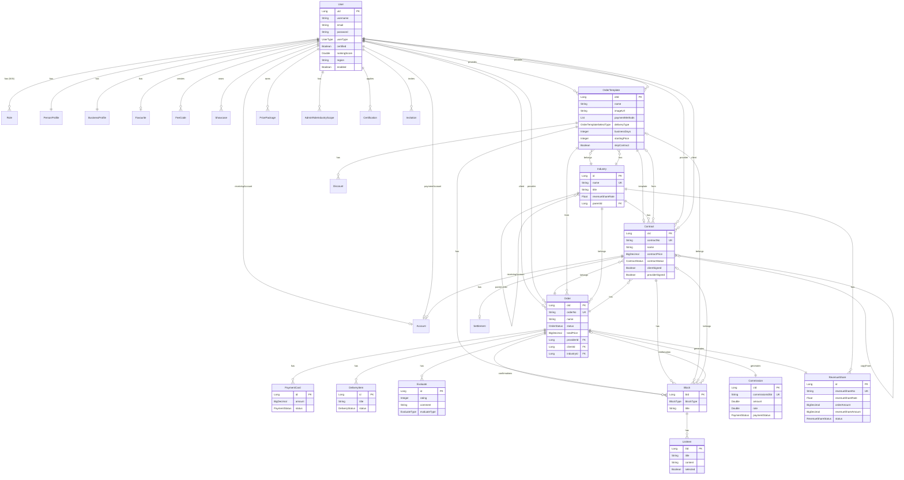
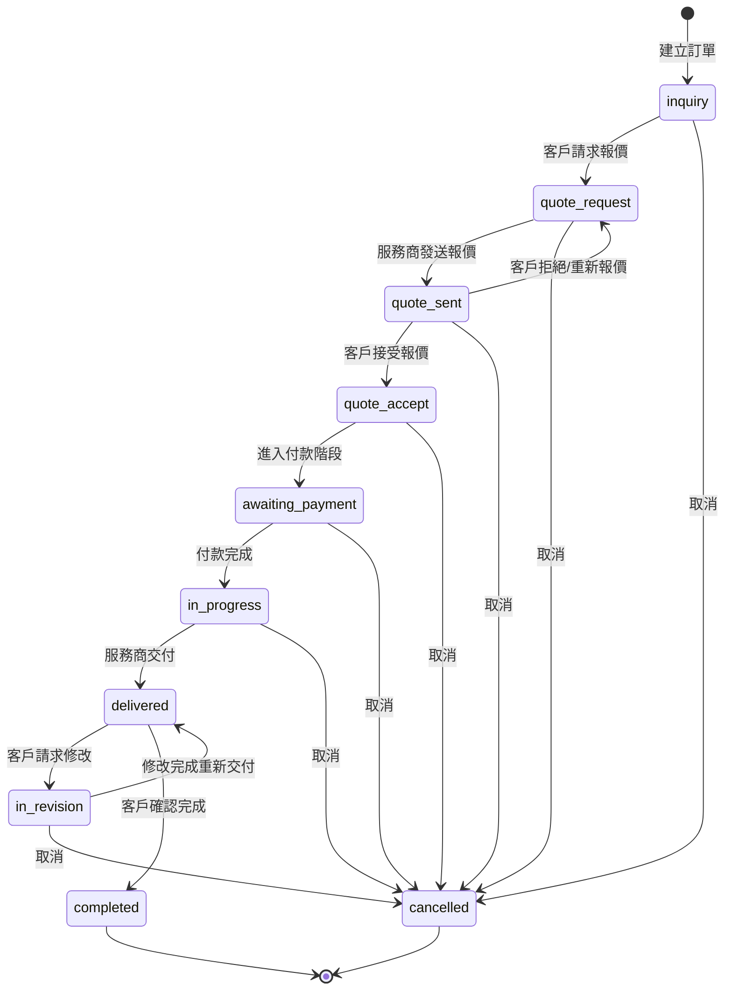
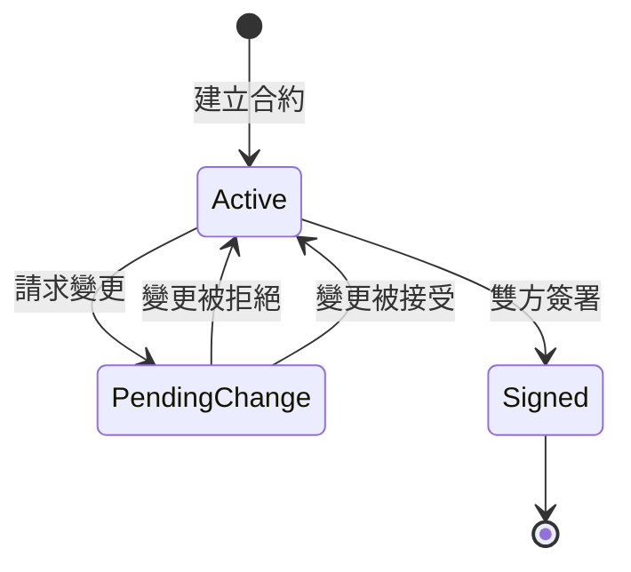
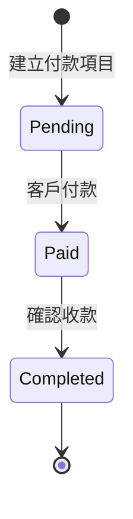
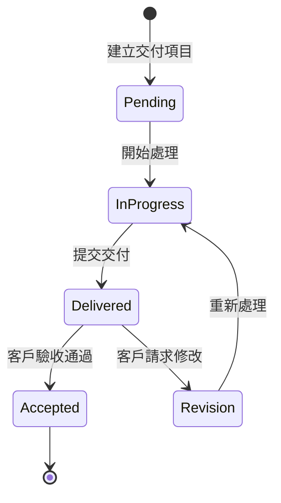
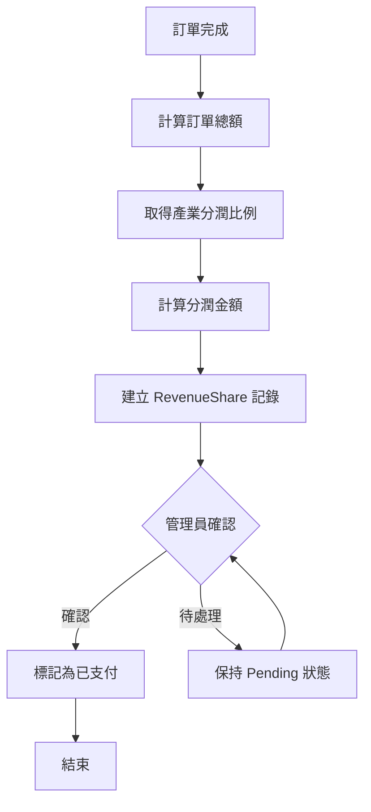

# CaseDeep ERD 與流程圖

> **文件版本**: 1.0  
> **建立日期**: 2025-12-31

---

## 1. 完整實體關係圖 (ERD)

### 1.1 核心業務實體

### 1.2 支援實體

```mermaid
erDiagram
    Role {
        Long id PK
        String roleName UK
        String description
    }

    PersonProfile {
        Long id PK
        String firstName
        String lastName
        String phone
    }

    BusinessProfile {
        Long id PK
        String companyName
        String taxId
        String address
    }

    Account {
        Long id PK
        String bankName
        String accountNumber
        String accountHolder
    }

    Showcase {
        Long id PK
        String title
        Long userId FK
    }

    PricePackage {
        Long id PK
        String name
        BigDecimal price
    }

    Certification {
        Long id PK
        String certNo
        CEStatus status
    }

    Invitation {
        Long id PK
        String code
        InvitationStatus status
    }

    Settlement {
        Long id PK
        BigDecimal amount
    }

    Discount {
        Long id PK
        DiscountType discountType
        Integer value
    }

    Currency {
        Long id PK
        String code
        String symbol
        String name
    }

    Location {
        Long id PK
        String name
        String country
    }

    FeeCode {
        Long fcId PK
        String feeCode UK
    }
```

---

## 2. 訂單狀態流程圖

### 2.1 主要狀態轉換

### 2.2 狀態說明表

| 狀態               | 中文名稱   | 說明                        |
| ------------------ | ---------- | --------------------------- |
| `inquiry`          | 詢價中     | 訂單初始狀態，等待客戶行動  |
| `quote_request`    | 請求報價   | 客戶已請求服務商報價        |
| `quote_sent`       | 報價已發送 | 服務商已發送報價            |
| `quote_accept`     | 報價已接受 | 客戶接受報價，準備簽約/付款 |
| `awaiting_payment` | 等待付款   | 合約已簽署，等待客戶付款    |
| `in_progress`      | 進行中     | 付款完成，服務進行中        |
| `delivered`        | 已交付     | 服務商已交付成果            |
| `in_revision`      | 修改中     | 客戶請求修改                |
| `completed`        | 已完成     | 訂單成功完成                |
| `cancelled`        | 已取消     | 訂單被取消                  |

---

## 3. 合約狀態流程

| 狀態            | 說明             |
| --------------- | ---------------- |
| `Active`        | 合約有效，可編輯 |
| `PendingChange` | 有變更請求待審核 |
| `Signed`        | 雙方已簽署       |

---

## 4. 付款狀態流程

---

## 5. 交付狀態流程

---

## 6. 分潤計算流程

---

## 7. 資料表命名對照

| Entity 類別   | 資料表名稱       |
| ------------- | ---------------- |
| User          | T_USER           |
| Order         | T_ORDER          |
| OrderTemplate | T_ORDER_TEMPLATE |
| Contract      | T_CONTRACT       |
| Industry      | T_INDUSTRY       |
| Commission    | T_COMMISSION     |
| RevenueShare  | T_REVENUE_SHARE  |
| PaymentCard   | T_PAYMENT_CARD   |
| DeliveryItem  | T_DELIVERY_ITEM  |
| Evaluate      | T_EVALUATE       |
| Block         | T_BLOCK          |
| ListItem      | T_LIST_ITEM      |
| Role          | T_ROLE           |
| Certification | T_CERTIFICATION  |
| Invitation    | T_INVITATION     |

---

*此文檔提供系統完整的資料模型視覺化與狀態流程說明*
