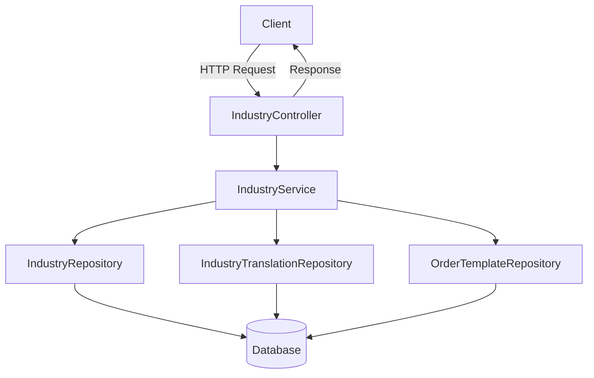
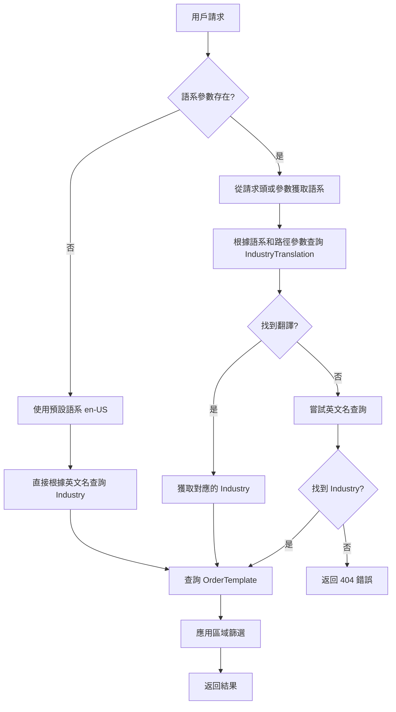
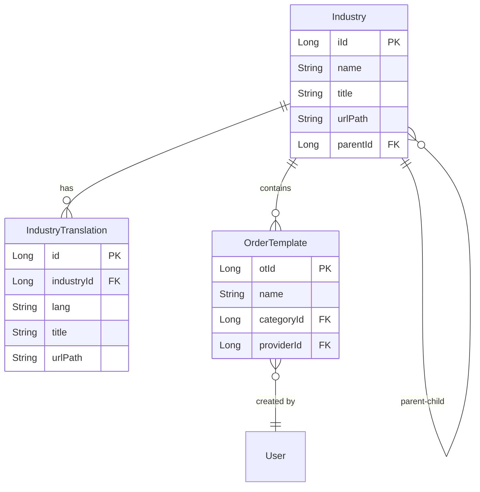
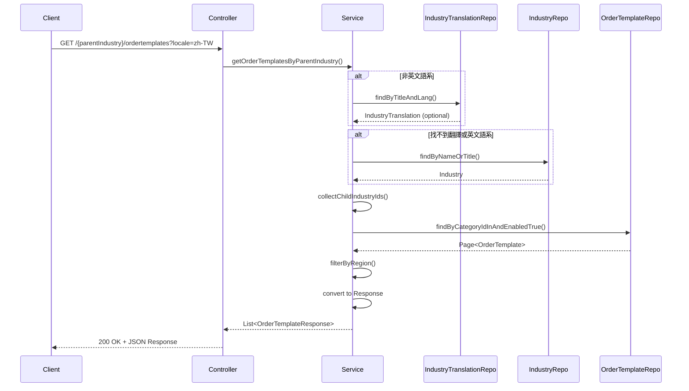

# IndustryController 多語言查詢 OrderTemplate 功能實施計劃

## 1. 功能概述和目標

### 1.1 功能概述
本計劃旨在擴展 `IndustryController`，新增根據 Industry 查詢相關 OrderTemplate 的功能。此功能將支援多語言查詢，允許用戶使用不同語言的 Industry 名稱或翻譯來查詢對應的 OrderTemplate。

### 1.2 主要目標
- 新增兩個 RESTful API 端點，支援階層式查詢
- 實現多語言支援，根據用戶語系自動選擇對應的 IndustryTranslation
- 處理 Industry 的父子階層關係
- 提供區域篩選功能
- 確保良好的錯誤處理和效能

### 1.3 預期效益
- 提升用戶體驗：用戶可以使用自己熟悉的語言查詢
- 支援國際化：為不同地區的用戶提供在地化的查詢體驗
- 提高查詢靈活性：支援階層式的分類查詢

## 2. 技術架構說明

### 2.1 系統架構


### 2.2 多語言查詢流程


### 2.3 資料模型關係


## 3. 需要修改的檔案清單

1. **Controller 層**
   - `src/main/java/com/casemgr/controller/IndustryController.java` - 新增兩個 API 端點

2. **Service 層**
   - `src/main/java/com/casemgr/service/IndustryService.java` - 新增介面方法
   - `src/main/java/com/casemgr/service/impl/IndustryServiceImpl.java` - 實現業務邏輯

3. **Repository 層**
   - `src/main/java/com/casemgr/repository/OrderTemplateRepository.java` - 新增查詢方法
   - `src/main/java/com/casemgr/repository/IndustryTranslationRepository.java` - 新增多語言查詢方法

4. **Request/Response 物件（如需要）**
   - 可能需要新增 `OrderTemplateQueryRequest.java` - 處理查詢參數
   - 可能需要擴展 `OrderTemplateResponse.java` - 包含額外資訊

## 4. 每個檔案的具體修改步驟和程式碼範例

### 4.1 IndustryController.java 修改

```java
// 新增以下方法到 IndustryController

/**
 * 根據父分類查詢 OrderTemplate（支援多語言）
 */
@GetMapping("/{parentIndustry}/ordertemplates")
@Operation(summary = "Get OrderTemplates by parent industry",
           description = "Get OrderTemplates by parent industry name/translation. Supports multi-language query.")
public ResponseEntity<List<OrderTemplateResponse>> getOrderTemplatesByParentIndustry(
        @Parameter(description = "Parent industry name or translation") 
        @PathVariable("parentIndustry") String parentIndustry,
        @Parameter(description = "Locale for industry name resolution (e.g., en-US, zh-TW)") 
        @RequestParam(required = false, defaultValue = "en-US") String locale,
        @Parameter(description = "Region filter for templates") 
        @RequestParam(required = false) String region,
        @Parameter(description = "Page number (0-based)") 
        @RequestParam(required = false, defaultValue = "0") int page,
        @Parameter(description = "Page size") 
        @RequestParam(required = false, defaultValue = "20") int size) {
    return ResponseEntity.ok(industryService.getOrderTemplatesByParentIndustry(
            parentIndustry, locale, region, page, size));
}

/**
 * 根據父分類和子分類查詢 OrderTemplate（支援多語言）
 */
@GetMapping("/{parentIndustry}/{childIndustry}/ordertemplates")
@Operation(summary = "Get OrderTemplates by parent and child industry",
           description = "Get OrderTemplates by parent and child industry names/translations. Supports multi-language query.")
public ResponseEntity<List<OrderTemplateResponse>> getOrderTemplatesByIndustryHierarchy(
        @Parameter(description = "Parent industry name or translation") 
        @PathVariable("parentIndustry") String parentIndustry,
        @Parameter(description = "Child industry name or translation") 
        @PathVariable("childIndustry") String childIndustry,
        @Parameter(description = "Locale for industry name resolution (e.g., en-US, zh-TW)") 
        @RequestParam(required = false, defaultValue = "en-US") String locale,
        @Parameter(description = "Region filter for templates") 
        @RequestParam(required = false) String region,
        @Parameter(description = "Page number (0-based)") 
        @RequestParam(required = false, defaultValue = "0") int page,
        @Parameter(description = "Page size") 
        @RequestParam(required = false, defaultValue = "20") int size) {
    return ResponseEntity.ok(industryService.getOrderTemplatesByIndustryHierarchy(
            parentIndustry, childIndustry, locale, region, page, size));
}
```

### 4.2 IndustryService.java 修改

```java
// 新增以下方法到 IndustryService 介面

/**
 * 根據父分類查詢 OrderTemplate（支援多語言）
 * 
 * @param parentIndustryName 父分類名稱或翻譯
 * @param locale 語系
 * @param region 區域篩選
 * @param page 頁碼
 * @param size 每頁大小
 * @return OrderTemplate 列表
 */
List<OrderTemplateResponse> getOrderTemplatesByParentIndustry(
    String parentIndustryName, String locale, String region, int page, int size) 
    throws EntityNotFoundException;

/**
 * 根據父分類和子分類查詢 OrderTemplate（支援多語言）
 * 
 * @param parentIndustryName 父分類名稱或翻譯
 * @param childIndustryName 子分類名稱或翻譯
 * @param locale 語系
 * @param region 區域篩選
 * @param page 頁碼
 * @param size 每頁大小
 * @return OrderTemplate 列表
 */
List<OrderTemplateResponse> getOrderTemplatesByIndustryHierarchy(
    String parentIndustryName, String childIndustryName, 
    String locale, String region, int page, int size) 
    throws EntityNotFoundException;
```

### 4.3 IndustryServiceImpl.java 修改

```java
// 新增以下實現到 IndustryServiceImpl

@Autowired
private OrderTemplateRepository orderTemplateRepository;

@Autowired
private IndustryTranslationRepository industryTranslationRepository;

@Autowired
private OrderTemplateConverter orderTemplateConverter;

// 快取設定（可選）
@Cacheable(value = "industryOrderTemplates", 
           key = "#parentIndustryName + '_' + #locale + '_' + #region + '_' + #page + '_' + #size")
@Override
@Transactional(readOnly = true)
public List<OrderTemplateResponse> getOrderTemplatesByParentIndustry(
        String parentIndustryName, String locale, String region, int page, int size) 
        throws EntityNotFoundException {
    
    // 1. 解析 Industry
    Industry parentIndustry = resolveIndustryByNameAndLocale(parentIndustryName, locale);
    
    // 2. 獲取所有子分類（包含自己）
    List<Long> industryIds = new ArrayList<>();
    industryIds.add(parentIndustry.getIId());
    collectChildIndustryIds(parentIndustry, industryIds);
    
    // 3. 查詢 OrderTemplate
    Page<OrderTemplate> templates = orderTemplateRepository
        .findByCategoryIdInAndEnabledTrue(industryIds, 
            PageRequest.of(page, size, Sort.by("createTime").descending()));
    
    // 4. 轉換為 Response 並應用區域篩選
    return templates.stream()
        .filter(template -> filterByRegion(template, region))
        .map(OrderTemplateResponse::new)
        .collect(Collectors.toList());
}

@Override
@Transactional(readOnly = true)
public List<OrderTemplateResponse> getOrderTemplatesByIndustryHierarchy(
        String parentIndustryName, String childIndustryName, 
        String locale, String region, int page, int size) 
        throws EntityNotFoundException {
    
    // 1. 解析父分類
    Industry parentIndustry = resolveIndustryByNameAndLocale(parentIndustryName, locale);
    
    // 2. 解析子分類（必須是父分類的子分類）
    Industry childIndustry = resolveChildIndustryByNameAndLocale(
        childIndustryName, locale, parentIndustry);
    
    // 3. 查詢 OrderTemplate（只查詢子分類）
    Page<OrderTemplate> templates = orderTemplateRepository
        .findByCategoryIdAndEnabledTrue(childIndustry.getIId(),
            PageRequest.of(page, size, Sort.by("createTime").descending()));
    
    // 4. 轉換為 Response 並應用區域篩選
    return templates.stream()
        .filter(template -> filterByRegion(template, region))
        .map(OrderTemplateResponse::new)
        .collect(Collectors.toList());
}

// 輔助方法：根據名稱和語系解析 Industry
private Industry resolveIndustryByNameAndLocale(String industryName, String locale) 
        throws EntityNotFoundException {
    
    // 嘗試通過翻譯查找
    if (!locale.equalsIgnoreCase("en-US")) {
        Optional<IndustryTranslation> translation = 
            industryTranslationRepository.findByTitleAndLang(industryName, locale);
        
        if (translation.isPresent()) {
            return translation.get().getIndustry();
        }
    }
    
    // 嘗試通過英文名查找
    Industry industry = industryRepository.findByNameOrTitle(industryName, industryName)
        .orElseThrow(() -> new EntityNotFoundException(
            "Industry not found with name: " + industryName + " (locale: " + locale + ")"));
    
    return industry;
}

// 輔助方法：解析子分類（確保是指定父分類的子分類）
private Industry resolveChildIndustryByNameAndLocale(
        String childIndustryName, String locale, Industry parentIndustry) 
        throws EntityNotFoundException {
    
    Industry childIndustry = resolveIndustryByNameAndLocale(childIndustryName, locale);
    
    // 驗證是否為子分類
    if (childIndustry.getParentIndustry() == null || 
        !childIndustry.getParentIndustry().getIId().equals(parentIndustry.getIId())) {
        throw new EntityNotFoundException(
            "Industry '" + childIndustryName + "' is not a child of '" + 
            parentIndustry.getName() + "'");
    }
    
    return childIndustry;
}

// 輔助方法：遞迴收集所有子分類 ID
private void collectChildIndustryIds(Industry parent, List<Long> ids) {
    if (parent.getChildIndustries() != null) {
        for (Industry child : parent.getChildIndustries()) {
            ids.add(child.getIId());
            collectChildIndustryIds(child, ids);
        }
    }
}

// 輔助方法：區域篩選
private boolean filterByRegion(OrderTemplate template, String region) {
    if (StringUtils.isEmpty(region)) {
        return true;
    }
    
    // 假設 User 實體有 region 屬性
    // 可根據實際需求調整篩選邏輯
    return template.getProvider() != null && 
           region.equals(template.getProvider().getRegion());
}
```

### 4.4 OrderTemplateRepository.java 修改

```java
// 新增以下方法到 OrderTemplateRepository

import org.springframework.data.domain.Page;
import org.springframework.data.domain.Pageable;

/**
 * 根據多個分類 ID 查詢啟用的 OrderTemplate
 */
Page<OrderTemplate> findByCategoryIdInAndEnabledTrue(
    List<Long> categoryIds, Pageable pageable);

/**
 * 根據單個分類 ID 查詢啟用的 OrderTemplate
 */
Page<OrderTemplate> findByCategoryIdAndEnabledTrue(
    Long categoryId, Pageable pageable);

/**
 * 根據分類 ID 和提供者區域查詢
 */
@Query("SELECT ot FROM OrderTemplate ot WHERE ot.category.iId = :categoryId " +
       "AND ot.enabled = true AND ot.provider.region = :region")
Page<OrderTemplate> findByCategoryIdAndRegion(
    @Param("categoryId") Long categoryId, 
    @Param("region") String region, 
    Pageable pageable);
```

### 4.5 IndustryTranslationRepository.java 修改

```java
// 新增以下方法到 IndustryTranslationRepository

/**
 * 根據標題和語言查找翻譯
 */
Optional<IndustryTranslation> findByTitleAndLang(String title, String lang);

/**
 * 根據 URL 路徑和語言查找翻譯
 */
Optional<IndustryTranslation> findByUrlPathAndLang(String urlPath, String lang);
```

### 4.6 IndustryRepository.java 修改

```java
// 新增以下方法到 IndustryRepository

/**
 * 根據名稱或標題查找 Industry
 */
Optional<Industry> findByNameOrTitle(String name, String title);
```

## 5. 資料流程圖



## 6. 測試計劃

### 6.1 單元測試

1. **IndustryServiceImpl 測試**
   - 測試多語言查詢成功場景
   - 測試找不到翻譯時的降級處理
   - 測試父子分類驗證
   - 測試區域篩選邏輯

2. **Repository 測試**
   - 測試新增的查詢方法
   - 測試分頁功能

### 6.2 整合測試

1. **API 端點測試**
   ```java
   @Test
   void testGetOrderTemplatesByParentIndustry_WithChineseTranslation() {
       // Given
       String parentIndustry = "軟體開發";
       String locale = "zh-TW";
       
       // When
       ResponseEntity<List<OrderTemplateResponse>> response = 
           restTemplate.getForEntity(
               "/api/industries/{parentIndustry}/ordertemplates?locale={locale}",
               new ParameterizedTypeReference<List<OrderTemplateResponse>>() {},
               parentIndustry, locale);
       
       // Then
       assertEquals(HttpStatus.OK, response.getStatusCode());
       assertNotNull(response.getBody());
       assertFalse(response.getBody().isEmpty());
   }
   ```

2. **錯誤處理測試**
   - 測試無效的 Industry 名稱
   - 測試無效的父子關係
   - 測試無效的語系

### 6.3 效能測試

1. **負載測試**
   - 測試並發查詢效能
   - 測試大量資料的分頁效能

2. **快取測試**
   - 驗證快取命中率
   - 測試快取失效機制

## 7. 實施時間表建議

### 第 1 週：準備和設計階段
- **Day 1-2**: 需求確認和設計評審
- **Day 3-4**: 資料庫 Schema 調整（如需要）
- **Day 5**: 開發環境準備

### 第 2 週：核心開發階段
- **Day 1-2**: Repository 層開發
- **Day 3-4**: Service 層實現
- **Day 5**: Controller 層開發

### 第 3 週：測試和優化階段
- **Day 1-2**: 單元測試編寫
- **Day 3**: 整合測試
- **Day 4**: 效能優化和快取實現
- **Day 5**: 程式碼審查和文件更新

### 第 4 週：部署和監控
- **Day 1-2**: UAT 測試
- **Day 3**: 生產環境部署準備
- **Day 4**: 部署和監控設置
- **Day 5**: 上線後觀察和調整

## 8. 注意事項和建議

### 8.1 效能優化建議
1. **使用快取**：對常用的查詢結果進行快取，特別是 Industry 翻譯的查詢
2. **資料庫索引**：確保 `industry_translation` 表的 `(title, lang)` 組合有索引
3. **懶加載優化**：適當使用 `@EntityGraph` 或 `JOIN FETCH` 來減少 N+1 查詢問題

### 8.2 錯誤處理建議
1. **友善的錯誤訊息**：根據用戶語系返回對應語言的錯誤訊息
2. **降級處理**：當找不到特定語言的翻譯時，自動降級到英文
3. **日誌記錄**：記錄所有查詢失敗的情況，便於問題追蹤

### 8.3 安全性建議
1. **輸入驗證**：對所有輸入參數進行驗證，防止 SQL 注入
2. **權限控制**：根據需求決定是否需要身份驗證
3. **速率限制**：考慮添加 API 速率限制，防止濫用

### 8.4 擴展性建議
1. **模組化設計**：將多語言查詢邏輯抽取為獨立的元件，便於重用
2. **配置化**：將預設語系、快取時間等設為可配置項
3. **監控指標**：添加查詢效能、快取命中率等監控指標

## 9. 結論

本實施計劃提供了一個完整的解決方案，用於實現 IndustryController 的多語言查詢 OrderTemplate 功能。通過遵循此計劃，可以確保功能的正確實現，同時保持良好的效能和可維護性。建議在實施過程中保持靈活性，根據實際情況調整細節。