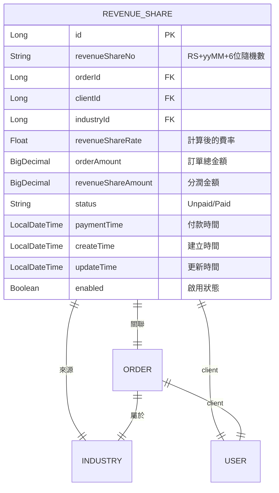
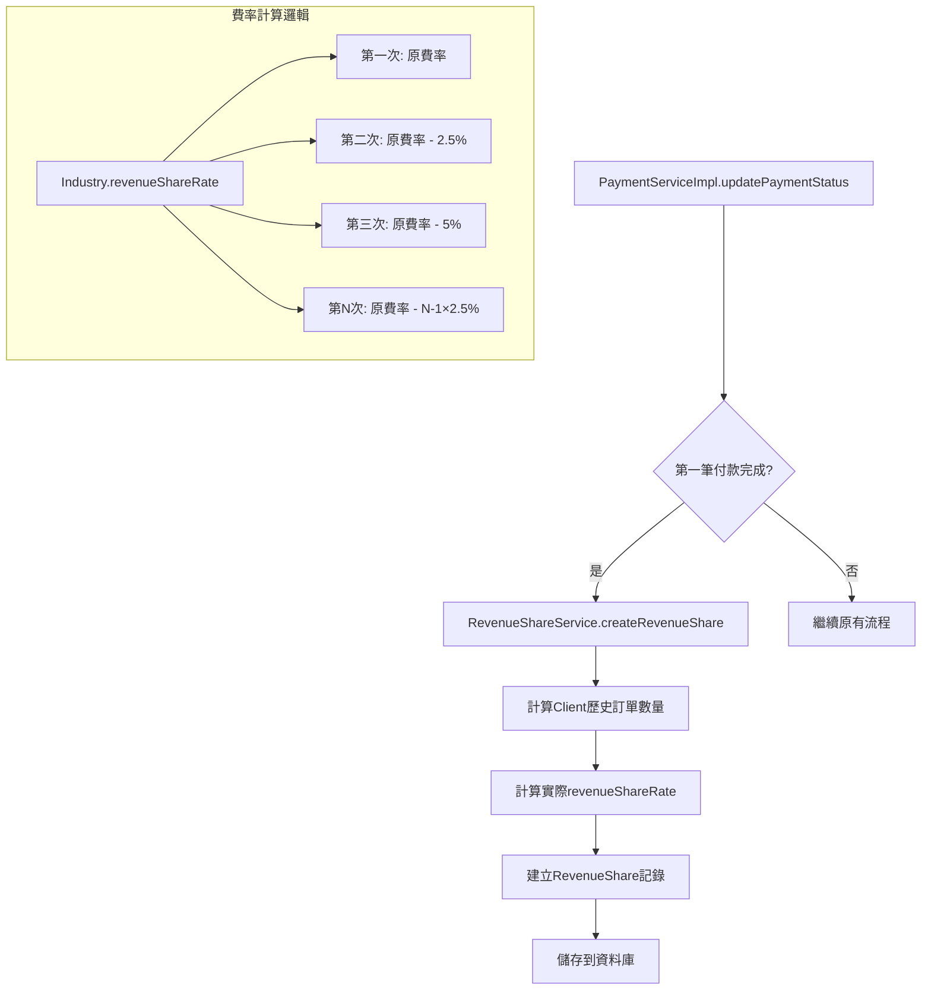
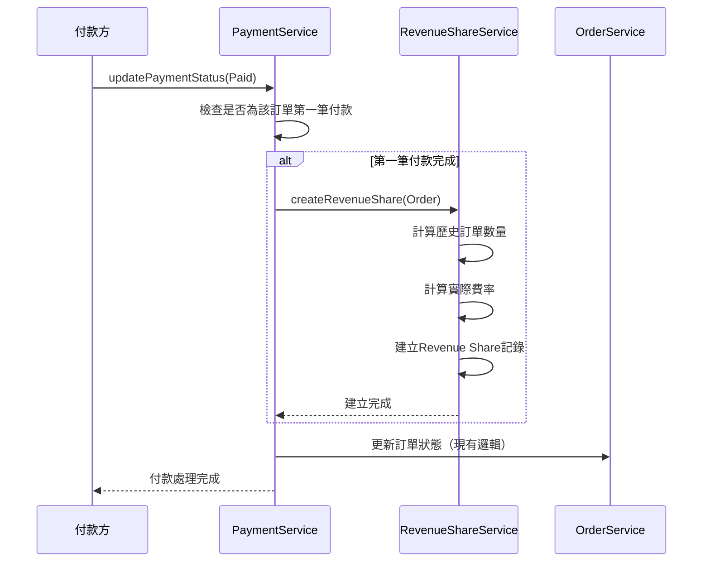
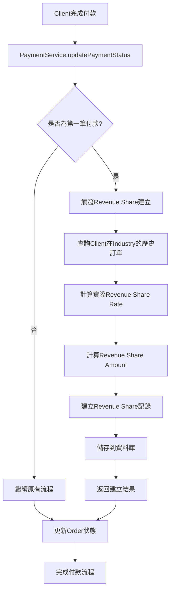

# Revenue Share功能技術架構設計文件

**文件版本：** 1.0.0  
**更新日期：** 2025/6/17  
**作者：** Kilo Code  

---

## 📋 需求概述

### 功能需求
1. 在Industry entity中增加revenueShareRate欄位 ✅ (已存在)
2. 建立新的Revenue Share entity，包含以下欄位：
   - ID格式為RS開頭 (避免與現有CO前綴衝突)
   - 關聯Order
   - revenueShareRate
   - status (Unpaid/Paid)
   - 付款時間
   - 訂單金額
   - revenueShare amount（訂單金額 * revenueShareRate）
3. 當第一筆Payment Card狀態變為已支付時，自動建立Revenue Share記錄
4. revenueShareRate計算邏輯：
   - 同一個Client User第一次使用Industry定義的rate
   - 第N次訂單：原費率 - (N-1) * 2.5%
5. 需要基本CRUD API和狀態更新API

---

## 🔍 現有架構分析

### ✅ 現有優勢
1. **Industry實體**：已有`revenueShareRate`欄位（Float類型）
2. **ID生成機制**：使用[`NumberUtils.generateFormNumber()`](src/main/java/com/casemgr/utils/NumberUtils.java:8)，支援自定義前綴
3. **付款流程**：[`PaymentServiceImpl.updatePaymentStatus()`](src/main/java/com/casemgr/service/impl/PaymentServiceImpl.java:255)可監聽付款狀態變化
4. **Order關聯**：Order已關聯Industry、Client、Provider等必要實體
5. **BaseEntity**：提供創建時間、更新時間、啟用狀態等通用欄位

### ⚠️ 需要處理的問題
1. **ID前綴衝突**：Commission已使用"CO"前綴，需要為Revenue Share使用"RS"前綴
2. **觸發點設計**：需要在第一筆Payment Card完成時觸發建立Revenue Share記錄

---

## 🏗️ Revenue Share技術架構設計

### 1. 實體層設計 (Entity Layer)



#### 1.1 RevenueShare實體設計
```java
@Entity
@Table(name = "T_REVENUE_SHARE")
@SQLDelete(sql = "UPDATE t_revenue_share SET enabled=false WHERE id=?")
@Where(clause = "enabled = true")
public class RevenueShare extends BaseEntity {
    
    @Id
    @GeneratedValue(strategy = GenerationType.IDENTITY)
    @Column(name = "ID")
    private Long id;
    
    @Column(name = "REVENUE_SHARE_NO", nullable = false, unique = true)
    private String revenueShareNo; // RS + yyMM + 6位隨機數
    
    @ManyToOne(fetch = FetchType.LAZY)
    @JoinColumn(name = "ORDER_ID", referencedColumnName = "ID")
    private Order order;
    
    @ManyToOne(fetch = FetchType.LAZY)
    @JoinColumn(name = "CLIENT_ID", referencedColumnName = "ID")
    private User client;
    
    @ManyToOne(fetch = FetchType.LAZY)
    @JoinColumn(name = "INDUSTRY_ID", referencedColumnName = "ID")
    private Industry industry;
    
    @Column(name = "REVENUE_SHARE_RATE", nullable = false)
    private Float revenueShareRate; // 計算後的實際費率
    
    @Column(name = "ORDER_AMOUNT", precision = 19, scale = 4, nullable = false)
    private BigDecimal orderAmount; // 訂單總金額
    
    @Column(name = "REVENUE_SHARE_AMOUNT", precision = 19, scale = 4, nullable = false)
    private BigDecimal revenueShareAmount; // 分潤金額
    
    @Enumerated(EnumType.STRING)
    @Column(name = "STATUS", nullable = false)
    private RevenueShareStatus status; // Unpaid/Paid
    
    @Column(name = "PAYMENT_TIME")
    private LocalDateTime paymentTime;
}
```

#### 1.2 RevenueShareStatus枚舉
```java
public enum RevenueShareStatus {
    Unpaid,  // 未支付
    Paid     // 已支付
}
```

### 2. 服務層架構設計



#### 2.1 RevenueShareService接口
```java
public interface RevenueShareService {
    // 建立Revenue Share記錄（內部使用）
    RevenueShareResponse createRevenueShare(Order order);
    
    // 基本CRUD操作
    RevenueShareResponse getById(Long id);
    List<RevenueShareResponse> listByClientId(Long clientId);
    List<RevenueShareResponse> listByOrderId(Long orderId);
    Page<RevenueShareResponse> listAll(Pageable pageable);
    
    // 狀態更新
    RevenueShareResponse updateStatus(Long id, RevenueShareStatus status, LocalDateTime paymentTime);
    
    // 統計功能
    BigDecimal getTotalUnpaidAmount(Long clientId);
    BigDecimal getTotalPaidAmount(Long clientId);
}
```

#### 2.2 費率計算核心邏輯
```java
private Float calculateRevenueShareRate(User client, Industry industry) {
    // 計算該Client在該Industry的歷史訂單數量（不包含當前訂單）
    int historicalOrderCount = countClientOrdersByIndustry(client.getId(), industry.getId());
    
    Float baseRate = industry.getRevenueShareRate();
    if (baseRate == null) {
        throw new BusinessException("Industry revenue share rate not configured");
    }
    
    if (historicalOrderCount == 0) {
        return baseRate; // 第一次使用原費率
    }
    
    // 第N次訂單: 原費率 - (N-1) * 2.5%
    Float reduction = historicalOrderCount * 0.025f;
    Float finalRate = baseRate - reduction;
    
    // 確保費率不會變成負數，最低為0
    return Math.max(finalRate, 0.0f);
}
```

### 3. API設計

#### 3.1 RESTful API結構
```java
@RestController
@RequestMapping("/api/revenue-shares")
public class RevenueShareController {
    
    // 查詢Revenue Share列表
    @GetMapping
    public ResponseEntity<Page<RevenueShareResponse>> listRevenueShares(
        @RequestParam(defaultValue = "0") int page,
        @RequestParam(defaultValue = "10") int size,
        @RequestParam(required = false) Long clientId);
    
    // 查詢單一Revenue Share
    @GetMapping("/{id}")
    public ResponseEntity<RevenueShareResponse> getRevenueShare(@PathVariable Long id);
    
    // 更新付款狀態
    @PutMapping("/{id}/status")
    public ResponseEntity<RevenueShareResponse> updateStatus(
        @PathVariable Long id,
        @RequestBody RevenueShareStatusUpdateRequest request);
    
    // 統計資料
    @GetMapping("/stats")
    public ResponseEntity<RevenueShareStatsResponse> getStats(
        @RequestParam(required = false) Long clientId);
}
```

#### 3.2 管理員API
```java
@RestController
@RequestMapping("/api/admin/revenue-shares")
@PreAuthorize("hasRole('ADMIN')")
public class AdminRevenueShareController {
    
    // 管理員查詢所有記錄
    @GetMapping
    public ResponseEntity<Page<RevenueShareResponse>> listAllRevenueShares(Pageable pageable);
    
    // 管理員更新記錄
    @PutMapping("/{id}")
    public ResponseEntity<RevenueShareResponse> updateRevenueShare(
        @PathVariable Long id,
        @RequestBody RevenueShareUpdateRequest request);
    
    // 批量更新狀態
    @PutMapping("/batch-status")
    public ResponseEntity<List<RevenueShareResponse>> batchUpdateStatus(
        @RequestBody BatchStatusUpdateRequest request);
}
```

### 4. 資料傳輸物件設計 (DTOs)

#### 4.1 Request DTOs
```java
// 狀態更新請求
public class RevenueShareStatusUpdateRequest {
    @NotNull
    private RevenueShareStatus status;
    
    private LocalDateTime paymentTime;
}

// 管理員更新請求
public class RevenueShareUpdateRequest {
    private RevenueShareStatus status;
    private LocalDateTime paymentTime;
    private String remarks;
}

// 批量狀態更新請求
public class BatchStatusUpdateRequest {
    @NotNull
    private List<Long> ids;
    
    @NotNull
    private RevenueShareStatus status;
    
    private LocalDateTime paymentTime;
}
```

#### 4.2 Response DTOs
```java
// 主要回應DTO
public class RevenueShareResponse {
    private Long id;
    private String revenueShareNo;
    private Long orderId;
    private String orderNo;              // 來自Order
    private Long clientId;
    private String clientName;           // 來自User
    private Long industryId;
    private String industryName;         // 來自Industry
    private Float revenueShareRate;
    private BigDecimal orderAmount;
    private BigDecimal revenueShareAmount;
    private RevenueShareStatus status;
    private LocalDateTime paymentTime;
    private LocalDateTime createTime;
    private LocalDateTime updateTime;
}

// 統計資料回應
public class RevenueShareStatsResponse {
    private BigDecimal totalUnpaidAmount;
    private BigDecimal totalPaidAmount;
    private Long unpaidCount;
    private Long paidCount;
    private BigDecimal averageRevenueShareRate;
}
```

### 5. 業務邏輯整合點

#### 5.1 觸發點設計


#### 5.2 PaymentServiceImpl整合修改
在[`PaymentServiceImpl.updatePaymentStatus()`](src/main/java/com/casemgr/service/impl/PaymentServiceImpl.java:255)方法中新增：

```java
@Transactional
public PaymentCardResponse updatePaymentStatus(Long pcId, PaymentStatus status) throws EntityNotFoundException {
    // ... 現有邏輯 ...
    
    // 新增：如果是第一筆付款完成，建立Revenue Share記錄
    if (status == PaymentStatus.Paid) {
        boolean isFirstPayment = isFirstPaymentForOrder(currentOrder);
        if (isFirstPayment) {
            log.info("First payment completed for Order ID: {}. Creating Revenue Share record.", currentOrder.getOId());
            revenueShareService.createRevenueShare(currentOrder);
        }
    }
    
    // ... 繼續現有邏輯 ...
}

private boolean isFirstPaymentForOrder(Order order) {
    return order.getPayments().stream()
        .filter(pc -> PaymentStatus.Paid.equals(pc.getStatus()))
        .count() == 1; // 剛好有一筆已付款
}
```

---

## 📁 檔案結構與實作順序

### 階段一：核心實體與資料層（第1週）
1. `src/main/java/com/casemgr/entity/RevenueShare.java` - 核心實體
2. `src/main/java/com/casemgr/repository/RevenueShareRepository.java` - 資料存取層
3. `src/main/java/com/casemgr/enumtype/RevenueShareStatus.java` - 狀態枚舉

### 階段二：業務邏輯層（第2週）
4. `src/main/java/com/casemgr/service/RevenueShareService.java` - 服務接口
5. `src/main/java/com/casemgr/service/impl/RevenueShareServiceImpl.java` - 服務實作
6. `src/main/java/com/casemgr/request/RevenueShareStatusUpdateRequest.java` - 請求DTO
7. `src/main/java/com/casemgr/request/RevenueShareUpdateRequest.java` - 管理員請求DTO
8. `src/main/java/com/casemgr/response/RevenueShareResponse.java` - 回應DTO
9. `src/main/java/com/casemgr/response/RevenueShareStatsResponse.java` - 統計回應DTO
10. `src/main/java/com/casemgr/converter/RevenueShareConverter.java` - 資料轉換器

### 階段三：API層與整合（第2週）
11. `src/main/java/com/casemgr/controller/RevenueShareController.java` - 用戶API
12. `src/main/java/com/casemgr/controller/AdminRevenueShareController.java` - 管理員API
13. 修改`src/main/java/com/casemgr/service/impl/PaymentServiceImpl.java` - 整合觸發點

### 階段四：測試與優化（第3週）
14. 單元測試
15. 整合測試
16. 效能優化和資料庫索引

---

## 🔧 技術實作細節

### 1. ID生成策略
```java
// 在RevenueShareServiceImpl中
private String generateRevenueShareNo() {
    return NumberUtils.generateFormNumber("RS");
    // 格式：RS + yyMM + 6位隨機數
    // 例如：RS2506123456
}
```

### 2. 資料庫Repository設計
```java
@Repository
public interface RevenueShareRepository extends JpaRepository<RevenueShare, Long> {
    
    // 根據客戶查詢
    List<RevenueShare> findByClientIdOrderByCreateTimeDesc(Long clientId);
    
    // 根據訂單查詢
    Optional<RevenueShare> findByOrderId(Long orderId);
    
    // 根據狀態查詢
    List<RevenueShare> findByStatus(RevenueShareStatus status);
    
    // 計算客戶在特定行業的歷史訂單數量
    @Query("SELECT COUNT(rs) FROM RevenueShare rs WHERE rs.client.id = :clientId AND rs.industry.id = :industryId")
    int countByClientIdAndIndustryId(@Param("clientId") Long clientId, @Param("industryId") Long industryId);
    
    // 計算未付款總金額
    @Query("SELECT COALESCE(SUM(rs.revenueShareAmount), 0) FROM RevenueShare rs WHERE rs.client.id = :clientId AND rs.status = 'Unpaid'")
    BigDecimal sumUnpaidAmountByClientId(@Param("clientId") Long clientId);
    
    // 計算已付款總金額
    @Query("SELECT COALESCE(SUM(rs.revenueShareAmount), 0) FROM RevenueShare rs WHERE rs.client.id = :clientId AND rs.status = 'Paid'")
    BigDecimal sumPaidAmountByClientId(@Param("clientId") Long clientId);
}
```

### 3. 資料庫索引建議
```sql
-- 建議建立的索引以提升查詢效能
CREATE INDEX idx_revenue_share_order_id ON t_revenue_share(order_id);
CREATE INDEX idx_revenue_share_client_id ON t_revenue_share(client_id);
CREATE INDEX idx_revenue_share_industry_id ON t_revenue_share(industry_id);
CREATE INDEX idx_revenue_share_status ON t_revenue_share(status);
CREATE INDEX idx_revenue_share_create_time ON t_revenue_share(create_time);
CREATE INDEX idx_revenue_share_client_industry ON t_revenue_share(client_id, industry_id);
```

### 4. 異常處理設計
```java
// 自定義異常
public class RevenueShareException extends BusinessException {
    public RevenueShareException(String message) {
        super(message);
    }
}

// 在服務中的異常處理
public RevenueShareResponse createRevenueShare(Order order) {
    try {
        // 驗證訂單狀態
        if (order == null) {
            throw new RevenueShareException("Order cannot be null");
        }
        
        if (order.getIndustry() == null || order.getIndustry().getRevenueShareRate() == null) {
            throw new RevenueShareException("Industry revenue share rate not configured");
        }
        
        // 檢查是否已存在Revenue Share記錄
        if (revenueShareRepository.findByOrderId(order.getOId()).isPresent()) {
            throw new RevenueShareException("Revenue Share record already exists for this order");
        }
        
        // ... 建立邏輯 ...
        
    } catch (Exception e) {
        log.error("Failed to create Revenue Share for Order ID: {}", order.getOId(), e);
        throw new RevenueShareException("Failed to create Revenue Share record: " + e.getMessage());
    }
}
```

---

## 🎯 實作優先順序建議

### 高優先級（第1週）- 核心功能
- ✅ 建立RevenueShare實體和Repository
- ✅ 實作基本的RevenueShareService CRUD
- ✅ 實作費率計算邏輯
- ✅ 單元測試覆蓋核心邏輯

### 中優先級（第2週）- API與整合
- ✅ 實作Controller層和DTOs
- ✅ 整合到PaymentService觸發點
- ✅ 實作基本的異常處理
- ✅ API測試

### 低優先級（第3週）- 優化與管理
- ✅ 管理員功能
- ✅ 統計和報表功能
- ✅ 效能優化
- ✅ 完整的整合測試
- ✅ 文件更新

---

## 📊 資料流程圖



---

## 🚀 後續擴展可能性

### 1. 進階功能
- **自動付款提醒**：定期提醒未付款的Revenue Share
- **批量處理**：支援批量更新狀態和批量付款
- **報表系統**：詳細的Revenue Share分析報表
- **審計日誌**：記錄所有狀態變更的審計軌跡

### 2. 系統整合
- **財務系統整合**：與現有財務模組整合
- **通知系統**：整合郵件或簡訊通知
- **Dashboard**：管理員儀表板顯示統計資料

### 3. 效能優化
- **快取機制**：對頻繁查詢的資料進行快取
- **異步處理**：大量資料處理使用異步方式
- **資料庫分片**：高併發情況下的資料庫優化

---

## 📝 注意事項

### 1. 業務邏輯注意點
- **費率下限**：確保費率不會變成負數
- **重複建立防護**：同一訂單不可建立多筆Revenue Share記錄
- **資料一致性**：確保訂單金額與Revenue Share計算一致

### 2. 技術實作注意點
- **事務處理**：確保Revenue Share建立與付款更新在同一事務中
- **異常處理**：妥善處理各種異常情況
- **日誌記錄**：詳細記錄關鍵操作日誌

### 3. 測試重點
- **費率計算邏輯**：各種情況下的費率計算正確性
- **觸發時機**：確保只在第一筆付款時觸發
- **併發處理**：多個付款同時進行的情況處理

---

**文件結束**  
*此架構設計將為Revenue Share功能提供完整、可維護、可擴展的技術基礎*