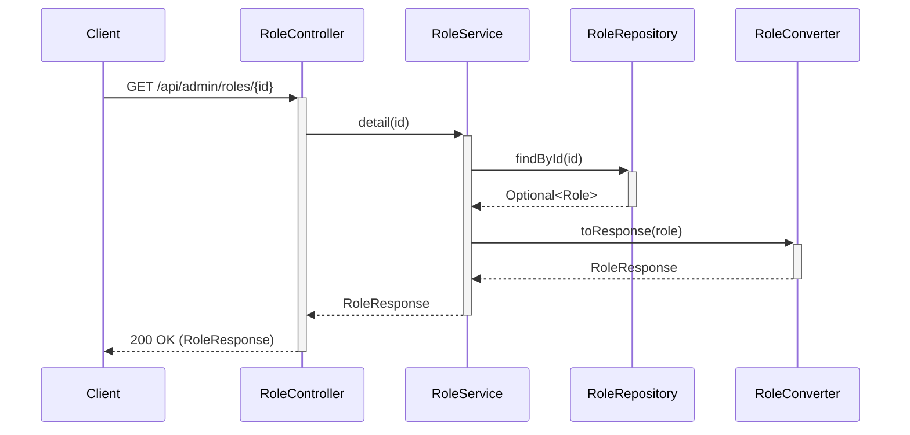
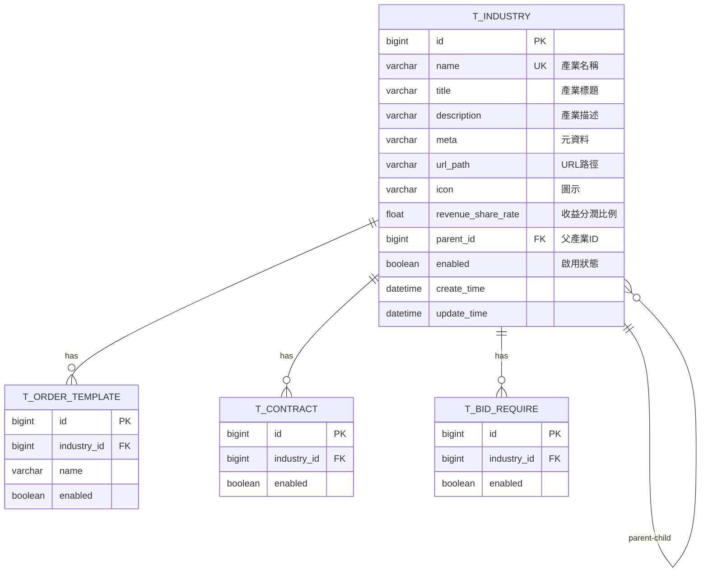
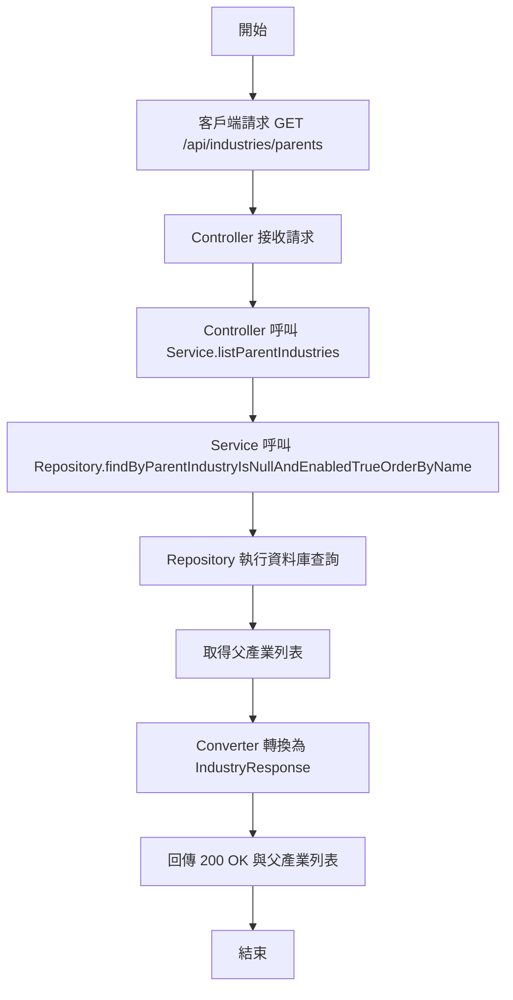
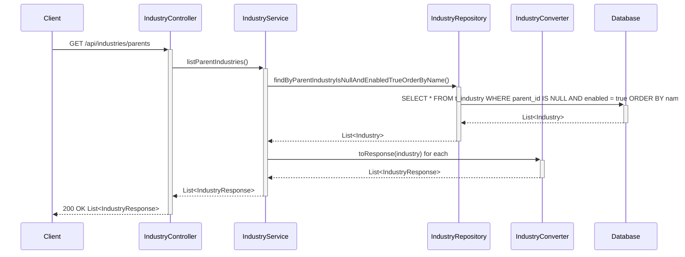

# API 規格文件 (spec.md)

## 1. 總覽

本文件定義了系統中各種 API 的技術規格，包括：
- `Role` (角色) 管理 API：允許管理員 (ADMIN) 對系統中的角色進行建立、讀取、更新和刪除 (CRUD) 操作
- `Industry` (產業) 管理 API：提供產業分類的查詢和管理功能，包括父產業專用 API

設計遵循統一的實作模式，並整合了權限控制、軟刪除和結構化資料轉換。

## 2. 實體關係圖 (ERD)

我們需要在 `T_ROLE` 和 `T_INDUSTRY` 之間建立一個多對多的關聯表 `T_ROLE_INDUSTRY_SCOPE` 來管理角色的產業權限範圍。

```mermaid
erDiagram
    T_USER ||--o{ T_USER_ROLE : "has"
    T_ROLE ||--o{ T_USER_ROLE : "has"
    T_ROLE ||--o{ T_ROLE_INDUSTRY_SCOPE : "has"
    T_INDUSTRY ||--o{ T_ROLE_INDUSTRY_SCOPE : "has"

    T_USER {
        bigint id PK
        varchar username
        varchar password
        varchar email
        boolean enabled
        -- other columns
    }

    T_ROLE {
        bigint id PK "原 rId，建議統一為 id"
        varchar roleName UK
        varchar description
        boolean enabled
    }

    T_USER_ROLE {
        bigint user_id PK, FK
        bigint role_id PK, FK
    }

    T_INDUSTRY {
        bigint id PK
        varchar name UK
        varchar title
        bigint parent_id FK
        boolean enabled
        -- other columns
    }

    T_ROLE_INDUSTRY_SCOPE {
        bigint role_id PK, FK
        bigint industry_id PK, FK
        boolean is_all_industries "標記是否適用所有產業"
    }
```

**資料庫表格設計:**

*   **T_ROLE**:
    *   `id` (bigint, PK): 主鍵。
    *   `role_name` (varchar, UK): 角色名稱 (e.g., 'ADMIN', 'PROVIDER')。
    *   `description` (varchar): 角色描述。
    *   `enabled` (boolean): 軟刪除標記。
    *   `create_time`, `update_time` (datetime): 繼承自 `BaseEntity`。

*   **T_ROLE_INDUSTRY_SCOPE**:
    *   `role_id` (bigint, PK, FK): 外鍵，關聯到 `T_ROLE.id`。
    *   `industry_id` (bigint, PK, FK): 外鍵，關聯到 `T_INDUSTRY.id`。
    *   `is_all_industries` (boolean): 若為 `true`，則 `industry_id` 可為 `NULL`，表示此角色適用於所有產業。

## 3. API 接口定義

所有端點的基礎路徑為 `/api/admin/roles`。

### 3.1. 權限控制

所有 `/api/admin/roles/**` 路徑下的端點都必須要求使用者具有 `ADMIN` 角色。這將透過 Spring Security 的 `@PreAuthorize("hasRole('ADMIN')")` 註解在 `RoleController` 上實現。

### 3.2. 端點詳情

#### 3.2.1. 獲取所有角色 (GET /)

*   **描述**: 獲取所有未被軟刪除的角色列表。
*   **成功回應 (200 OK)**:
    ```json
    [
      {
        "id": 1,
        "roleName": "ADMIN",
        "description": "System Administrator"
      },
      {
        "id": 2,
        "roleName": "PROVIDER",
        "description": "Service Provider"
      }
    ]
    ```

#### 3.2.2. 獲取單一角色 (GET /{id})

*   **描述**: 根據 ID 獲取單一角色的詳細資訊。
*   **成功回應 (200 OK)**:
    ```json
    {
      "id": 1,
      "roleName": "ADMIN",
      "description": "System Administrator"
    }
    ```
*   **錯誤回應 (404 Not Found)**: 如果找不到對應 ID 的角色。

#### 3.2.3. 建立新角色 (POST /)

*   **描述**: 建立一個新的角色。
*   **請求內文**: `RoleRequest`
    ```json
    {
      "roleName": "NEW_ROLE",
      "description": "A new role for testing"
    }
    ```
*   **成功回應 (201 Created)**:
    ```json
    {
      "id": 3,
      "roleName": "NEW_ROLE",
      "description": "A new role for testing"
    }
    ```
*   **錯誤回應 (400 Bad Request)**: 如果請求資料驗證失敗 (例如 `roleName` 為空或重複)。

#### 3.2.4. 更新角色 (PUT /{id})

*   **描述**: 更新一個已存在角色的資訊。
*   **請求內文**: `RoleRequest`
    ```json
    {
      "roleName": "UPDATED_ROLE",
      "description": "An updated description"
    }
    ```
*   **成功回應 (200 OK)**:
    ```json
    {
      "id": 3,
      "roleName": "UPDATED_ROLE",
      "description": "An updated description"
    }
    ```
*   **錯誤回應 (404 Not Found)**: 如果找不到對應 ID 的角色。
*   **錯誤回應 (400 Bad Request)**: 如果請求資料驗證失敗。

#### 3.2.5. 刪除角色 (DELETE /{id})

*   **描述**: 軟刪除一個角色。
*   **成功回應 (204 No Content)**:
*   **錯誤回應 (404 Not Found)**: 如果找不到對應 ID 的角色。

## 4. 資料傳輸物件 (DTO)

### 4.1. RoleRequest.java

```java
package com.casemgr.request;

import jakarta.validation.constraints.NotBlank;
import jakarta.validation.constraints.Size;
import lombok.Data;

@Data
public class RoleRequest {

    @NotBlank(message = "Role name cannot be blank")
    @Size(max = 50, message = "Role name cannot exceed 50 characters")
    private String roleName;

    @Size(max = 200, message = "Description cannot exceed 200 characters")
    private String description;
}
```

### 4.2. RoleResponse.java

```java
package com.casemgr.response;

import lombok.Data;

@Data
public class RoleResponse {
    private Long id;
    private String roleName;
    private String description;
}
```

## 5. 流程圖與循序圖

### 5.1. 建立角色流程圖

```mermaid
graph TD
    A[開始] --> B{請求到達 Controller};
    B --> C[@PreAuthorize('hasRole(\'ADMIN\')')];
    C -- 驗證通過 --> D[Controller 呼叫 Service.create(request)];
    C -- 驗證失敗 --> E[回傳 403 Forbidden];
    D --> F[Service 驗證 roleName 是否重複];
    F -- 不重複 --> G[Converter.toEntity(request)];
    F -- 重複 --> H[拋出例外];
    G --> I[Repository.save(entity)];
    I --> J[Converter.toResponse(savedEntity)];
    J --> K[回傳 201 Created 與 Response];
    H --> K;
    K --> Z[結束];
```

### 5.2. 查詢角色循序圖



## 6. 錯誤處理

系統將使用全局異常處理器 (`@ControllerAdvice`) 來捕獲並處理以下常見異常：

*   `EntityNotFoundException`: 回傳 `404 Not Found`。
*   `DataIntegrityViolationException` (e.g., unique constraint violation): 回傳 `400 Bad Request`，並附帶清晰的錯誤訊息。
*   `MethodArgumentNotValidException` (Bean Validation 失敗): 回傳 `400 Bad Request`，並列出所有驗證失敗的欄位和原因。
*   `AccessDeniedException`: 回傳 `403 Forbidden`。

---
# Industry API 規格

## 7. Industry API 總覽

本節定義了 `Industry` (產業) 管理 API 的技術規格，特別是新增的父產業查詢 API。此 API 提供產業分類的查詢功能，支援階層式產業結構的管理。

## 8. Industry 實體關係圖 (ERD)



**資料庫表格設計:**

* **T_INDUSTRY**:
  * `id` (bigint, PK): 主鍵
  * `name` (varchar, UK): 產業名稱，唯一索引
  * `title` (varchar): 產業標題
  * `description` (varchar): 產業描述
  * `meta` (varchar): 元資料
  * `url_path` (varchar): URL路徑
  * `icon` (varchar): 圖示路徑
  * `revenue_share_rate` (float): 收益分潤比例
  * `parent_id` (bigint, FK): 父產業ID，NULL表示為父產業
  * `enabled` (boolean): 軟刪除標記
  * `create_time`, `update_time` (datetime): 繼承自 `BaseEntity`

## 9. Industry API 接口定義

所有端點的基礎路徑為 `/api/industries`。

### 9.1. 權限控制

Industry API 端點根據功能分為：
- 查詢類端點：無需特殊權限，支援公開訪問
- 管理類端點：需要 `ADMIN` 權限

### 9.2. 新增端點詳情

#### 9.2.1. 獲取父產業列表 (GET /parents)

* **描述**: 獲取所有父產業列表（parent_id 為 NULL 的產業），按名稱排序
* **路徑**: `GET /api/industries/parents`
* **權限**: 無需特殊權限
* **請求參數**: 無
* **成功回應 (200 OK)**:
  ```json
  [
    {
      "id": 1,
      "name": "technology",
      "title": "Technology",
      "description": "Technology related industries",
      "meta": "tech, software, hardware",
      "urlPath": "/technology",
      "icon": "tech-icon.png",
      "revenueShareRate": 0.15,
      "parentId": null,
      "parentName": null,
      "childIndustries": [
        {
          "id": 2,
          "name": "software",
          "title": "Software Development",
          "parentId": 1
        }
      ]
    },
    {
      "id": 3,
      "name": "healthcare",
      "title": "Healthcare",
      "description": "Healthcare and medical services",
      "meta": "health, medical, care",
      "urlPath": "/healthcare",
      "icon": "health-icon.png",
      "revenueShareRate": 0.12,
      "parentId": null,
      "parentName": null,
      "childIndustries": []
    }
  ]
  ```
* **錯誤回應 (500 Internal Server Error)**: 伺服器內部錯誤

## 10. Industry 流程圖與循序圖

### 10.1. 獲取父產業列表流程圖



### 10.2. 獲取父產業列表循序圖



## 11. Industry 實作計劃

### 11.1. 需要修改的檔案

1. **IndustryRepository.java** - 新增查詢方法
2. **IndustryService.java** - 新增服務介面方法
3. **IndustryServiceImpl.java** - 實作服務方法
4. **IndustryController.java** - 新增控制器端點

### 11.2. 程式碼實作細節

#### Repository 層新增方法
```java
/**
 * 查詢所有父產業（按名稱排序）
 * @return 父產業列表
 */
List<Industry> findByParentIndustryIsNullAndEnabledTrueOrderByName();
```

#### Service 層新增方法
```java
/**
 * 列出所有父產業
 * @return 父產業回應列表
 */
List<IndustryResponse> listParentIndustries();
```

#### Controller 層新增端點
```java
/**
 * 取得父產業列表
 * @return 父產業列表
 */
@GetMapping("/parents")
@Operation(
    summary = "Get Parent Industries", 
    description = "Retrieve all parent industries ordered by name"
)
public ResponseEntity<List<IndustryResponse>> getParentIndustries();
```

## 12. Industry API 測試計劃

### 12.1. 單元測試
- IndustryServiceImpl.listParentIndustries() 方法測試
- IndustryRepository.findByParentIndustryIsNullAndEnabledTrueOrderByName() 查詢方法測試

### 12.2. 整合測試
- API 端點完整流程測試
- 資料排序驗證測試
- 錯誤處理測試

### 12.3. API 測試
- Postman 集合更新
- Swagger 文檔驗證
- 效能測試

---

# Admin 測試集合連結（新增）
- 集合：`postman-collections/P1-Admin-API-Tests.postman_collection.json`
- 環境：`postman-collections/environments/Admin-Local.postman_environment.json`
- 使用方式：先執行 Auth > Admin Login 取得 `adminToken`，再執行各 Admin 功能請求。
- 覆蓋範圍：Users / Orders / Commissions / RevenueShares / Upgrades / Certifications / Invitations / Roles / Currencies / SystemLists。

---

# Admin FeeCodes 與 Users 查詢/統計（新增規格）

## 架構與選型
- 後端：Spring Boot + Spring Web + Spring Security + Spring Data JPA
- 權限：
  - FeeCodes：建議使用 `@Secured('ROLE_CERTIFICATION_MANAGE')`
  - Users 查詢/統計：`@PreAuthorize("hasRole('ADMIN')")`

## 資料模型（相關）
- `FeeCode { fcId: Long, feeCode: String(unique), creator: User, enabled: boolean(BaseEntity) }`
- `FeeCodeResponse { feeCode: String }`
- `UserSearchRequest { industry, userType, page, size, sortBy, sortDir, searchKeyword }`
- `UserStatisticsRequest { industry, userType }`
- `UserSearchResponse { users: List<ProviderResponse>, statistics: UserStatistics }`
- `UserStatistics { totalCount, weeklyNewCount, industryBreakdown, userTypeBreakdown }`

## 關鍵流程
- FeeCodes：
  1) POST /api/admin/feecodes/{code} → 檢查唯一性 → 建立 FeeCode（creator 為目前管理者）→ 回傳 FeeCodeResponse
  2) GET /api/admin/feecodes → 依建立時間或字母排序回傳清單
- Users 查詢/統計：
  1) GET /api/admin/users/search → 解析查詢參數 → 查詢使用者清單（支援 industry/userType/keyword）→ 排序分頁 → 附帶統計回傳
  2) GET /api/admin/users/statistics → 依條件彙總 total/weeklyNew/各維度分布

## 虛擬碼
```
// FeeCodes create
if repo.findByFeeCode(code) != null -> 409
entity = new FeeCode(code, creator=currentUser)
repo.save(entity)
return FeeCodeResponse(code)

// Users search
spec = buildSpec(industry, userType, keyword)
page = userRepo.findAll(spec, pageable)
stats = statisticsService.from(page/content or repo)
return UserSearchResponse(users=map(page.content), statistics=stats)
```

## 系統脈絡圖
- Admin（操作人）→ Admin API（FeeCodes/Users）→ DB（T_FEECODE、T_USER 等）

## 容器/部署概觀
- 與既有後端相同（單體），新增端點無額外部署差異

## 模組關係圖（Backend）
- Controller（AdminFeeCodeController、AdminUserQueryController）→ Service（FeeCodeService、AdminUserService 扩充/QueryService）→ Repository（FeeCodeRepository、UserRepository）

## 序列圖（示意）
Client->>Auth: Login
Auth-->>Client: JWT
Client->>AdminFeeCodeController: POST /api/admin/feecodes/{code}
AdminFeeCodeController->>FeeCodeRepository: findByFeeCode
FeeCodeRepository-->>AdminFeeCodeController: null
AdminFeeCodeController->>FeeCodeRepository: save
AdminFeeCodeController-->>Client: 201 FeeCodeResponse

## ER 圖
- T_FEECODE(fcId, feeCode unique, creator_id FK, enabled, create_time, update_time)

## 類別圖（關鍵）
- AdminFeeCodeController / FeeCodeService / FeeCodeRepository
- AdminUserQueryController / AdminUserService(+search/statistics)

## 流程圖（錯誤處理）
- FeeCodes：已存在 → 409；未授權 → 401/403；成功 → 201/200
- Users：參數錯誤 → 400；未授權 → 401/403；成功 → 200

## 狀態圖
- FeeCode：enabled true/false（軟刪機制已由 BaseEntity/註解處理）


# Admin API 測試範疇與設計（新增）

以下為 Admin 範疇 API 測試所需的規格補充與對齊，僅針對 API 層面（路由、方法、授權、請求/回應）進行，供測試與實作比對使用。

## 架構與選型（Admin 範疇）
- 後端：Spring Boot、Spring Web、Spring Security、Validation（Jakarta）、Spring Data JPA。
- 安全：JWT Bearer Token；授權以 `@PreAuthorize` 或 `@Secured` 控制（例如 `hasRole('ADMIN')`、`ROLE_ORDER_MANAGE`）。
- 文件來源：以實際控制器為準（`Admin*Controller`、`RoleController`、`CurrencyController`、`SysListItemController`）。

## 資料模型（重點）
- User、Role、AdminRoleIndustryScope（授權範圍）、Order、Commission、RevenueShare、Certification、Invitation、Upgrade、Currency、SysListItem。

## 關鍵流程（Admin 請求處理）
1) 用戶攜帶 JWT 訪問 `/api/admin/**`。
2) Security Filter 驗證 Token → 解析角色。
3) 控制器端點以 `@PreAuthorize/@Secured` 檢查角色/權限。
4) 通過則執行 Service 邏輯，存取資料庫並回傳對應 DTO/Response。

## 虛擬碼（授權與路由）
```
if not hasJwt(): return 401
if not hasRequiredRole(endpoint.roles): return 403
requestBody -> @Valid -> service.handle()
return ResponseEntity.ok(body)
```

## 系統脈絡圖（簡述）
- Admin 前台（Operator）→ API Gateway/Backend → 資料庫
- 第三方（支付/郵件）僅於部分服務涉及（非本次測試重點）。

## 容器/部署概觀
- 單體後端（Spring Boot）容器化部署；以環境變數載入 DB/JWT 設定。

## 模組關係圖（Backend）
- Controller → Service → Repository → Entity
- Security 模組橫切驗證/授權。

## 序列圖（示意）
```
Client->>Auth: POST /api/auth/login
Auth-->>Client: 200 JWT
Client->>AdminUserController: GET /api/admin/users (Authorization: Bearer ...)
AdminUserController->>AdminUserService: list()
AdminUserService->>Repository: query
Repository-->>AdminUserService: users
AdminUserService-->>AdminUserController: users
AdminUserController-->>Client: 200 users
```

## ER 圖（重點關係）
- User 1..N Role（多對多）
- User 1..N AdminRoleIndustryScope（產業授權）
- Order 1..N Commission / RevenueShare（依流程產生）

## 類別圖（後端關鍵類別）
- Controller：`AdminUserController`、`AdminOrderController`、`AdminCommissionController`、`AdminRevenueShareController`、`AdminUpgradeController`、`AdminCertificationController`、`AdminInvitationController`、`RoleController`、`CurrencyController`、`SysListItemController`
- Service：對應 *Service / *ServiceImpl
- DTO：Request/Response/Converter

## 流程圖（授權與錯誤）
1) 驗證 Token → 失敗 401
2) 檢查角色 → 失敗 403
3) 校驗 Request → 失敗 400
4) 資源不存在 → 404；成功 → 2xx

## 狀態圖（使用者/訂單/分潤 簡述）
- 使用者：enabled true/false
- 訂單：多狀態遷移（依 `OrderStatus`）
- 分潤：`RevenueShareStatus` 轉換（更新支付時間）

## 4. 測試說明（Admin 範圍）
- 測試計畫：請參見 dmin-api-testing-plan.md（含完整測試數據與自動化步驟）。
- 測試數據：	est-data/admin-api-test-data.sql（可重複執行，避免重複）。
- 自動化：scripts/run-admin-api-tests.ps1（Postman + Newman，PowerShell 相容）。
更新 spec.md 與 api.md，記錄 Base62 改為明文，刪除/取消/狀態規則對齊測試；OrderTemplate 使用 findById+save+Converter。
# API 規格文件 (spec.md)
## 變更摘要（Order 建單 Null 防護）
- 範圍：`OrderServiceImpl.createFromTemplate`
- 目的：避免當模板未完整設定（特別是 `paymentMethods`、`deliveryType`、`businessDays`）時拋出 NPE 導致 500。
- 行為：
  - `paymentMethods == null`：視為空清單，不建立 PAYMENT 清單項目，流程不中斷。
  - `deliveryType == null`：Delivery 區塊以預設提示字串 `"Please input first delivery date"`。
  - `deliveryType == BusinessDaysForDelivery` 且 `businessDays == null`：記錄 warn，Delivery 區塊改用預設提示字串。
  - `startingPrice` 未設定：不影響流程，`calculateTotalPrice` 若無資料則維持 0。
- API 影響：無對外 API 介面調整；屬於服務端容錯強化與 log 增強。
## 變更摘要（Template 付款方式 PATCH 修正）
- 範圍：`PATCH /api/ordertemplates/{oId}/paymentmethod`、`OrderTemplateServiceImpl.updateTemplatePayment`
- 問題：回傳序列化 500，堆疊顯示 `IndexedStringListSerializer`，原因為 Service 以 unchecked cast 將 `List<PaymentMethod>` 指派給 `List<String>`，導致回傳 `OrderTemplateResponse.paymentMethods`（List<String>）序列化時類型不符。
- 修正：於 Service 將 Enum 轉為字串（`enum.name()`）後再保存，回傳為 `List<String>`。
- API 影響：無介面變更；請求仍使用 `{"paymentMethods":["FullPayment","Installment2_1",...]}`。
