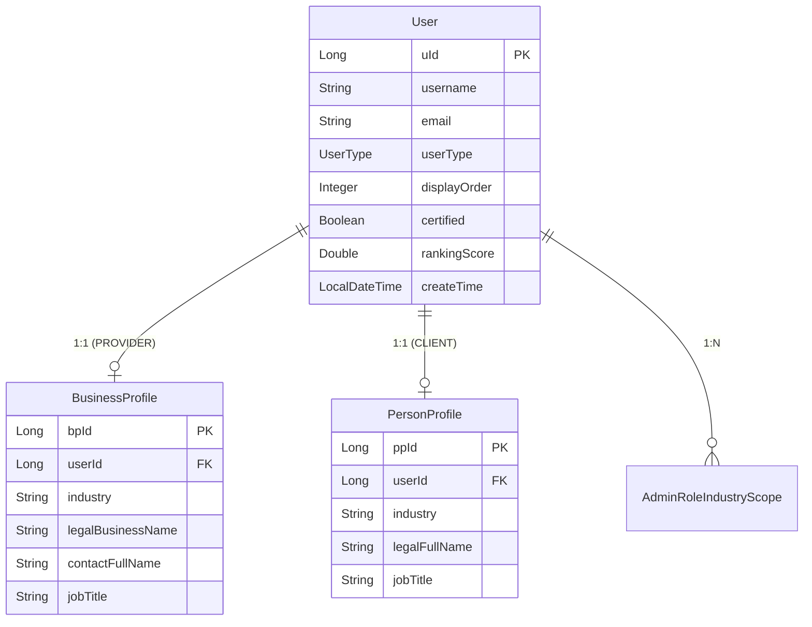
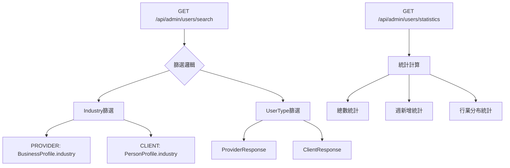

# 用戶管理系統多條件查詢API實現計劃

## 專案概述

本計劃旨在設計並實現一個支援多種篩選條件的用戶查詢API系統，主要功能包括：

1. **多條件查詢功能**：
   - 根據Industry進行篩選（支援"All Industries"或特定行業）
   - 根據用戶類型篩選（Provider或Client）
   - Provider和Client返回不同的資料結構

2. **統計功能**：
   - 顯示各類別的總數
   - 顯示最近一周的新增數量（格式：150 (+1)）

## 現有架構分析

### 實體關係結構


### 關鍵發現
1. **Industry關聯方式**：
   - `BusinessProfile.industry` 和 `PersonProfile.industry` 為字串型別
   - PROVIDER通過BusinessProfile關聯industry
   - CLIENT通過PersonProfile關聯industry

2. **UserType枚舉**：`CLIENT, PROVIDER, ADMIN, MANAGER`

3. **現有功能**：
   - ✅ 基本CRUD操作
   - ✅ 用戶排序功能
   - ✅ 產業範圍權限管理
   - ❌ 缺少多條件查詢API
   - ❌ 缺少統計功能

## API設計方案

### 1. API端點設計



#### 主要端點
| HTTP方法 | 端點路徑 | 功能描述 |
|----------|----------|----------|
| GET | `/api/admin/users/search` | 多條件查詢用戶列表 |
| GET | `/api/admin/users/statistics` | 獲取用戶統計資訊 |

### 2. 請求參數設計

#### UserSearchRequest
```java
public class UserSearchRequest {
    private String industry;        // "All Industries" 或具體行業名稱
    private UserType userType;      // CLIENT, PROVIDER, null(全部)
    private int page = 0;          // 分頁頁碼
    private int size = 20;         // 每頁數量
    private String sortBy = "displayOrder";  // 排序欄位
    private String sortDir = "asc";          // 排序方向
}
```

#### UserStatisticsRequest
```java
public class UserStatisticsRequest {
    private String industry;        // 可選：特定行業統計
    private UserType userType;      // 可選：特定用戶類型統計
}
```

### 3. 回應資料結構設計

#### 主要回應物件
```java
// 統一查詢回應
public class UserSearchResponse<T> {
    private List<T> users;              // ProviderResponse 或 ClientResponse
    private UserStatistics statistics;  // 統計資訊
    private PageInfo pageInfo;          // 分頁資訊
}

// Provider用戶回應
public class ProviderResponse {
    private Long userId;
    private String username;
    private String email;
    private BusinessProfile businessProfile;
    private String title;
    private String content;
    private String vedioUrl;
    private String signatureUrl;
    
    // 基本資訊
    private Boolean certified;
    private LocalDateTime registrationDate;    // createTime
    private LocalDateTime lastActiveDate;      // 需計算
    private Integer displayOrder;
    
    // 排名相關 (可直接取得)
    private Double rankingScore;               // User.rankingScore
    private Double commissionRate;             // User.commissionRate
    
    // 效能指標 (需計算)
    private PerformanceMetrics performance;
    
    // 業務數據 (需計算)
    private BusinessMetrics business;
}

// 效能指標
public class PerformanceMetrics {
    private Double livechatConversionRate;     // 25% 權重
    private Double rating;                     // 20% 權重 - 平均評分
    private Double orderCompletionRate;        // 15% 權重
    private Double repeatOrderRate;            // 10% 權重
    private Double averageResponseTime;        // 10% 權重 (小時)
    private Integer inProgressOrderCount;      // 反向權重 0-20%
}

// 業務指標
public class BusinessMetrics {
    private OrderQuantity orderQuantity;
    private Double totalRevenue;
    private Double averageOrderValue;
    private CommissionMetrics commission;
}

// 訂單數量分類
public class OrderQuantity {
    private Integer promotedOrders;
    private Integer directOrders;
    private Integer totalOrders;
}

// 佣金指標
public class CommissionMetrics {
    private Double totalCommissionAmount;
    private Double averageCommissionAmount;
    private Double commissionRate;
}

// Client用戶回應
public class ClientResponse {
    private Long userId;
    private String username;
    private String email;
    private PersonProfile personProfile;
    private String region;
    private String currencySymbol;
    
    // 基本資訊
    private LocalDateTime registrationDate;    // createTime
    private LocalDateTime lastActiveDate;      // 需計算
    private Double rating;                     // 平均評分
    private Integer displayOrder;
    
    // 業務數據 (需計算)
    private ClientBusinessMetrics business;
}

// Client業務指標
public class ClientBusinessMetrics {
    private Integer orderQuantity;             // 總訂單數
    private Double totalSpend;                 // 總消費
    private Double averageOrderValue;          // 平均訂單價值
    private List<String> orderSubIndustries;   // 訂單子行業
    private Double totalCommissionAmount;      // 總佣金金額
}

// 統計資訊
public class UserStatistics {
    private long totalCount;                        // 總數
    private long weeklyNewCount;                    // 最近一周新增
    private Map<String, StatisticItem> industryBreakdown;   // 行業分布
    private Map<UserType, StatisticItem> userTypeBreakdown; // 用戶類型分布
}

// 統計項目
public class StatisticItem {
    private long total;         // 總數
    private long weeklyNew;     // 週新增
    
    public String getDisplayText() {
        return String.format("%d (+%d)", total, weeklyNew);
    }
}

```

## 技術實現方案

### 1. UserSpecification重新設計

```java
public class UserSpecification {
    
    /**
     * 根據UserType和Industry進行篩選
     */
    public static Specification<User> filterByUserTypeAndIndustry(
            UserType userType, String industry) {
        return (root, query, criteriaBuilder) -> {
            List<Predicate> predicates = new ArrayList<>();
            
            // UserType篩選
            if (userType != null) {
                predicates.add(criteriaBuilder.equal(root.get("userType"), userType));
            }
            
            // Industry篩選邏輯
            if (industry != null && !"All Industries".equals(industry)) {
                Predicate industryPredicate = null;
                
                if (userType == UserType.PROVIDER || userType == null) {
                    // PROVIDER通過BusinessProfile篩選
                    Join<User, BusinessProfile> businessJoin = root.join("businessProfile", JoinType.LEFT);
                    Predicate providerIndustry = criteriaBuilder.and(
                        criteriaBuilder.equal(root.get("userType"), UserType.PROVIDER),
                        criteriaBuilder.equal(businessJoin.get("industry"), industry)
                    );
                    industryPredicate = providerIndustry;
                }
                
                if (userType == UserType.CLIENT || userType == null) {
                    // CLIENT通過PersonProfile篩選
                    Join<User, PersonProfile> personJoin = root.join("personProfile", JoinType.LEFT);
                    Predicate clientIndustry = criteriaBuilder.and(
                        criteriaBuilder.equal(root.get("userType"), UserType.CLIENT),
                        criteriaBuilder.equal(personJoin.get("industry"), industry)
                    );
                    
                    if (industryPredicate != null) {
                        industryPredicate = criteriaBuilder.or(industryPredicate, clientIndustry);
                    } else {
                        industryPredicate = clientIndustry;
                    }
                }
                
                if (industryPredicate != null) {
                    predicates.add(industryPredicate);
                }
            }
            
            return criteriaBuilder.and(predicates.toArray(new Predicate[0]));
        };
    }
    
    /**
     * 最近一周新增用戶篩選
     */
    public static Specification<User> createdInLastWeek() {
        return (root, query, criteriaBuilder) -> {
            LocalDateTime oneWeekAgo = LocalDateTime.now().minusWeeks(1);
            return criteriaBuilder.greaterThanOrEqualTo(root.get("createTime"), oneWeekAgo);
        };
    }
    
    /**
     * 排序規格
     */
    public static Specification<User> orderBy(String sortBy, String sortDir) {
        return (root, query, criteriaBuilder) -> {
            if ("asc".equalsIgnoreCase(sortDir)) {
                query.orderBy(criteriaBuilder.asc(root.get(sortBy)));
            } else {
                query.orderBy(criteriaBuilder.desc(root.get(sortBy)));
            }
            return null;
        };
    }
}
```

### 2. Repository層新增方法

```java
public interface UserRepository extends JpaRepository<User, Long>, JpaSpecificationExecutor<User> {
    // 現有方法...
    
    /**
     * 統計查詢：按行業和用戶類型分組統計
     */
    @Query("""
        SELECT 
            CASE 
                WHEN u.userType = 'PROVIDER' THEN bp.industry
                WHEN u.userType = 'CLIENT' THEN pp.industry
                ELSE 'Unknown'
            END as industry,
            u.userType as userType,
            COUNT(u) as total,
            SUM(CASE WHEN u.createTime >= :weekAgo THEN 1 ELSE 0 END) as weeklyNew
        FROM User u 
        LEFT JOIN u.businessProfile bp 
        LEFT JOIN u.personProfile pp 
        WHERE u.enabled = true
        GROUP BY 
            CASE 
                WHEN u.userType = 'PROVIDER' THEN bp.industry
                WHEN u.userType = 'CLIENT' THEN pp.industry
                ELSE 'Unknown'
            END,
            u.userType
        """)
    List<UserStatisticsProjection> findUserStatistics(@Param("weekAgo") LocalDateTime weekAgo);
    
    /**
     * 統計投影介面
     */
    interface UserStatisticsProjection {
        String getIndustry();
        UserType getUserType();
        Long getTotal();
        Long getWeeklyNew();
    }
}
```

### 3. Service層實現

```java
@Service
@RequiredArgsConstructor
public class AdminUserServiceImpl implements AdminUserService {
    
    private final UserRepository userRepository;
    private final UserResponseConverter userResponseConverter;
    
    @Override
    public UserSearchResponse<?> searchUsers(UserSearchRequest request) {
        // 建立查詢規格
        Specification<User> spec = Specification
            .where(UserSpecification.filterByUserTypeAndIndustry(
                request.getUserType(), request.getIndustry()))
            .and(UserSpecification.orderBy(request.getSortBy(), request.getSortDir()));
        
        // 分頁查詢
        Pageable pageable = PageRequest.of(request.getPage(), request.getSize());
        Page<User> userPage = userRepository.findAll(spec, pageable);
        
        // 轉換回應資料
        if (request.getUserType() == UserType.PROVIDER) {
            List<ProviderResponse> providers = userPage.getContent().stream()
                .map(userResponseConverter::toProviderResponse)
                .collect(Collectors.toList());
            return buildSearchResponse(providers, userPage, request);
        } else if (request.getUserType() == UserType.CLIENT) {
            List<ClientResponse> clients = userPage.getContent().stream()
                .map(userResponseConverter::toClientResponse)
                .collect(Collectors.toList());
            return buildSearchResponse(clients, userPage, request);
        } else {
            // 混合查詢，需要分別處理
            List<Object> mixedResults = userPage.getContent().stream()
                .map(user -> {
                    if (user.getUserType() == UserType.PROVIDER) {
                        return userResponseConverter.toProviderResponse(user);
                    } else {
                        return userResponseConverter.toClientResponse(user);
                    }
                })
                .collect(Collectors.toList());
            return buildSearchResponse(mixedResults, userPage, request);
        }
    }
    
    @Override
    public UserStatistics getUserStatistics(UserStatisticsRequest request) {
        LocalDateTime weekAgo = LocalDateTime.now().minusWeeks(1);
        List<UserRepository.UserStatisticsProjection> stats = 
            userRepository.findUserStatistics(weekAgo);
        
        return buildStatistics(stats, request);
    }
    
    private UserStatistics buildStatistics(
            List<UserRepository.UserStatisticsProjection> stats,
            UserStatisticsRequest request) {
        
        UserStatistics result = new UserStatistics();
        Map<String, StatisticItem> industryMap = new HashMap<>();
        Map<UserType, StatisticItem> userTypeMap = new HashMap<>();
        
        long totalCount = 0;
        long totalWeeklyNew = 0;
        
        for (UserRepository.UserStatisticsProjection stat : stats) {
            // 篩選條件檢查
            if (request.getIndustry() != null && 
                !"All Industries".equals(request.getIndustry()) &&
                !request.getIndustry().equals(stat.getIndustry())) {
                continue;
            }
            
            if (request.getUserType() != null && 
                !request.getUserType().equals(stat.getUserType())) {
                continue;
            }
            
            String industry = stat.getIndustry();
            UserType userType = stat.getUserType();
            long total = stat.getTotal();
            long weeklyNew = stat.getWeeklyNew();
            
            // 累計總數
            totalCount += total;
            totalWeeklyNew += weeklyNew;
            
            // 行業統計
            industryMap.merge(industry, 
                new StatisticItem(total, weeklyNew),
                (existing, newItem) -> new StatisticItem(
                    existing.getTotal() + newItem.getTotal(),
                    existing.getWeeklyNew() + newItem.getWeeklyNew()
                ));
            
            // 用戶類型統計
            userTypeMap.merge(userType,
                new StatisticItem(total, weeklyNew),
                (existing, newItem) -> new StatisticItem(
                    existing.getTotal() + newItem.getTotal(),
                    existing.getWeeklyNew() + newItem.getWeeklyNew()
                ));
        }
        
        result.setTotalCount(totalCount);
        result.setWeeklyNewCount(totalWeeklyNew);
        result.setIndustryBreakdown(industryMap);
        result.setUserTypeBreakdown(userTypeMap);
        
        return result;
    }
}
```

### 4. Controller層實現

```java
@RestController
@RequestMapping("/api/admin/users")
@RequiredArgsConstructor
@Tag(name = "Admin User Query", description = "管理員用戶查詢相關API")
@PreAuthorize("hasRole('ADMIN')")
public class AdminUserQueryController {
    
    private final AdminUserService adminUserService;
    
    /**
     * 多條件查詢用戶
     */
    @GetMapping("/search")
    @Operation(summary = "多條件查詢用戶", description = "支援按行業和用戶類型篩選的用戶查詢")
    public ResponseEntity<UserSearchResponse<?>> searchUsers(
            @Parameter(description = "行業名稱，'All Industries'表示全部") 
            @RequestParam(required = false, defaultValue = "All Industries") String industry,
            
            @Parameter(description = "用戶類型，null表示全部")
            @RequestParam(required = false) UserType userType,
            
            @Parameter(description = "頁碼，從0開始")
            @RequestParam(defaultValue = "0") int page,
            
            @Parameter(description = "每頁數量")
            @RequestParam(defaultValue = "20") int size,
            
            @Parameter(description = "排序欄位")
            @RequestParam(defaultValue = "displayOrder") String sortBy,
            
            @Parameter(description = "排序方向")
            @RequestParam(defaultValue = "asc") String sortDir) {
        
        try {
            UserSearchRequest request = new UserSearchRequest();
            request.setIndustry(industry);
            request.setUserType(userType);
            request.setPage(page);
            request.setSize(size);
            request.setSortBy(sortBy);
            request.setSortDir(sortDir);
            
            UserSearchResponse<?> response = adminUserService.searchUsers(request);
            return ResponseEntity.ok(response);
            
        } catch (Exception e) {
            log.error("用戶查詢失敗", e);
            return ResponseEntity.status(HttpStatus.INTERNAL_SERVER_ERROR).build();
        }
    }
    
    /**
     * 獲取用戶統計資訊
     */
    @GetMapping("/statistics")
    @Operation(summary = "獲取用戶統計", description = "獲取用戶總數和分類統計，包含最近一周新增數量")
    public ResponseEntity<UserStatistics> getUserStatistics(
            @Parameter(description = "行業篩選，可選")
            @RequestParam(required = false) String industry,
            
            @Parameter(description = "用戶類型篩選，可選")
            @RequestParam(required = false) UserType userType) {
        
        try {
            UserStatisticsRequest request = new UserStatisticsRequest();
            request.setIndustry(industry);
            request.setUserType(userType);
            
            UserStatistics statistics = adminUserService.getUserStatistics(request);
            return ResponseEntity.ok(statistics);
            
        } catch (Exception e) {
            log.error("獲取用戶統計失敗", e);
            return ResponseEntity.status(HttpStatus.INTERNAL_SERVER_ERROR).build();
        }
    }
}
```

## 實現步驟規劃

### 第一階段：資料結構設計 (預估 1-2 天)
- [ ] 建立 Request/Response 物件
  - `UserSearchRequest.java`
  - `UserStatisticsRequest.java`
  - `ProviderResponse.java`
  - `ClientResponse.java`
  - `UserStatistics.java`
  - `StatisticItem.java`
  - `PageInfo.java`
- [ ] 建立資料轉換器
  - `UserResponseConverter.java`

### 第二階段：Repository 層改進 (預估 2-3 天)
- [ ] 重寫 `UserSpecification.java`
  - 實現多條件篩選邏輯
  - 實現排序邏輯
  - 實現時間範圍篩選
- [ ] 擴展 `UserRepository.java`
  - 新增統計查詢方法
  - 新增統計投影介面
- [ ] 建立資料庫索引優化
  - 在 `createTime` 欄位建立索引
  - 在 `userType` 欄位建立索引
  - 在 `industry` 欄位建立索引（Profile表）

### 第三階段：Service 層實現 (預估 2-3 天)
- [ ] 擴展 `AdminUserService.java` 介面
  - 新增查詢方法定義
  - 新增統計方法定義
- [ ] 實現 `AdminUserServiceImpl.java`
  - 查詢邏輯實現
  - 統計邏輯實現
  - 資料轉換邏輯
  - 分頁處理邏輯

### 第四階段：Controller 層實現 (預估 1-2 天)
- [ ] 建立 `AdminUserQueryController.java`
  - 查詢端點實現
  - 統計端點實現
  - 參數驗證
  - 錯誤處理

### 第五階段：測試與優化 (預估 2-3 天)
- [ ] 單元測試
  - Service層測試
  - Repository層測試
  - Specification測試
- [ ] 整合測試
  - Controller層測試
  - 端到端測試
- [ ] 效能測試與優化
  - 查詢效能測試
  - 索引效果驗證
  - 記憶體使用優化

## API文檔範例

### 查詢用戶API
```http
GET /api/admin/users/search?industry=Technology&userType=PROVIDER&page=0&size=10

Response:
{
  "users": [
    {
      "userId": 1,
      "username": "provider1",
      "email": "provider1@example.com",
      "businessProfile": {
        "legalBusinessName": "Tech Company Ltd.",
        "industry": "Technology",
        "contactFullName": "John Doe"
      },
      "certified": true,
      "rankingScore": 4.5,
      "displayOrder": 1
    }
  ],
  "statistics": {
    "totalCount": 150,
    "weeklyNewCount": 5,
    "industryBreakdown": {
      "Technology": {
        "total": 150,
        "weeklyNew": 5,
        "displayText": "150 (+5)"
      }
    },
    "userTypeBreakdown": {
      "PROVIDER": {
        "total": 150,
        "weeklyNew": 5,
        "displayText": "150 (+5)"
      }
    }
  },
  "pageInfo": {
    "currentPage": 0,
    "pageSize": 10,
    "totalElements": 150,
    "totalPages": 15,
    "hasNext": true,
    "hasPrevious": false
  }
}
```

### 統計API
```http
GET /api/admin/users/statistics

Response:
{
  "totalCount": 500,
  "weeklyNewCount": 12,
  "industryBreakdown": {
    "Technology": {
      "total": 200,
      "weeklyNew": 5,
      "displayText": "200 (+5)"
    },
    "Healthcare": {
      "total": 150,
      "weeklyNew": 3,
      "displayText": "150 (+3)"
    },
    "Finance": {
      "total": 150,
      "weeklyNew": 4,
      "displayText": "150 (+4)"
    }
  },
  "userTypeBreakdown": {
    "PROVIDER": {
      "total": 300,
      "weeklyNew": 8,
      "displayText": "300 (+8)"
    },
    "CLIENT": {
      "total": 200,
      "weeklyNew": 4,
      "displayText": "200 (+4)"
    }
  }
}
```

## 效能考量與優化

### 1. 資料庫索引策略
```sql
-- 用戶表索引
CREATE INDEX idx_user_type_create_time ON t_user(user_type, create_time);
CREATE INDEX idx_user_display_order ON t_user(display_order);

-- Business Profile 表索引
CREATE INDEX idx_business_profile_industry ON t_business_profile(industry);
CREATE INDEX idx_business_profile_user_id ON t_business_profile(user_id);

-- Person Profile 表索引
CREATE INDEX idx_person_profile_industry ON t_person_profile(industry);
CREATE INDEX idx_person_profile_user_id ON t_person_profile(user_id);
```

### 2. 查詢優化策略
- 使用 JPA Specification 進行動態查詢構建
- 適當使用 JOIN FETCH 避免 N+1 查詢問題
- 統計查詢使用原生 SQL 提升效能
- 實現查詢結果快取機制

### 3. 記憶體優化
- 使用分頁查詢避免大量資料載入
- 實現 DTO 轉換減少不必要的資料傳輸
- 使用 Stream API 進行資料處理優化

## 測試策略

### 1. 單元測試範例
```java
@Test
void testSearchProvidersByIndustry() {
    // Given
    UserSearchRequest request = new UserSearchRequest();
    request.setIndustry("Technology");
    request.setUserType(UserType.PROVIDER);
    
    // When
    UserSearchResponse<?> response = adminUserService.searchUsers(request);
    
    // Then
    assertThat(response.getUsers()).isNotEmpty();
    assertThat(response.getUsers().get(0)).isInstanceOf(ProviderResponse.class);
}
```

### 2. 整合測試範例
```java
@Test
void testUserStatisticsAPI() throws Exception {
    mockMvc.perform(get("/api/admin/users/statistics"))
           .andExpect(status().isOk())
           .andExpect(jsonPath("$.totalCount").exists())
           .andExpect(jsonPath("$.weeklyNewCount").exists())
           .andExpect(jsonPath("$.industryBreakdown").exists());
}
```

## 風險評估與應對措施

### 1. 技術風險
- **查詢效能風險**：大量資料查詢可能影響效能
  - 應對：實現分頁、索引優化、查詢快取
- **記憶體使用風險**：複雜查詢可能消耗大量記憶體
  - 應對：使用 DTO 投影、Stream 處理

### 2. 業務風險
- **資料一致性風險**：統計資料可能不準確
  - 應對：使用事務、定期資料校驗
- **擴展性風險**：未來需求變化可能需要重構
  - 應對：採用可擴展的設計模式、介面抽象

## 部署與維護

### 1. 部署檢查清單
- [ ] 資料庫索引建立完成
- [ ] API 文檔更新完成
- [ ] 單元測試通過率 > 90%
- [ ] 整合測試通過
- [ ] 效能測試達標

### 2. 監控指標
- API 回應時間
- 資料庫查詢執行時間
- 記憶體使用情況
- 錯誤率統計

---

## 總結

此實現計劃提供了一個完整的用戶查詢API系統設計方案，涵蓋了從架構設計到具體實現的各個層面。透過分階段的實現策略，確保系統的可靠性和可維護性。

**預估總開發時間：8-12 個工作天**

**建議優先順序：**
1. 第一階段：資料結構設計（必須）
2. 第二階段：Repository 層改進（必須）
3. 第三階段：Service 層實現（必須）
4. 第四階段：Controller 層實現（必須）
5. 第五階段：測試與優化（建議）